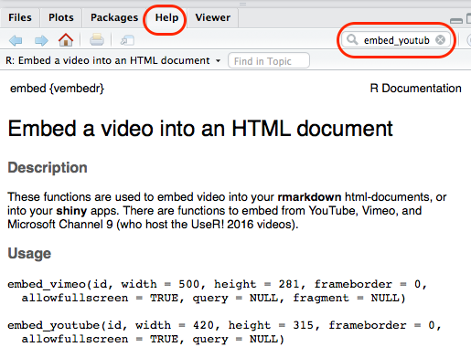
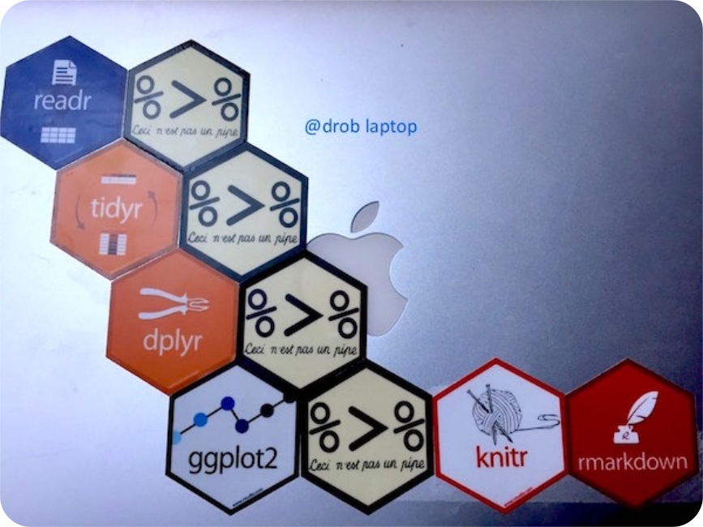
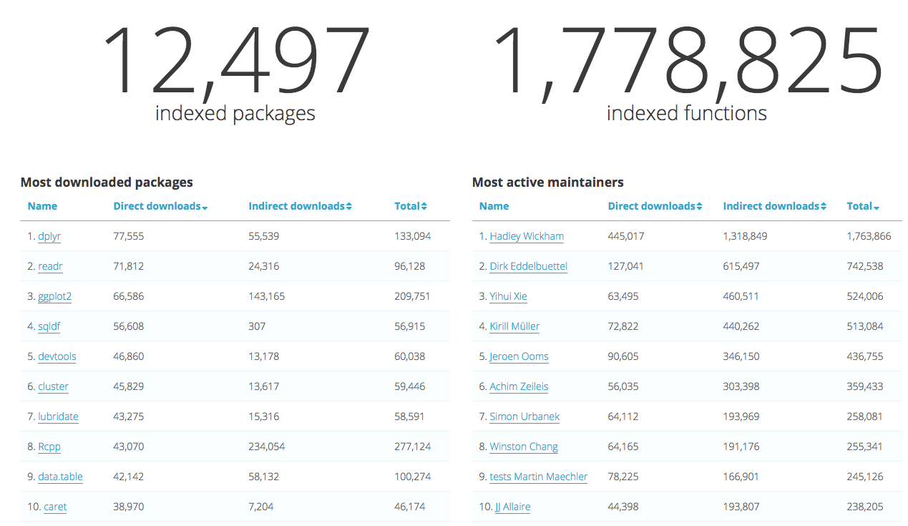
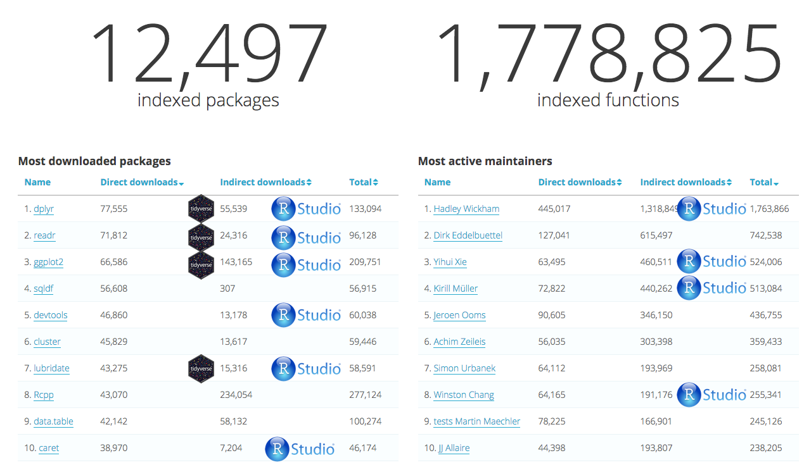
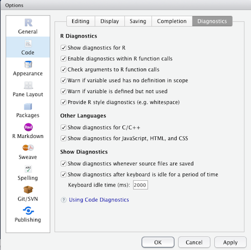
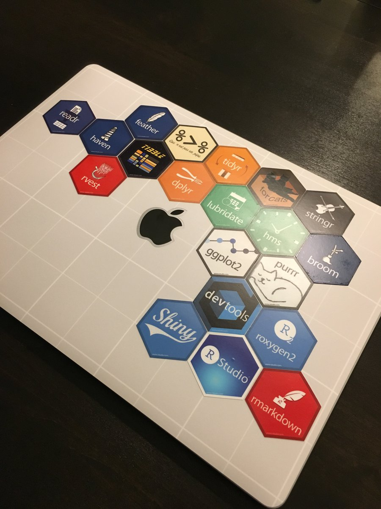
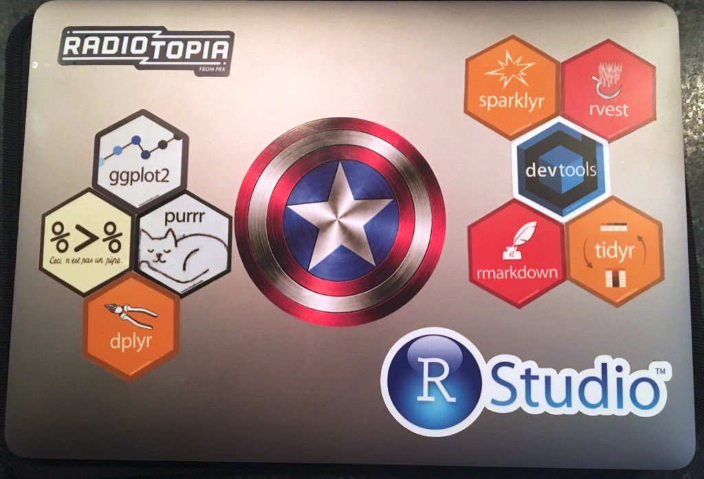

```{r setup, include=FALSE}
knitr::opts_chunk$set(echo = TRUE)
```

## Overview

The four day course provides a complete introduction to data science in  with the **tidyverse**. 
Focusing on getting data ready, some exploratory analysis, visualization and handling models.

Preparing data takes up to 90% of the time spent in analysis — speeding this up is the mission of this course

This workshop is composed of 30 hours:


### lectures {.col-4 .box .bg-green}

- ~ 8 hours
- available online
- very short exercises included
- convert them to pdf using chrome

### practical sessions {.box-4 .bg-yellow .stretch}

- ~ 15 hours
- using your own laptop
- teachers available
- supplementary exercises if needed

### bring your own data  {.box-4 .bg-orange .stretch}

- ~ 7 hours (Day 4)
- teachers available
- project provided for those that don't have data yet


## Time table and contents


### Day 1 {.box-8 .bg-green}
- Session 1
    + Introduction to R and RStudio (AG)
    + Basic data types, control structures (AG)

- Session 2
    + Markdown (EK)
    + Importing data into R (`readr`) (EK)
    
- Setup _Bring Your Own data Session_ (Day 4)

## Time table | (cont.)

### Day 2 {.box-8 .bg-green}

- Session 1
    + Introduction to tidy data (RK)
- Session 2
    + Visualization with `ggplot2` (AG)
- Session 3
    + Data wrangling with `dplyr` (RK)

## Time table | (cont.)

### Day 3 {.box-8 .bg-green}

- Session 1
    + Functional programming with `purrr` (EK)
- Session 2  
    + Handling statistical models with `broom` (AG)
- Session 3  
    + Programming with `tidyeval` (AG)

### Day 4 {.box-8 .bg-green}

- Project work 
    + Project (_BYOD_) or
    + Microarray analysis


## What is R? {.vs2}

**R** is shorthand for ["GNU R"](https://www.r-project.org):

- An interactive programming language
- Focus on data analysis ("stats") and plotting
- **R** is also shorthand for the ecosystem around this language
    + Book authors
    + Package developers
    + Ordinary useRs
  
Learning to use **R** will make you **more efficient** and **facilitate the use** of advanced data analysis tools

## Why use R? {.vs2}

- It's *free!*
- easy to install / maintain
- easy to process big files and analyse huge amounts of data
- integrated data visualization tools, *even dynamic*
- fast, and even faster with *C++* integration via [Rcpp](http://dirk.eddelbuettel.com/code/rcpp/Rcpp-attributes.pdf).
- easy to get help
    + [huge R community in the web](https://support.rstudio.com/hc/en-us/articles/200552336-Getting-Help-with-R)
    + [stackoverflow](http://stackoverflow.com/questions/tagged/r) with a lot of tags like **tidyverse**, **dplyr**, **ggplot2** etc.
    + [rbloggers](http://www.r-bloggers.com)
    
    
## Twitter R community    

[`#rstats`](https://twitter.com/search?q=%23rstats) on twitter

```{r, echo = FALSE, out.width = "95%"}
knitr::include_graphics("img/01_r_community.jpg")
```


## Constant trend

```{r, out.width = "70%", echo = FALSE, fig.align = "center"}
knitr::include_graphics("./img/01_r_progression.png")
```

From [Touchon & McCoy. _Ecosphere_. 2016](http://onlinelibrary.wiley.com/doi/10.1002/ecs2.1394/full)

## Packages | +10,000 in Jan 2017


### [CRAN](https://cran.r-project.org/web/packages/available_packages_by_date.html) {.box-4 .bg-green .stretch}

**reliable**: package is checked during submission process

[MRAN](https://mran.microsoft.com/packages/) for Windows users

### [bioconductor](https://www.bioconductor.org/) {.box-4 .bg-green .stretch}

dedicated to biology. [status](https://www.bioconductor.org/packages/release/bioc/html/limma.html)

typical install:
```{r, eval=FALSE}
source("https://bioconductor.org/biocLite.R")
biocLite("limma")
```

### [GitHub](https://github.com/) {.box-4 .bg-yellow .stretch}

easy install thanks to [devtools](https://github.com/hadley/devtools). [status](https://github.com/hadley/readr)

```{r, eval=FALSE}
# install.packages("devtools")
devtools::install_github("tidyverse/readr")
```

could be a security issue (see next slide)

### CRAN install from Rstudio {.col-6}


### github install from Rstudio' console {.col-6}


more in the article from [David Smith](http://blog.revolutionanalytics.com/2017/01/cran-10000.html)


## Security

### {.col-9}
```{r, echo = FALSE, out.width = "70%"}
knitr::include_graphics("https://i0.wp.com/rud.is/b/wp-content/uploads/2017/02/hieRarchy.png")
```

### {.col-3 .middle}

<span class = "small">source [Bob Rudis' blog](https://rud.is/b/2017/02/23/on-watering-holes-trust-defensible-systems-and-data-science-community-security/)</span>  

## Help pages

```{css}
.to_right > p {
  text-align: right;
}
```

### {.col-6 .middle .to_right}
2 possibilities for manual pages. 

### {.col-6}
```{r}
?log
help(log)
```

%end% 

In **Rstudio**, the help page can be viewed in the bottom right pane

### {.col-8}



### Sadly {.box-4 .bg-orange}

manpages are often unhelpful, 
now **vignettes** (and [**articles**](http://readxl.tidyverse.org/articles/sheet-geometry.html) on tidyverse) are better and described workflows.

## Drawback: Steep learning curve | Period of much suckiness

```{r, echo = FALSE}
#devtools::install_github("ijlyttle/vembedr")
vembedr::embed_youtube("8SGif63VW6E", query = list(start = vembedr::secs("4m12s"), end = vembedr::secs("4m52s")))
```

## [Tidyverse](http://tidyverse.org/) | creator {.vs1}

**R base** is complex, has a long history and many contributors

### Why R is hard to learn {.bg-yellow .box-11}

>- Unhelpful help `?print`
>- generic methods `print.data.frame`
>- too many commands _open source_
>- inconsistent names `read.csv, load, readRDS`
>- inconsistent syntax _open source_
>- too many ways to select variables `df$x, df$"x", df[,"x"], df[[1]]`
>- [...] see [r4stats' post](http://r4stats.com/articles/why-r-is-hard-to-learn/) for the full list
>- the tidyverse curse

### {.col-8 .offset-4} 

<span class = "small">source: [Robert A. Muenchen' blog](http://r4stats.com/articles/why-r-is-hard-to-learn/)</span>

%end%

### {.col-12 .build}
> Navigating the balance between base R and the tidyverse is a challenge to learn | Robert A. Muenchen {.bg-orange}

## Tidyverse | creator {.vs2}

We think the [**tidyverse**](http://tidyverse.org/) is better, especially for beginners. It is

- recent (both an issue and an advantage)
- unified
- consistent

### Hadley Wickham {.box-8}

[Hadley](http://had.co.nz), chief scientist at **Rstudio**, coined the _tidyverse_ at [userR meeting in 2016](https://twitter.com/drob/status/748196885307920385).
He developed and maintains most of the core _tidyverse_ packages

### {.col-4}

```{r, echo = FALSE, out.width = "75%"}
knitr::include_graphics("https://pbs.twimg.com/profile_images/677589103710306304/m56O6Wgf_400x400.jpg")
```


## Tidyverse  | packages {.vs1}


## Tidyverse | packages in processes


```{r, echo = FALSE, out.width = "80%"}
knitr::include_graphics("img/01_tidyverse_data_science.png")
```


## Tidyverse | workflow

### Pipeline {.col-9}



### David Robinson {.col-3}

@drob on twitter


## Tidyverse criticism  | core / extended

### Core {.box .col-6 .bg-green}

- `ggplot2`, for data visualization
- `dplyr`, for data manipulation
- `tidyr`, for data tidying
- `readr`, for data import
- `purrr`, for functional programming
- `tibble`, for tibbles, a modern re-imagining of data frames


### Extended {.box .col-6 .bg-yellow}

- Working with specific types of vectors:
    + `hms`, for times
    + `stringr`, for strings
    + `lubridate`, for date/times
    + `forcats`, for factors

- Importing other types of data:
    + `feather`, for sharing with other languages
    + `haven`, for SPSS, SAS and Stata files
    + `httr`, for web apis
    + `jsonlite` for JSON
    + `readxl`, for .xls and .xlsx files
    + `rvest`, for web scraping
    + `xml2`, for XML

- Modelling
    + `modelr`, for modelling within a pipeline
    + `broom`, for turning models into tidy data


> source: http://tidyverse.tidyverse.org/ | H.Wickham

## Tidyverse criticism  | dialect {.vs2}

<blockquote class="twitter-tweet" data-lang="fr"><p lang="en" dir="ltr"><a href="https://twitter.com/ucfagls">@ucfagls</a> yeah. I think the tidyverse is a dialect. But its accent isn’t so thick</p>&mdash; Hadley Wickham (@hadleywickham) <a href="https://twitter.com/hadleywickham/status/819610201946984451">12 janvier 2017</a></blockquote>
<script async src="https://platform.twitter.com/widgets.js" charset="utf-8"></script>


## Tidyverse criticism | controversy {.vs2}

[SO's comment](http://stackoverflow.com/questions/41880796/grouped-multicolumn-gather-with-dplyr-tidyr-purrr)


See the popularity of the [data.table versus dplyr](http://stackoverflow.com/questions/21435339/data-table-vs-dplyr-can-one-do-something-well-the-other-cant-or-does-poorly) question.

Easily summarized: [`data.table`](https://github.com/Rdatatable/data.table/wiki) is faster, for less than 10 m rows, negligible.


## Tidyverse criticism  | jobs {.vs2}

<blockquote class="twitter-tweet" data-lang="fr"><p lang="en" dir="ltr">Realized today: <a href="https://twitter.com/hashtag/tidyverse?src=hash">#tidyverse</a> R and base <a href="https://twitter.com/hashtag/rstats?src=hash">#rstats</a> have little in common. Beware when looking for  job which requires knowledge of R.</p>&mdash; Yeedle N. (@Yeedle) <a href="https://twitter.com/Yeedle/status/837448170963668992">2 mars 2017</a></blockquote>
<script async src="https://platform.twitter.com/widgets.js" charset="utf-8"></script>

Personal complains:

- still young so change quickly and drastically. Backward compatibility is not always maintained.
- `tibbles` are nice but a lot of non-tidyverse packages require `matrices`. `rownames` still an issue.

Anyway, learning the _tidyverse_ does not prevent to learn _R base_, it helps to get things done early in the process


## Tidyverse  | trends

```{r, echo = FALSE, out.width = "90%"}

```

### {.offset-4 .col-6 }

<span class="small">source: [rdocumentation](https://www.rdocumentation.org/trends) (2017/04/18)</span>


## Tidyverse | trends


```{r, echo = FALSE, out.width = "90%"}

```

### {.col-6 .offset-4} 

<span class="small">source: [rdocumentation](https://www.rdocumentation.org/trends) (2017/04/18)</span>


# RStudio


## Rstudio | What is it?

[RStudio](https://www.rstudio.com/products/RStudio/) is an Integrated Development Environment.  
It makes working with R much easier


### Features {.box-9 .bg-green .build}

>- _Console_ to run **R**, with syntax highlighter
>- _Editor_ to work with scripts
>- _Viewer_ for data / plots / website
>- _Package management_ (including building)
>- _Autocompletion_ using <kbd>TAB</kbd>
>- [_Cheatsheets_](https://www.rstudio.com/resources/cheatsheets/)
>- _Git_ integration for versioning
>- _Inline_ outputs (>= v1.03)
>- _Keyboard shortcuts_
>- [_Notebooks_](https://rviews.rstudio.com/2017/03/15/why-i-love-r-notebooks/)

### Warning {.box-3 .bg-orange .build}
Don't mix up **R** and **RStudio**.  
**R** needs to be installed first.

## Rstudio | The 4 panels layout


## Four panels {.vs2}

### scripting {.col-6 .box .bg-green .stretch}

- could be your main window
- should be a **Rmarkdown** doc
- tabs are great

### Environment {.col-6 .box .bg-yellow .stretch}

- Environment, display loaded objects and their `str()`
- History is useless IMO
- nice `git` integration

### Console {.col-6 .box .stretch}

- could be hidden with **inline** outputs
- in the preview, embed a nice `terminal` tab

### Files / Plots / Help {.col-6 .box .bg-yellow .stretch}

- necessary package management tab
- plots becomes useless when using **inline** outputs
- very useful help tab

## For reproducibility, options to activate / deactivate


## Code diagnostics, highly recommended

using  `Global Options -> Code -> Diagnostics` editing pane:

### {.col-6}


<span class = "small">source: [Kevin Ushey' article](https://support.rstudio.com/hc/en-us/articles/205753617-Code-Diagnostics?version=1.1.133&mode=desktop)</span> 

### {.col-6}

- check argument calls


- missing arguments


- variable definitions


+ unused variables & style recommendations


## The dream team


## Rstudio | Working directory and projects

It is where **R** is looking for files (read or write).  
Using the console, try:

###{.col-4}
```{r, prompt = TRUE, eval = FALSE}
getwd()
```

### setwd() or relative paths {.col-8 .box .bg-red}

- It is possible to change the location using `setwd()` (in the console or interactively in _RStudio_)
- A better way is to use projects in Rstudio

### Projects {.box .col-8 .bg-green}

They solve most issues with working directories: get rid of `setwd()`

### {.col-4}


## Using `library()` {.vs2}

### with only `base` loaded {.col-6 .box .bg-yellow}

```{r, eval = TRUE}
x <- 1:10
filter(x, rep(1, 3))
```


### Conflicts! when 2 packages export a function {.box-6 .bg-red}

with the same name, the latest loaded wins

```{r, eval = FALSE}
library(dplyr)
filter(x, rep(1, 3))
```

```{css}
.error {
    font-family: monospace;
    color: red;
}
```

<span class = "error">Error in UseMethod("filter_") : no applicable method for 'filter_' applied to an object of class "c('integer', 'numeric')</span>


### **Solution**  {.box-10 .offset-1 .bg-green}

using the `::` operator to call a function from a specific package

```{r}
stats::filter(x, rep(1, 3))
```

```{r, include = FALSE}
library(dplyr)
```


## Pipes with magrittr | developed by Stefan Milton Bache


compare the approaches between classic parenthesis and the [magrittr](https://cran.r-project.org/web/packages/magrittr/vignettes/magrittr.html) pipeline

### R base {.bg-yellow .box .col-6}

```{r}
set.seed(12)
round(mean(rnorm(5)), 2)
```


### magrittr {.bg-green .box .col-6}

```{r}
set.seed(12)
rnorm(5) %>%
  mean() %>%
  round(2)
```

Of note, `magrittr` needs to loaded with either:
```{r, eval = FALSE}
library(magrittr)
library(dplyr)
library(tidyverse)
```


## Coding's style

`R` is rather flexible and permissive with its syntax. However, being more strict tends to ease the debugging process.

See [tidyverse style's recommendations](http://style.tidyverse.org/)

In summary:


### Good {.bg-green .box .col-6}

- use **spaces**
- use more **lines**
    + `}` alone on their line except for
      ```{r, eval = FALSE}
      } else {
      ```
    + using the pipe `%>%` to display a single instruction per line
    + break list definitions, function arguments ...
- avoid using names of existing functions and variables
- use **`snake_case`** more than `CamelCases`  
  
### Bad {.bg-red .box .col-6}  
  
```{r, eval = FALSE}
# example from http://adv-r.had.co.nz/Style.html
T <- FALSE
c <- 10
mean <- function(x) sum(x)
```
```{r, eval=FALSE}
# lack spaces for readibility
average<-mean(feet/12+inches,na.rm=TRUE)
```


## Hexbins

After David Robinson' laptop, see and get inspired!

### Hadley Wickham {.col-6}



### Bob Rudis {.col-6}


