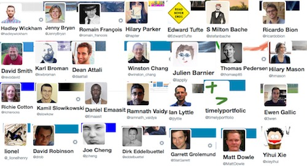
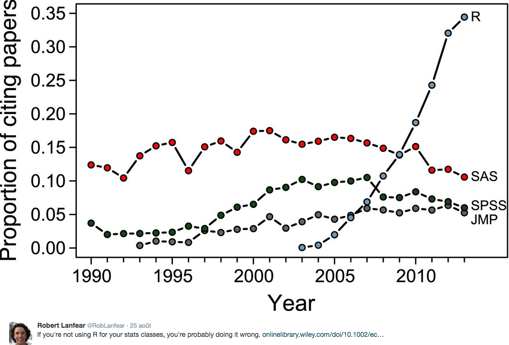
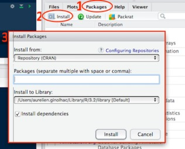
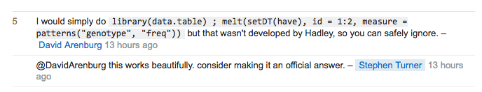
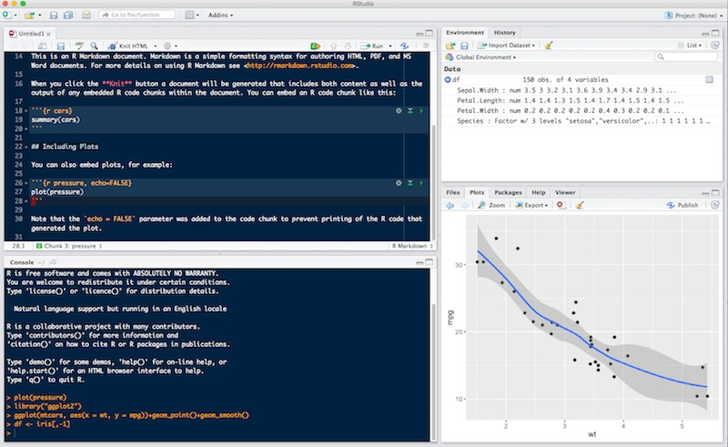
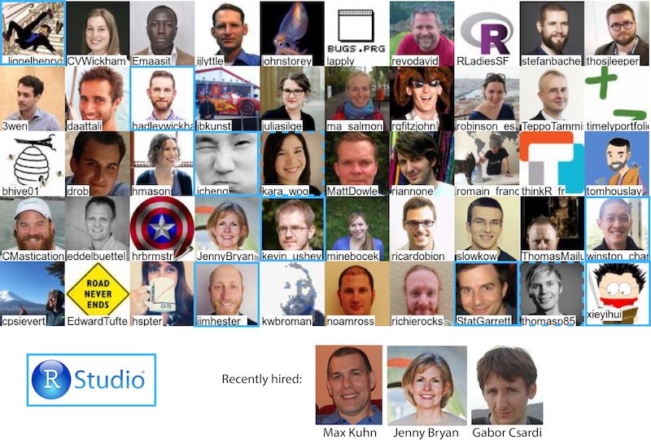
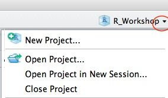

```{r setup, include=FALSE}
knitr::opts_chunk$set(echo = TRUE)
```

## Overview

The four day course provides a complete introduction to data science in  with the **tidyverse**. 
Focusing on getting data ready, some exploratory analysis, visualization and handling models.

Preparing data takes up to 90% of the time spent in analysis — speeding this up is the mission of this course

This workshop is composed of 30 hours:


### lectures {.col-4 .box .bg-green}

- ~ 8 hours
- available online
- very short exercises included
- convert them to pdf using chrome

### practical sessions {.col-4 .box .bg-yellow .stretch}

- ~ 15 hours
- using your own laptop
- teachers available
- supplementary exercises if needed

### bring your own data  {.col-4 .box .bg-orange}

- ~ 7 hours (Day 4)
- teachers available
- project provided for those that don't have data yet


## Time table and contents


### Day 1 {.col-8 .box .bg-green}
- Session 1
    + Introduction to R and RStudio (AG)
    + Transiting from other languages 
    + Basic data types, control structures, loops

- Session 2
    + Markdown (EK)
    + Importing data into R (`readr`) 
- Setup _Bring Your Own data Session_ (Day 4 )

## Time table | (cont.)

### Day 2 {.col-8 .box .bg-green}
- Session 1
    + Introduction to tidy data (RK)
- Session 2
    + `ggplot2` (AG)
- Session 3
    + `dplyr` (RK)
    
## Time table | (cont.)

### Day 3 {.col-8 .box .bg-green}
- Session 1
    + `purrr` (EK)
- Session 2  
    + `broom` (AG)

### Day 4 {.col-8 .box .bg-green}
- Project work 
    + Project (_BYOD_) or
    + Microarray analysis


## What is R? {.vs2}

"R" is shorthand for ["GNU R"](https://www.r-project.org):

- An interactive programming language
- Focus on data analysis ("stats") and plotting
- "R" is also shorthand for the ecosystem around this language
    + Book authors
    + Package developers
    + Ordinary useRs
  
Learning to use R will make you **more efficient** and **facilitate the use** of advanced data analysis tools

## Why use R? {.vs2}

- It's *free!*
- easy to install / maintain
- easy to process big files and analyse huge amounts of data
- integrated data visualisation tools, *even dynamic*
- fast, and even faster with *C++* integration via [Rcpp](http://dirk.eddelbuettel.com/code/rcpp/Rcpp-attributes.pdf).
- easy to get help
    + [huge R community in the web](https://support.rstudio.com/hc/en-us/articles/200552336-Getting-Help-with-R)
    + [stackoverflow](http://stackoverflow.com/questions/tagged/r) with a lot of tags like **dplyr**, **ggplot2** etc.
    + [rbloggers](http://www.r-bloggers.com)
    
    
## Twitter R community    

[`#rstats`](https://twitter.com/search?q=%23rstats) on twitter

```{r, echo = FALSE, out.width = "95%"}

```


## Constant trend

```{r, out.width = "70%", echo = FALSE, fig.align = "center"}

```

From [Touchon & McCoy. _Ecosphere_. 2016](http://onlinelibrary.wiley.com/doi/10.1002/ecs2.1394/full)

## Packages

- CRAN *<span class="green2">reliable: package is checked during submit process</span>*
- [GitHub](https://github.com/) using [devtools](https://github.com/hadley/devtools). *<span class="yellow2">Check [status](https://github.com/hadley/readr)</span>*

    ```{r, eval=FALSE}
    # install.packages("devtools")
    devtools::install_github("hadley/readr")
    ```

- [bioconductor](https://www.bioconductor.org/). *<span class="yellow2">Check [status](https://www.bioconductor.org/packages/release/bioc/html/limma.html)</span>*
    ```{r, eval=FALSE}
    source("https://bioconductor.org/biocLite.R")
    biocLite("limma")
    ```

<div class="centered">


</div>

## Help

2 possibilities
```{r}
?log
help(log)
```

In **Rstudio**, the help page can be viewed in the bottom right pane

```{r}
apropos("log")
```

## Drawback: Steep learning curve | Period of much suckiness

```{r, echo=FALSE}
#devtools::install_github("ijlyttle/vembedr")
vembedr::embed_youtube("8SGif63VW6E", query = list(start = vembedr::secs("4m12s"), end = vembedr::secs("4m52s")))
```

## Tidyverse | creator {.vs2}

**R base** is complex, [**tidyverse**](http://tidyverse.org/) is better.


### Hadley Wickham {.box .col-8}

[Hadley](http://had.co.nz), chief scientist at **Rstudio**, coined the _tidyverse_ at [userR meeting in 2016](https://twitter.com/drob/status/748196885307920385).
He developed and maintains most of the core _tidyverse_ packages

### {.col-4}

```{r, echo = FALSE, out.width = "100%"}
knitr::include_graphics("https://pbs.twimg.com/profile_images/677589103710306304/m56O6Wgf_400x400.jpg")
```


## Tidyverse  | packages {.vs1}


## Tidyverse | packages in processes


```{r, echo = FALSE, out.width = "80%"}
knitr::include_graphics("img/01_tidyverse_data_science.png")
```


## Tidyverse | workflow

### Pipeline {.col-9}


### David Robinson {.col-3 .box}


## Tidyverse criticism  | dialect {.vs1}

<blockquote class="twitter-tweet" data-lang="fr"><p lang="en" dir="ltr"><a href="https://twitter.com/ucfagls">@ucfagls</a> yeah. I think the tidyverse is a dialect. But its accent isn’t so thick</p>&mdash; Hadley Wickham (@hadleywickham) <a href="https://twitter.com/hadleywickham/status/819610201946984451">12 janvier 2017</a></blockquote>
<script async src="https://platform.twitter.com/widgets.js" charset="utf-8"></script>


## Tidyverse criticism | controversy

[SO's comment](http://stackoverflow.com/questions/41880796/grouped-multicolumn-gather-with-dplyr-tidyr-purrr)



See the popularity of the [data.table versus dplyr](http://stackoverflow.com/questions/21435339/data-table-vs-dplyr-can-one-do-something-well-the-other-cant-or-does-poorly) question.

Easily summarised: [`data.table`](https://github.com/Rdatatable/data.table/wiki) is faster, for less than 10 m rows, negligible.

## Tidyverse criticism  | jobs {.vs2}

<blockquote class="twitter-tweet" data-lang="fr"><p lang="en" dir="ltr">Realized today: <a href="https://twitter.com/hashtag/tidyverse?src=hash">#tidyverse</a> R and base <a href="https://twitter.com/hashtag/rstats?src=hash">#rstats</a> have little in common. Beware when looking for  job which requires knowledge of R.</p>&mdash; Yeedle N. (@Yeedle) <a href="https://twitter.com/Yeedle/status/837448170963668992">2 mars 2017</a></blockquote>
<script async src="https://platform.twitter.com/widgets.js" charset="utf-8"></script>

Anyway, learning the _tidyverse_ does not prevent to learn _R base_, it helps to get things done early in the process

# RStudio


## Rstudio | What is it?

[RStudio](https://www.rstudio.com/products/RStudio/) is an Integrated Development Environment.  
It makes working with R much easier

### Features {.col-9 .box .bg-green}

>- _Console_ to run **R**, with syntax highlighter
>- _Editor_ to work with scripts
>- _Viewer_ for data / plots / website
>- _Package management_ (including building)
>- _autocompletion_ using <kbd>TAB</kbd>
>- [_Cheatsheets_](https://www.rstudio.com/resources/cheatsheets/)
>- _git_ integration for versioning
>- _inline_ outputs (>= v1.03)
>- _Keyboard shortcuts_

### Warning {.col-3 .box .bg-orange}
Don't mix up **R** and **RStudio**.  
**R** needs to be installed first.

## Rstudio | The 4 panels layout



## Four panels

XX


## Opions

to activate / deactivate

## The dream team




## Getting started

Let's get ready to use **R** and **RStudio**. Do the following:

- Open up RStudio
- Maximise the RStudio window
- Click the Console pane, at the prompt (`>`) type in `3 + 2` and hit enter

```{r, eval = FALSE, prompt = TRUE}
3 + 2
```

## Arithmetic operations

You will not be surprised that **R** is very good at computing

### arithmetic operators {.col-6 .bg-green .box}

- `+`: addition  
- `-`: subtraction  
- `*`: multiplication  
- `/`: division  
- `^` or `**`: exponentiation 
- `%%`: modulo (remainder after division)
- `%/%`: integer division

### Remember {.col-6 .bg-orange .box}

 **R** will:

- first perform **exponentiation**
- then multiplications and/or divisions
- and finally additions and/or subtractions.

If you need to change the priority during the evaluation, use parentheses – _i.e._ `(` and `)` – to group calculations.

## Rstudio | Working directory and projects

It is where **R** is looking for files (read or write).  
Using the console, try:

###{.col-4}
```{r, prompt = TRUE, eval = FALSE}
getwd()
```

### setwd() or relative paths {.col-8 .box .bg-red}

- It is possible to change the location using `setwd()` (in the console or interactively in _RStudio_)
- A better way is to use projects in Rstudio

### Projects {.box .col-8 .bg-green}

They solve most issues with working directories: get rid of `setwd()`

### {.col-4}




### R base {.bg-orange .col-12 .box}

We could let **base** down, but the **tidyverse** is wrapping around it. Some functions need to be known

# Data types and structures | R base

## 4 main types

Type          | Example
------------- | ---------------------------
numeric       | integer (2), double (2.34)
string        | "tidyverse !"
boolean       | TRUE / FALSE
complex       | 2+0i

### Special case

```{r, eval = FALSE}
NA   # not available, missing data
NA_real_
NA_integer_
NA_character_
NA_complex_
NULL # empty
```

## Structures


### Vectors {.col-5 .box .stretch}

`c()` is the function for **concatenate**

### Example {.col-7 .box .bg-cobalt .stretch}

```{r, row = TRUE, collapse = TRUE}
4
c(43, 5.6, 2.90)
```


### Factors {.col-5 .box .stretch}

convert strings to factors, `levels` is the dictionary

### Example {.col-7 .box .bg-cobalt}

```{r, row = TRUE, collapse = TRUE}
factor(c("AA", "BB", "AA", "CC"))
```

### Matrix (2D), Arrays ($\geq$ 3D) {.col-5 .box .stretch}

won't dig into those

### Example {.col-7 .box .bg-cobalt .stretch}

```{r, row = TRUE, collapse = TRUE}
matrix(1:4, nrow = 2)
```

### Lists {.col-5 .box .bg-green}

very important as can contain anything

### Example {.col-7 .box .bg-cobalt}

```{r, row = TRUE, collapse = TRUE}
list(f = factor(c("AA", "AA")),
     v = c(43, 5.6, 2.90),
     s = 4)
```


## Data frames are special lists

###  `data.frame` {.col-5 .box .bg-green .stretch}

same as list **but** where all objects _must_ have the **same** length

### Example {.col-7 .box .bg-cobalt .stretch}


```{r, include=FALSE}
library(dplyr)
```


```{r, row = TRUE, collapse = TRUE}
data.frame(
  f = c("AA", "AA", "BB") %>% factor(),
  v = c(43, 5.6, 2.90),
  s = rep(4, 3))
```

## Data types 2

```{r, eval = TRUE}
# evaluate
typeof(2)
# check
is.integer(2.34)
# check with an actual integer
is.integer(2L)
# convert
as.integer(2.34)
```

## Vectors

**Vectors** are the simplest type of "object" in R.
```{r}
print(5)
```

**[1]** means we made a numeric vector of length 1.
Now look at what the **`:`** operator does:

```{r}
1:30
```

How many elements are in the thing we made here? What does the **[24]** signify?

##

Think of vectors as collections of simple things (like numbers) that are ordered. We can create vectors from other vectors using the **`c`** function:

```{r}
c(2, TRUE, "a string")
```

We can use the assignment operator to associate a name to our vectors in order to reuse them:
```{r}
myvec <- c(3, 4, 1:3)
myvec
```

##

The following will build a character vector. We know this because the elements are all in quotes.

```{r}
char.vec <- c("dog", "cat", "ape")
```

Now use the **`c`** function to combine a length-one vector number of the number `4` with the `char.vec`. What happens?

```{r}
c(4, char.vec)
```

Notice that the 4 is quoted. R turned it into a character vector and then combined it with char.vec.   All the elements in a vector must be of the same type.

##

R has a few built in vectors. One of these is `LETTERS`. What does it contain?

```{r}
LETTERS
```

How do extract the first element from this (the letter A). Here is how to do it:

```{r}
LETTERS[1]
```

Use the square brakets to subset vectors

##

What do we do if we need more than one element? Here is how to get elements in position 3 through to 10:

```{r}
LETTERS[3:10]
```

Remember what the : operator does? Take a look:

```{r}
3:10
```

Can you see how `LETTERS[3:10]` works now?

## Exercise

- find a way to output the following
```{r, echo = FALSE}
LETTERS[2:5]
```

- find a way to output the following
```{r, echo = FALSE}
LETTERS[c(2:5, 7)]
```

- find a way to output first 5 letters + one to the last
```{r, echo = FALSE}
LETTERS[c(1:5, length(LETTERS) - 1)]
```


##

Solution

```{r, eval = FALSE}
LETTERS[2:5]
```

```{r, eval = FALSE}
LETTERS[c(2:5, 7)]
```
```{r, eval = TRUE}
LETTERS[c(1:5, length(LETTERS) - 1)]
```

## Vectorized operation

```{r}
myvec <- 10:18
myvec + 2
```

**R** recycles vectors that are too short:

```{r}
myvec * c(1:3)
```

## Vectorized operation

Have a look at the following operation:

```{r}
c(1:3) + c(1:2) * c(1:4)
```

The detailed steps _R_ performs _behind the scene_ are:

```{r, eval = FALSE}
c(1, 2, 3, 1) + (c(1, 2, 1, 2) * c(1, 2, 3, 4))
c(1, 2, 3, 1) + c(1, 4, 3, 8)
```

## Factors

Vectors with qualitative data

```{r}
factor(c("cytoplasm", "nucleus", "extracellular", "nucleus", "nucleus"))
```

## Matrix

A matrix is a **2D** array

```{r}
M <- matrix(1:6, ncol = 2, nrow = 3)
M
```
```{r}
M <- matrix(1:6, ncol = 2, nrow = 3, byrow = TRUE)
M
```

## Array

Similar to a matrix but with dimensions $\geq$ 3D

```{r}
A <- array(1:24, dim = c(2, 4, 3))
A
```

## Lists

Most permissive type. Could be anything!
```{r}
l <- list(name = "Farina", firstname = "Geoff", year = 1995)
```
<div class = "float-r"></div>
```{r}
l["firstname"]
l[["firstname"]]
```

Have a look at [R for data science](http://r4ds.had.co.nz/lists.html) for a description of the analogy by Hadley Wickham.

## Data frame

It's the most important type to recall.  
`ggplot2` and `dplyr` are focusing on those.

```{r}
women
```

## Convert to a data frame

The function `as.data.frame()` allows to convert a matrix / list into a `data.frame`.  
A data frame can be considered as a collection of vectors having the **same length**.

We can extract a vector from a data frame in a few different ways:

```{r}
# Using the name and the $ operator
women$height
# using [[]], name in quotes or indices
women[["height"]]
```

Remember the analogy introduced by Hadley Wickham to explain lists indexing:  The _pepper shaker_ also applies to data frames.
What would be the output of `women["height"]`?

## Data frame as a table

A data frame can be considered as a table and extract a specify a cell by its `row` and `column`:

```{r}
head(women, 5)
women[4, 2] # [row, col]
```

## Logical operators

In addition to the arithmetic operators 


### Perform comparisons {.bg-green .box .col-9}

* `==` equal
* `!=` different
* `<` smaller
* `<=` smaller **or** equal
* `>` greater
* `>=` greater **or** equal
* `!` is not
* `&`, `&&` and
* `|`, `||` or


## Using `library()`


### library {col-6 .box .bg-green}


```{r}
library(dplyr)
```

### Conflicts! {col-6 .box .bg-red}

When 2 packges export a function with the same name, the latest loaded wins


**Solution**: using the `::` operator to ensure calling a function from a specific package 

```{r, eval = FALSE}
dplyr::select()
```


## Pipes with magrittr | developped by Stefan Milton Bache


compare the approaches between classic parenthesis and the [magrittr](https://cran.r-project.org/web/packages/magrittr/vignettes/magrittr.html) pipeline

### R base {.bg-yellow .box .col-6}

```{r}
set.seed(12)
round(mean(rnorm(5)), 2)
```


### magrittr {.bg-green .box .col-6}

```{r}
set.seed(12)
rnorm(5) %>%
  mean() %>%
  round(2)
```

Of note, `magrittr` needs to loading with either
```{r, eval = FALSE}
library(magrittr)
library(dplyr)
library(tidyverse)
```


## Coding's style

`R` is rather flexible and permissive with its syntax. However, being more strict tends to ease the debugging process.

See [Hadley's recommendations](http://style.tidyverse.org/)

In summary:


### Good {.bg-green .box .col-6}

- use **spaces**
- use more **lines**
    + `}` alone on their line except for
      ```{r, eval = FALSE}
      } else {
      ```
    + using the pipe `%>%` to display a single instruction per line
    + break list definitions, function arguments ...
- avoid using names of existing functions and variables
  
  
### Bad {.bg-red .box .col-6}  
  
```{r, eval = FALSE}
# example from http://adv-r.had.co.nz/Style.html
T <- FALSE
c <- 10
mean <- function(x) sum(x)
```
