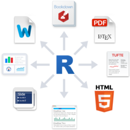
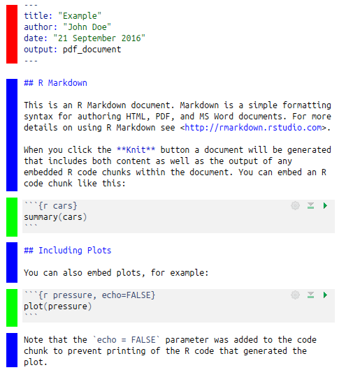
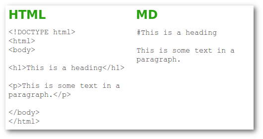
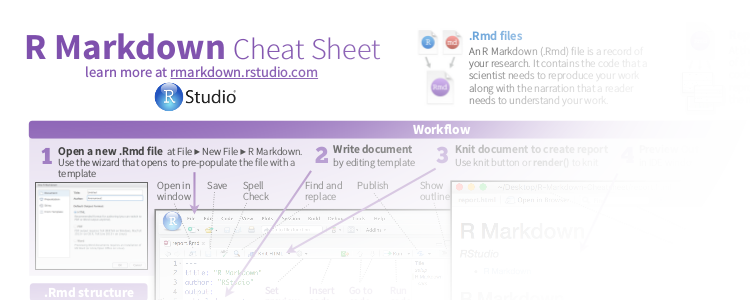
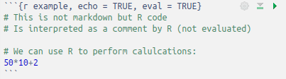
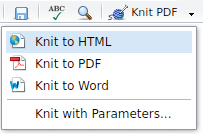

```{r setup, include=FALSE}
knitr::opts_chunk$set(echo = TRUE)
```
```{r, echo = FALSE, message = FALSE}
# Importing txtcol from gist
devtools::source_gist("c205af6bd80d7f59c3557345e8121195", filename = "txtcol.R")
```

## RMarkdown

```{block, type = 'float-r'}

```

RMarkdown enables you to write detailed reports to:

- ensure reproducibility
- keep track of your analyses
- comment/descibe different steps of your analyses
- export a single (Rmd) document to various formats (Pdf, Html...)


```{block, type = 'box bg-red flexbox vcenter'}
<strong>Rmarkdown =</strong>

<strong>+</strong>

<strong>+</strong>

```

```{r, echo = FALSE, eval = FALSE}
# Hiding as the sound is not working in the room...
vembedr::embed_vimeo("178485416")
```

## Rmarkdown document | Structure

A Rmarkdown document document contains 3 elements:

```{block, type = 'float-r'}

```

- A **`r txtcol("YAML header", "red")`** to define document wide options
- Text which is formatted using the **`r txtcol("markdown", "blue")`** syntax
- **`r txtcol("chunks", "green")`** containing the code to be interpreted by _R_ 

## Markdown

**Markdown** is used to **format the text**

<div class = "col2">
- Markup language (like Xml, HTML)
    + A coding system used to structure text
    + Uses markup tags (_e.g._ `<h1></h1>` in HTML)
</div>
<div class = "col2">
- Lightweight  markup language
    + Easy to read and write as it uses simple tags (_e.g._ `#`)
</div>

```{block, type = 'flexbox vcenter'}

```

## Markdown

- Most common text formatting **tags** are defined:
    + Headers (`#`, `##`, `###` ...)
    + **bold** (`**`This will be bold`**`)
    + *italic* (`*`This will be italic`*`)
    + `code` (` ` `This will be some inline coding stuff` ` `)
    + Links to URLs (`[Text describing the link](http://example.com)`)
    + Many more: Have a look at the online documents on the [Rmarkdown website](http://rmarkdown.rstudio.com/lesson-8.html) or download the [cheatsheet as Pdf](https://www.rstudio.com/wp-content/uploads/2016/03/rmarkdown-cheatsheet-2.0.pdf) (the link can be found in the Rstudio Help menu)

```{block, type = 'flexbox vcenter'}

```

## Including _R_ code

- Small pieces of _R_ codes can be integrated inline
    + Use backticks (` ` `) combined to the keyword r (`` `r '\x60r <your R code>\x60'` ``)
    + Example: type in ``1 + 1 = `r '\x60r 1+1\x60'` `` to render 1 + 1 = `r 1+1`.
- Bigger pieces of _R_ code are contained in **chunks**
    + chunks are defined between two lines starting with a 3 backticks tag (` ``` `)
    + curly brackets define how to interprete the content (_R_ code but other languages such as Python are also supported)
        + ` ```{r} ` is the minimum to define a starting _R_ chunk
        + can contain more options (name of chunk, whether to show it or not, evaluate it or not)

```{block, type = 'flexbox vcenter'}

```

## Combining _R_ code and markdown text

```{block, type = 'float-r'}

```


Both parts (_R_ code and markdown) are knitted together in the final document:

- R chunks are extracted, interpreted separately
- The result is formatted (together with the source code) and integrated into the markdown document
- The markdown document is converted to the desired document format (Pdf, Html...)
- Fully integrated in Rstudio (Knit button)

> 

# Exercise: Write your first document


## Learn to use the markdown syntax

Before writing your own Rmarkdown document, use the excellent ressource on [www.markdowntutorial.com](http://www.markdowntutorial.com/) to learn the basics of markdown formatting.
