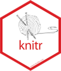
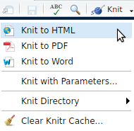
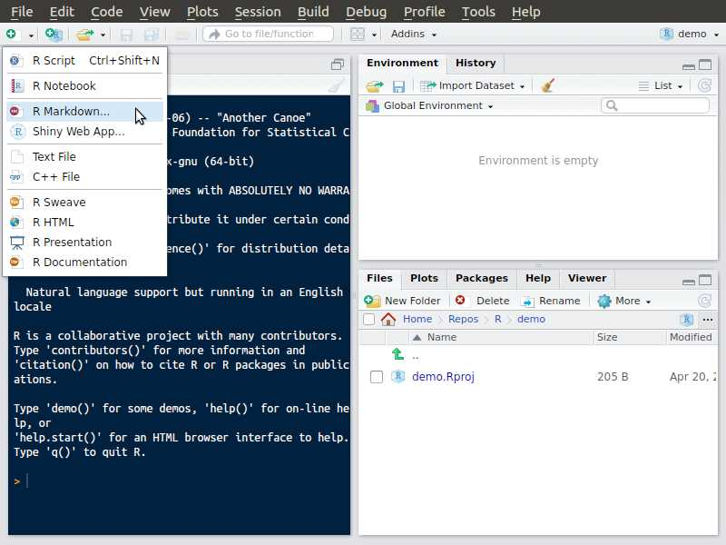
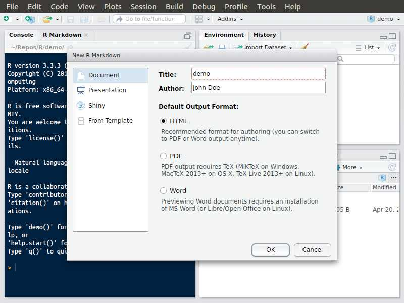
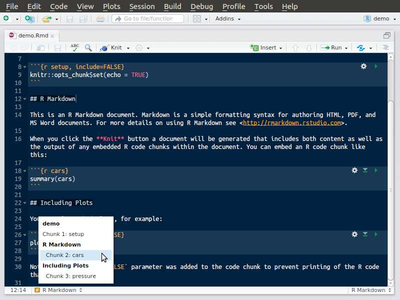
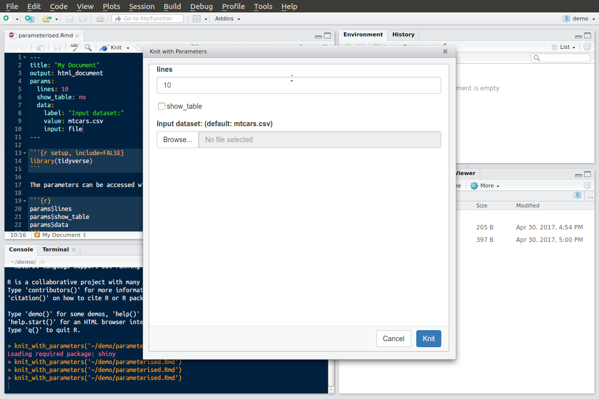

```{r setup, include=FALSE}
knitr::opts_chunk$set(echo = TRUE)
library(tidyverse)
```

```{css}
/* my css codes. Some might get integrated in a future iosp version...*/

article .my_flex > p {
  display: flex;
  display: -webkit-flex;
  align-items: center;
  -webkit-align-items: center;
  justify-content: space-around;
  -webkit-justify-content: space-around;
  font-size: 50px;
}

.box li {
  line-height: 1.1em; /* should be optimized in the main iosp css... */
}

article .code-transparent > pre {
  background: none;
  /*border-left: none;*/
}

.code-transparent pre {
  color: #c7254e;
  background: none;
  border-left: none;
  padding-left: 50px;
}

.center img {
  display: block;
  margin: auto;
  float: none;
}
```

## Learning objectives {.vs2}

### You will learn to: {.box-10 .offset-1 .bg-red .icon}


- use the markdown syntax
- create _Rmarkdown_ documents
- define the output format you expect to render
- use the interactive RStudio interface to
    + create your documents
    + insert R code
    + build your final document
- use some nice rmarkdown features like
    + inserting bibliography
    + creating parameterised reports

## RMarkdown

### Why using `rmarkdown`?{.box-10 .offset-1 .bg-blue .icon}


- write detailed reports
- ensure reproducibility
- keep track of your analyses
- comment/describe each step of your analysis
- export a single (Rmd) document to various formats (Pdf, Html...)
- text file that can be managed by a version control system (like [git](https://git-scm.com/))

### Rmarkdown {.box-8 .offset-2 .bg-red .my_flex .vs1}

 +  + 

## Markdown

**Markdown** is used to **format the text**

### Markup language {.box-6 .bg-blue .build}

- Such as Xml, HTML
- A coding system used to structure text
- Uses markup tags (_e.g._ `<h1></h1>` in HTML)

### HTML {.box-6 .bg-green .my_code .stretch .build}

```
<!DOCTYPE html>
<html>
<body>

<h1>This is a heading</h1>

<p>This is some text in a paragraph.</p>

</body>
</html>
```

### **Lightweight** markup language{.box-6 .bg-blue .build}

- Easy to read and write as it uses simple tags (_e.g._ `#`)

### MD {.box-6 .bg-green .my_code .stretch .build}

```
# This is a heading

This is some text in a paragraph
```

## Markdown | common text formatting **tags**

### Headers{.box-6 .bg-pink2 .stretch .build}

- Levels are defined using `#`, `##`, `###` ...

### Text style{.box-6 .bg-aquamarine2 .stretch .build}

- **bold** (`**`This will be bold`**`)
- *italic* (`*`This will be italic`*`)

### Links and images{.box-6 .bg-yellow .stretch .build}

- `[description](http://example.com)`
- ``

### Verbatim code{.box-6 .bg-blue .stretch .build .code-transparent} 
- `code` (` ` `This will be some inline coding stuff` ` `)
- triple backticks are delimiting code blocks

~~~
```
This is *verbatim* code
# Even headers are not interpreted
```
~~~

### Rmarkdown cheatsheet {.box-12 .bg-green .icon .stretch .build}


- Have a look at the online documents on the [Rmarkdown website](http://rmarkdown.rstudio.com/lesson-8.html)
- Download the [cheatsheet as Pdf](https://www.rstudio.com/wp-content/uploads/2016/03/rmarkdown-cheatsheet-2.0.pdf)
    + from the Rstudio `Help > Cheatsheets` menu


## Exercise | Markdown

### Learn to use the markdown syntax{.box-8 .offset-2 .bg-green .icon}


Before writing your own Rmarkdown document, use the excellent ressource on
[commonmark.org](http://commonmark.org/help/tutorial/) to learn the basics of markdown formatting.


<span class = "vs2 small">An alternative online ressource can be found on [www.markdowntutorial.com](http://www.markdowntutorial.com/)</span>


## Including _R_ code

### Rmarkdown{.box-5 .bg-red .icon}


- extends markdown
- allows to integrate code chunks that will be interpreted
    + **R code**
    + bash
    + python
    + css
    + ...

### Knitr{.box-7 .bg-red .icon}



- R chunks are extracted, interpreted separately
- The result is formatted (with or without the source code) and integrated into the markdown document
- The markdown document is converted to the desired document format (Pdf, Html...)
- Relies on the powerful [pandoc](http://pandoc.org/) converter
- Fully integrated in Rstudio (Knit button)

```{block, type = "center"}

```

## Rmarkdown document | Create, step 1{.nvs1}

###{.col-10 .offset-1}



## Rmarkdown document | Create, step 2{.nvs1}

###{.col-10 .offset-1}



## Rmarkdown document | Structure

A Rmarkdown document document contains 3 elements:

```{block, type = 'float-r'}

```

- A **<span class = "red">YAML header</span>** to define document wide options
- Text which is formatted using the **<span class = "blue">markdown"</span>** syntax
- **<span class = "green">chunks</span>** containing the code to be interpreted by _R_ 

## Rmarkdown document | Navigation{.nvs2}

###{.col-10 .offset-1}



## Rmarkdown document | Insert a chunk

### Inserting a code chunk {.box-5 .bg-blue .build}


### R code chunks {.box-7 .bg-blue}


- chunks are defined between two lines starting with a 3 backticks tag (` ``` `)
- curly brackets define how to interprete the content (_R_ code but other languages such as Python are also supported)
  + ` ```{r} ` is the minimum to define a starting _R_ chunk
  + can contain more options (name of chunk, whether to show it or not, evaluate it or not)

### Inline code {.box-10 .bg-blue .offset-1 .build}

To integrate small pieces of _R_ codes

- Use backticks (` ` `) combined to the keyword r (`` `r '\x60r <your R code>\x60'` ``)
- Example: type in ``1 + 1 = `r '\x60r 1+1\x60'` `` to render 1 + 1 = `r 1+1`.


## Rmarkdown document | generate

### Creating the output document {.box-6 .offset-3 .bg-blue .center .vs2}

- use the integrated **Knit** button.
- call `rmarkdown::render()`


## Popular output formats

### HTML {.box-6 .bg-green .stretch}

- fast rendering
- by default embeds binaries (pictures etc.)
- customise styles using your own `css` files
    + change headers
    + fonts
    + ...

### Pdf {.box-6 .bg-red .stretch}

- single file
- preserves original aspect
- requires $\LaTeX$
- customise using your own
    + $\LaTeX$ document class
    + pandoc template (`.tex`)

### Word document {.box-6 .offset-3 .bg-blue .stretch}

- Widely used
- Easily editable
- Collaborate with people not using Rmarkdown
- Prepare even scientific manuscripts suitable for submission

## Bibliographies{ .compact-table}

### Supported bibliography formats {.box-6 .bg-pink2}

```{r, echo = FALSE}
tibble::tribble(
           ~Format, ~`File extension`,
            "MODS",         ".mods",
        "BibLaTeX",          ".bib",
          "BibTeX",       ".bibtex",
             "RIS",          ".ris",
         "EndNote",          ".enl",
     "EndNote XML",          ".xml",
             "ISI",          ".wos",
         "MEDLINE",      ".medline",
           "Copac",        ".copac",
   "JSON citeproc",         ".json"
  ) %>% knitr::kable()
```

### Defined in the yaml header {.box-6 .bg-green}

- defined at the root of the YAML header
- citations are inserted:
    + using square brackets `[]`
    + the _database identifier_ preceded by `@`
- output style is formatted using citation style language (`csl`) files
    + <https://www.zotero.org/styles>
    + <https://github.com/citation-style-language/styles>

```
---
title: "Sample Document"
output: html_document
bibliography: bibliography.bib
csl: nature.csl
---

Insert your reference [@my-reference] like I did.
```
## Parameterised reports

### Parameterised reports {.box-6 .bg-blue}

- use a single Rmarkdown file and adjust _R_ variables
    + data filepath
    + boolean (yes/no)
    + numbers
    + ...

### Define your parameters {.box-6 .bg-blue}

- Place them in the YAML header

```
---
title: "My Document"
output: html_document
params:
  lines: 10
  show_table: no
  data: 
    label: "Input dataset:"
    value: mtcars.csv
    input: file
---
```

## Parameterised reports

### {.col-10 .offset-1}



## Growing variety of output formats

### Output documents {.box-10 .offset-1 .bg-blue .icon}


- Look on the [rmarkdown website](http://rmarkdown.rstudio.com/gallery.html)
- Documents (HTML, PDF, MS Word...)
- **interactive** documents (`shiny` package)
- websites (like the sites of this workshop or [rmarkdown](http://rmarkdown.rstudio.com))

### Books{.box-6 .bg-green .icon}


- Bookdown package. Go on the [website](https://bookdown.org/yihui/bookdown/) to learn more about it.
- Generate books as PDF, EPUB or MOBI files.
- Have a look at the [R for Data Science](http://r4ds.had.co.nz/) website. It is also freely available in the bookdown format (but you might prefer the paid version to support the authors!)
    
### Slideshow presentations {.box-6 .bg-yellow}

- **ioslides_presentation** (HTML)
- slidy_presentation (HTML)
- beamer_presentation (pdf, $\LaTeX$)
- ...

## Slideshow presentations

### IOSlides Plus (`iosp`) {.box-6 .bg-blue}

- extends **ioslides_presentation**
- used for this presentation
- customised css
- shortcuts to create columns and/or boxes (`###` level 3 headers with attributes (`{}`))
- have a look on [github](https://github.com/koncina/iosp)

### Source{.box-6 .bg-cobalt}

```
## Slide with columns and boxes

IOSlides Plus extends `ioslides_presentation` and allows to easily create boxes:

### Box 1{.box-4 .bg-red}

Test 1

### Box 2{.box-6 .bg-green}

- line 1
- line 2

### Box 3{.box-6 .bg-blue}

This box has again a width of 6 col: it will be rendered in a new row.

```

## Slide with columns and boxes

IOSlides Plus extends `ioslides_presentation` and allows to easily create boxes:

### Box 1{.box-4 .bg-red}

Test 1

### Box 2{.box-6 .bg-green}

- line 1
- line 2

### Box 3{.box-6 .bg-blue}

This box has again a width of 6 col: it will be rendered in a new row.

## Wrap up {.vs2}

### You learned to: {.box-10 .offset-1 .bg-red .icon}


- create _Rmarkdown_ documents
- format your text using the markdown syntax
- insert your R code in chunks
- adapt some rendering options of R code chunks
- define the output format you expect to render
- use the interactive RStudio interface to
    + create your documents
    + insert R code
    + build your final document
- insert bibliography
- create parameterised reports


