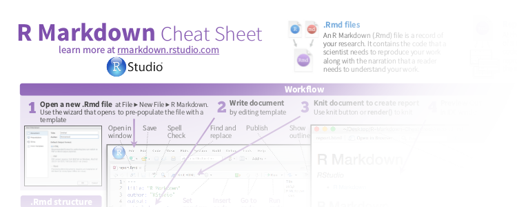
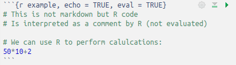
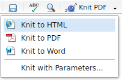

```{r setup, include=FALSE}
knitr::opts_chunk$set(echo = TRUE)
```

## RMarkdown

###{.col-8}

RMarkdown enables you to write detailed reports to:

- ensure reproducibility
- keep track of your analyses
- comment/descibe different steps of your analyses
- export a single (Rmd) document to various formats (Pdf, Html...)

###{.col-4}


```{css}
article .my_flex > p {
  display: flex;
  display: -webkit-flex;
  align-items: center;
  -webkit-align-items: center;
  justify-content: space-around;
  -webkit-justify-content: space-around;
  font-size: 50px;
}
```


### Rmarkdown {.box-8 .offset-2 .bg-red .my_flex}

 +  + 

```{r, echo = FALSE, eval = FALSE}
# Hiding as the sound is not working in the room...
vembedr::embed_vimeo("178485416")
```

## Rmarkdown document | Structure

A Rmarkdown document document contains 3 elements:

```{block, type = 'float-r'}

```

- A **<span class = "red">YAML header</span>** to define document wide options
- Text which is formatted using the **<span class = "blue">markdown"</span>** syntax
- **<span class = "green">chunks</span>** containing the code to be interpreted by _R_ 

## Markdown

**Markdown** is used to **format the text**

### Markup language {.box-6 .bg-blue .build}

- Such as Xml, HTML
- A coding system used to structure text
- Uses markup tags (_e.g._ `<h1></h1>` in HTML)

### HTML {.box-6 .bg-green .my_code .stretch .build}

```
<!DOCTYPE html>
<html>
<body>

<h1>This is a heading</h1>

<p>This is some text in a paragraph.</p>

</body>
</html>
```

### **Lightweight** markup language{.box-6 .bg-blue .build}

- Easy to read and write as it uses simple tags (_e.g._ `#`)

```{css}
article .my_code > pre {
  background: none;
  /*border-left: none;*/
}
```

### MD {.box-6 .bg-green .my_code .stretch .build}

```
# This is a heading

This is some text in a paragraph
```

## Markdown

- Most common text formatting **tags** are defined:
    + Headers (`#`, `##`, `###` ...)
    + **bold** (`**`This will be bold`**`)
    + *italic* (`*`This will be italic`*`)
    + `code` (` ` `This will be some inline coding stuff` ` `)
    + Links to URLs (`[Text describing the link](http://example.com)`)
    + Many more: Have a look at the online documents on the [Rmarkdown website](http://rmarkdown.rstudio.com/lesson-8.html) or download the [cheatsheet as Pdf](https://www.rstudio.com/wp-content/uploads/2016/03/rmarkdown-cheatsheet-2.0.pdf) (the link can be found in the Rstudio Help menu)

### {.col-10 .offset-1}



## Including _R_ code

### Inline code {.box-6 .bg-blue .build .middle}

To integrate small pieces of _R_ codes

- Use backticks (` ` `) combined to the keyword r (`` `r '\x60r <your R code>\x60'` ``)
- Example: type in ``1 + 1 = `r '\x60r 1+1\x60'` `` to render 1 + 1 = `r 1+1`.

### Code chunks {.box-6 .bg-blue}

Can contain bigger pieces of _R_ code

- chunks are defined between two lines starting with a 3 backticks tag (` ``` `)
- curly brackets define how to interprete the content (_R_ code but other languages such as Python are also supported)
  + ` ```{r} ` is the minimum to define a starting _R_ chunk
  + can contain more options (name of chunk, whether to show it or not, evaluate it or not)



## Combining _R_ code and markdown text

### {.col-8}


Both parts (_R_ code and markdown) are knitted together in the final document:

- R chunks are extracted, interpreted separately
- The result is formatted (together with the source code) and integrated into the markdown document
- The markdown document is converted to the desired document format (Pdf, Html...)
- Fully integrated in Rstudio (Knit button)




### {.col-4}


# Exercise: Write your first document


## Learn to use the markdown syntax

Before writing your own Rmarkdown document, use the excellent ressource on [www.markdowntutorial.com](http://www.markdowntutorial.com/) to learn the basics of markdown formatting.
