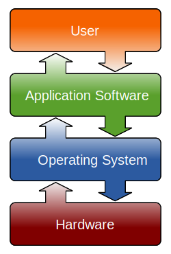
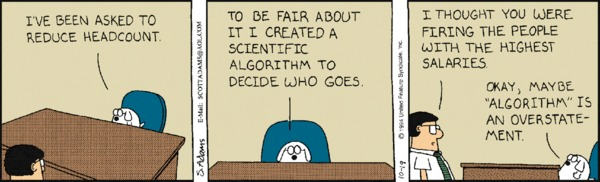
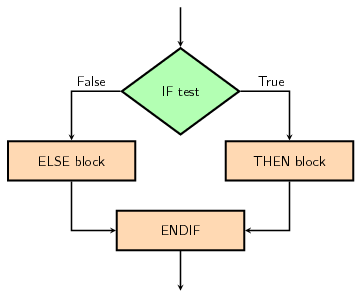
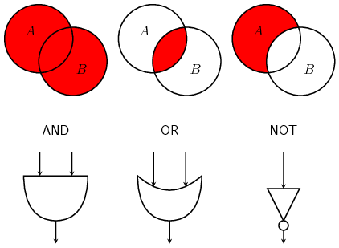
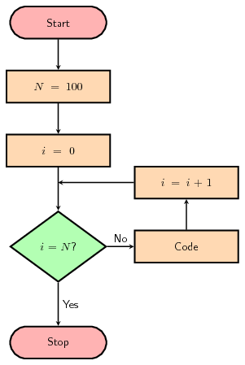

<!-- 1 hour in 2016 -->

```{r setup, include=FALSE}
knitr::opts_chunk$set(echo = TRUE)
```

```{r, message = FALSE, echo = FALSE}
library(tidyverse)
```

## Hardware vs Software

- **Hardware**: The **body** of a computer
- **Software**: The **soul** of a computer

<!-- Media were downloaded from pixabay under the Creative Commons CC0 license -->
<div class = "col2">
```{r, fig.align = "center", echo = FALSE, out.width = "75%"}

```
</div>
<div class = "col2">
```{r, fig.align = "center", echo = FALSE, out.width = "50%"}

```
</div>

## Hardware vs Software

<div class = "col2 center">
```{r, fig.align = "center", echo = FALSE}

```
</div>

## Binary | How information is stored

- 1 or 0 (on or off)

- This is how everything is stored! Even music and pictures!
- bit = 1 binary digit
- byte = 8 bits
- Two digits are easier to manipulate
- Less complexity = less errors or chances to fail (permutations of bits)

## How do we get to binary? | Decimal (base 10) vs binary (base 2)

<div class = "col3">

```{r, echo = FALSE}
# From http://stackoverflow.com/questions/6614283/converting-decimal-to-binary-in-r
data_frame(Decimal = c(0:5, 15)) %>%
  rowwise() %>%
  mutate(Binary = paste(sapply(strsplit(paste(rev(intToBits(Decimal))), ""), `[[`, 2), collapse = ""),
         Binary = stringi::stri_sub(Binary, -4)) %>%
  knitr::kable()
```

</div>

<div class = "col2">

</div>

## How do we get to binary? | Decimal (base 10) vs binary (base 2)

<div class = "col2">
### Example:

- 107 (decimal, base 10) corresponds to **01101011** in binary (base 2)
- Is 107 odd or even? (Is there no remainder after dividing by 2?)
    + If it is **odd**: put a **1** in the row
    + If it is **even**: put a **0** in the row
- In the next row use the integer division by 2 (`floor()` or `%/%`)
- Write all the bits from the bottom to top to get the binary value

</div>

<div class = "col2">


```{r, echo = FALSE}
data_frame(n = 0:8, Number = 107) %>%
  mutate(a = Number %/% 2^n) %>%
  mutate(b = lag(a)/2, c = ceiling(b-a)) %>%
  mutate(d = a*2 + c) %>%
  mutate(division = paste(d, "/ 2 = ", b), remainder = paste("+", c)) %>%
  filter(n != 0) %>%
  select(division, remainder) %>%
  rename_(.dots = set_names(names(.), c("Divide last integer value (floor)", "Even or odd?"))) %>%
  knitr::kable()
```

</div>

## What is a Program?

- A program is a set of instructions that tell a computer what to do!
- machine code
- A recipe for a computer
- Written example: How do you make a ham and cheese sandwich? (Think about making consistent results!)

<div class = "box col2">
### Recipe: Bake a ham

- Preheat oven to 450
- Put ham in a baking pan
- Put honey glaze on the ham
- Put ham in oven for 1 hour
</div>

<div class = "box col2">
### Program

- Type in principal, interest rate and period of saving
- Compute total interest earned
- Add interest to principal
- Print out new principal amount
</div>

- An efficient chef can use an ingredient without worrying about exactly how it is made
- A great chef with ultimately understand how each component is made, to better appreciate the interactions among the parts.

## What is a source code?

- We can't tell a computer general statements of what we want to do...
    + "Do my taxes!"
    + "Write my thesis!"
- Code is a way of telling the computer what we want to do in words that it understands...


<!-- from [wikimedia](https://commons.wikimedia.org/wiki/File:Prog-languages.png) -->
```{r, fig.align = "center", echo = FALSE}
knitr::include_graphics("img/04_prog_languages.png")
```

## Workflow:

<div class = "float-r">
```{r, echo = FALSE}
knitr::include_graphics("img/04_high_level_to_low.png", dpi = 100)
```
</div>

- We edit the program
- A compiler translates this program
- The computer runs the translated program
- We analyze the output and go back to editing until our program is finished
- Source code can be:
    + Compilated
    + Interpreted

### Syntax

- Some differences are superficial:
    + BASIC: `print`
    + Java: `System.out.print();`
    + C++: `printf();`
- Other differences are more significant

## High level _vs_ low level programming languages
  
<div class = "col2">
    
### [Python](https://www.python.org/)
    
```
#!/usr/bin/env python
print "Hello from Biostat2!";
```

### [C++](https://en.wikipedia.org/wiki/C%2B%2B)

```
#include <stdio.h>

int main(void)
{      
  printf("Hello from Biostat2!\n");
  return 0; 
} 
```
</div>


<div class = "col2">

### [GNU assembler](https://en.wikipedia.org/wiki/GNU_Assembler)

```
.LC0:
	.string	"Hello from Biostat2!"
	.text
	.globl	main
	.type	main, @function
main:
.LFB0:
	.cfi_startproc
	pushq	%rbp
	.cfi_def_cfa_offset 16
	.cfi_offset 6, -16
	movq	%rsp, %rbp
	.cfi_def_cfa_register 6
	movl	$.LC0, %edi
	call	puts
	movl	$0, %eax
	popq	%rbp
	.cfi_def_cfa 7, 8
	ret
	.cfi_endproc
```

</div>
    
## How do we write a program? | Errors that can occur

- A program can have 3 types of errors:
    + *compile-time errors*: The compiler finds syntax errors and other basic problems
    + *run-time errors*: A problem that occurs during program execution which causes a program to terminate abnormally (such as trying to divide by zero).
    + *logical errors*: A program that runs but produces incorrect results, perhaps using an incorrect formula.

## Errors | Compile time errors

- Errors which are detected during the compilation
    + Syntax
    + Declaration of variables

<div class = "col2">

```
#include <stdio.h>
 
int main(void)
{   
    int a = 8;
    int b = 4;
    int c = 2;
    int average = (a + n) / 2;
    int result = average / c;
    
    printf("Dividing the mean of %d and %d by %d gives: %d\n", a, b, c, result);
    return 0; 
}
```
</div>
<div class = "col2">
<div class = "box">
```
error: ‘n’ undeclared (first use in this function)
     int average = (a + n) / 2;
                        ^
```
</div>
</div>

## Errors | Run-time errors

- Errors which are detected during program execution causing it to crash
    + division by 0

<div class = "col2">
```
#include <stdio.h>
 
int main(void)
{   
    int a = 8;
    int b = 4;
    int c = 0;
    int average = (a + b) / 2;
    int result = average / c;
    
    printf("Dividing the mean of %d and %d by %d gives: %d\n", a, b, c, result);
    return 0; 
} 
```
</div>
<div class = "col2">
<div class = "box">
```
Floating point exception
```
</div>
</div>

## Errors | Logical errors

- Program runs
- Results are unexpected for example due to wrong formula:
    + average defined as `a + b / 2` instead of `(a + b) / 2`

<div class = "col2">
```
#include <stdio.h>
 
int main(void)
{   
    int a = 8;
    int b = 4;
    int c = 2;
    int average = a + b / 2;
    int result = average / c;
    
    printf("Dividing the mean of %d and %d by %d gives: %d\n", a, b, c, result);
    return 0; 
} 
```
</div>
<div class = "col2">
<div class = "box">
```
Dividing the mean of 8 and 4 by 2 gives: 5
```
</div>
</div>

## Algorithm

<div class = "box bg-green center">
###Definition

> An algorithm is a **well-ordered** collection of **unambiguous** and **effectively computable** operations that when executed **produces a result** and **halts in a finite amount of time**.  
_Schneider and Gersting 1995_
</div>

```{r, fig.align = "center", echo = FALSE}

```

> _[© Dilbert by Scott Adams](http://dilbert.com/strip/1994-10-19)_

## Algorithm

### Well-ordered:
- All of the steps must be in a logical order.
- Otherwise errors could occur:
    + _example:_ You can't bake a frozen pizza before you take the plastic wrap off!

### Unambiguous:

The directions have to make sense to be as simple as possible

If you can break down the step into two or more simpler steps, it is too complex

example: If the directions on the frozen pizza box say:

- Step 1: Bake the pizza _What does this mean?_
- Step 2: Eat the pizza

## Algorithm

### Effectively computable:

The step must be doable!

ex: If the directions on the frozen pizza box say:

Step 1: Preheat oven to 1000°C
There are ovens that do this, but yours probably doesn't

### Produces a result:

The program has to do something! Otherwise, we don't know if it solves the task it is supposed to.

Even a simple “Your pizza is ready!” prompt is good enough...

### Halts in a finite amount of time:

If the program takes an infinite amount of time to finish, the
result will be of no use to you.

Example: an algorithm to print all numbers larger than 10.

## Pseudocode

- A method to organize a program in advance, and plan what you want to do
- Not written in normal language, but not in pure code either
- It's a recipe for your program, that someone else should be able to understand and utilize!

<div class = "box">
<div class = "float-r">
_[example from the CS160 site](http://computerscience.chemeketa.edu/cs160Reader/ProgrammingLanguages/Pseudocode.html)_
</div>
### Example

<div class = "col2">

> Get the users test and work grades. Tell the user they passed if their overall average is 60% or above.

</div>
<div class = "col2">

```
print "Enter test average:"
testGrade = getInputFromUser()
print "Enter work average:"
workGrade = getInputFromUser()
overallGrade = (testGrade + workGrade) / 2
if (overallGrade >= 60)
  print "You passed"
```
</div>
</div>

## Variables

- Variables store information for later use
- Variable names should be clear and understandable
- **Be consistent with naming!**, use [naming conventions](https://journal.r-project.org/archive/2012-2/RJournal_2012-2_Baaaath.pdf):
    + alllowercase
    + period.separated
    + **underscore_separated** (_recommended by [Hadley Wickham](http://adv-r.had.co.nz/Style.html)_)
    + lowerCamelCase
    + UpperCamelCase
- Example: my_age, my_name, class_size, name_list, is_taller
    + _my_age_ to store a number
    + _my_name_ to store letters (a string)

## Types of Variables

- Numeric
    + Integer, Float, double
    + In R: Numeric, Integer, Complex
- Strings
    + Character (same in R)
- Boolean (In R: Logical)


## Control statements | IF, THEN, ELSE

- IF, THEN, ELSE statements:
    + Require boolean entries (`TRUE`/`FALSE`)
    + Use **indentations** in the pseudocode
    
<div class = "box col2">

### Pseudocode:

```
IF condition THEN
    do_task()
ELSE
    do_something_else()
ENDIF
```
</div>

<div class = "box col2">

### Flowchart:

```{r, fig.align = "center", echo = FALSE}

```

</div>


## Logical/boolean operators | AND, OR, NOT

- Can be used with non boolean tests but always return boolean values

<div class = "col2">
```{r, echo = FALSE}

```

</div>
<div class = "col2">
--------- --------- --------- --------- ---------
    A         B      A AND B   A OR B     NOT A
--------- --------- --------- --------- ---------
 False      False     False     False     True
 
 False      True      False     True      True
 
 True       False     False     True      False
 
 True       True      True      True      False
--------- --------- --------- --------- ---------
</div>


## Conditional blocks in _R_

- `if`, `else if` and `else`
- blocks are delimited with curly braces `{` and `}`
- **indent** your code after `{` (see Hadleys recommendations)

```{r, eval = TRUE}
n1 <- 11
n2 <- 7
if (n1 == n2) {
  print(paste(n1, "and", n2, "are equal"))
} else if (n1 > n2) {
  print(paste(n1, "is greater than", n2))
} else {
  print(paste(n1, "is smaller than", n2))
}
```

## For loops

<div class = "col2">



</div>
<div class = "col2">

### For loops in _R_

```{r}
v <- c(3:7)
for (i in v) {
  print(i)
}
```


</div>

## Other loops, `while` and `repeat`

Exist in _R_ but not covered in this course


## Functions

A function is a chunk of code that does “something”

- It's a black box, but how to use it should be understandable
- You need to know:
    + what goes in
    + what comes out
    + and not much more...
- Function: any command you write that performs a multi-step procedure.
- useful when you have to repeat some work often
- In _R_ you already used some functions that are already provided:
    + _e.g._ `sum()`, `stdev()`, `ggplot()`

## Functions in _R_ | minimal function

- Use the assignement `<-` and the keyword `function` to store a function in an object (name of function)
- Example of a minimal function that does nothing:

```{r}
f <- function() {}
f
```
- Calling `f` will not execute the code inside the function
- A function is called with parenthesis `()` _i.e._ `f()` in our example

```{r}
f()
```

- In R a function **will always return** something: Here `f()` returns `NULL`

## Functions in _R_ | putting some code inside the function

```{r}
f <- function() {
  print("Hello from biostat2!")
}
```

- The code isn't executed yet: it is "stored" for later use
- We can call the function as before using `f()`

```{r}
f()
```

- Use functions whenever you often reuse the same piece of codes.

## Functions in _R_ | **returning** a result

```{r}
f <- function() {
  1 + 1
  print("Hello from biostat2!")
  3 + 2
}

result <- f()

# Here we show what we have stored in result:
result
```

- The function **returns** the last command which is generating a result

## Functions in _R_ | **returning** a result

- You can explicitly use the **`return()`** command to **exit the function earlier** and return a specified value

<div class = "col2">
```{r}
f <- function() {
  1 + 1
  3 + 2
}
f()

f <- function() {
  1 + 1
  return()
  3 + 2 
}
f()
```
</div>

<div class = "col2">
```{r}
f <- function() {
  1 + 1
  return(6)
  3 + 2
}
f()
```
</div>

## Functions in _R_ | arguments

- You already know objects or variables:

```{r}
a <- 1
a
```

- You can use variables inside a function

<div class = "col2">
```{r, error = TRUE}
f <- function() {
  a <- a + 1
  return(a)
}
f()
```

</div>
<div class = "col2">
```{r, error = TRUE}
rm(a)
f <- function() {
  a <- a + 1
  return(a)
}

a <- 1
f()
```
</div>
- Not very handy: here we declare `a` before the function: **You should not design your function like this**

## Functions in _R_ | arguments

- You can specify the objects/variables your function will use as **arguments**

```{r, error = TRUE}
rm(a) # Removing any a object that might have been created before
f <- function(a) { # Note that we added a between parenthesis
  a <- a + 1
  return(a)
}

f()

f(2)
```

## Functions in _R_ | multiple arguments

```{r, error = TRUE}
f <- function(a, b) {
  result <- a / b
  return(result)
}
```

<div class = "col2">
```{r, error = TRUE}
f()
f(5)
```
</div>
<div class = "col2">
```{r, error = TRUE}
f(5, 2)
f(a = 5, b = 2)
f(b = 5, a = 2)
```
</div>

- Note that we use `=` here and not `<-`

## Functions in _R_ | arguments with default values

<div class = "col2">
```{r, error = TRUE}
f <- function(a, b) {
  result <- a / b
  return(result)
}
f()
```

- By default you must supply values
- You can assign default values to your arguments

</div>
<div class = "col2">
```{r, error = TRUE}
f <- function(a = 5, b = 2) {
  result <- a / b
  return(result)
}
f()
f(6, 3)
f(b = 6, a = 3)
```
</div>

## Functions in R | Example

Going back to our `if`, `if else`, `else` example and wrapping it in a function:

```{r, eval = TRUE}
my_compare <- function(n1, n2) {
  if (n1 == n2) {
    message(paste(n1, "and", n2, "are equal"))
  } else if (n1 > n2) {
    message(paste(n1, "is greater than", n2))
  } else {
    message(paste(n1, "is smaller than", n2))
  }
}

my_compare(11, 10)
my_compare(10, 10)
my_compare(2, 10)
```

## Manage exceptions

- It is unlikely that your code will crash _R_ (runtime error)
    + Try the classical division by 0 (`1/0`)
    + Many exceptions are catched and handled by _R_


```{r, error = TRUE}
my_function <- function(v) {
  result <- v / 2;
  print(result)
}

my_function(10)
my_function(TRUE)
my_function("a")

```

## Manage exceptions

- It is better to implement tests to avoid _runtime errors_ or _logical errors_. Helps the debugging process.
    + _R_ provides useful functions to test your variables: `is.numeric()`, `is.character()`
    + _R_ provides also useful functions to manage exceptions: `stop()`, `warning()`

```{r, error = TRUE}
my_function <- function(v) {
  if (!is.numeric(v)) stop("argument v should be a number!")
  result <- v / 2;
  print(result)
}

my_function(10)
my_function(TRUE)
my_function("a")
```

## Scope of variables

### Rmarkdown

- Objects are linearly transmitted to the next chunk (**chunks are not independent**)
- When knitting, R code chunks do not have access to objects that were **only** used in your editing session and not defined in the Rmarkdown document

### Functions

<div class = "col3">
```{r}
a <- 1

f <- function(a) {
  a <- a + 1
  return(a)
}

f(4)
a
```
</div>
<div class = "col3">
```{r, error = TRUE}
a <- 1

f <- function() {
  a <- a + 1
  return(a)
}

f()
a
```
</div>
<div class = "col3">
```{r, error = TRUE}
a <- 1

f <- function(b) {
  b <- b + 1
  return(b)
}

f(a)
b
```
</div>
