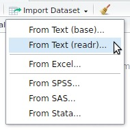
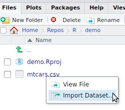
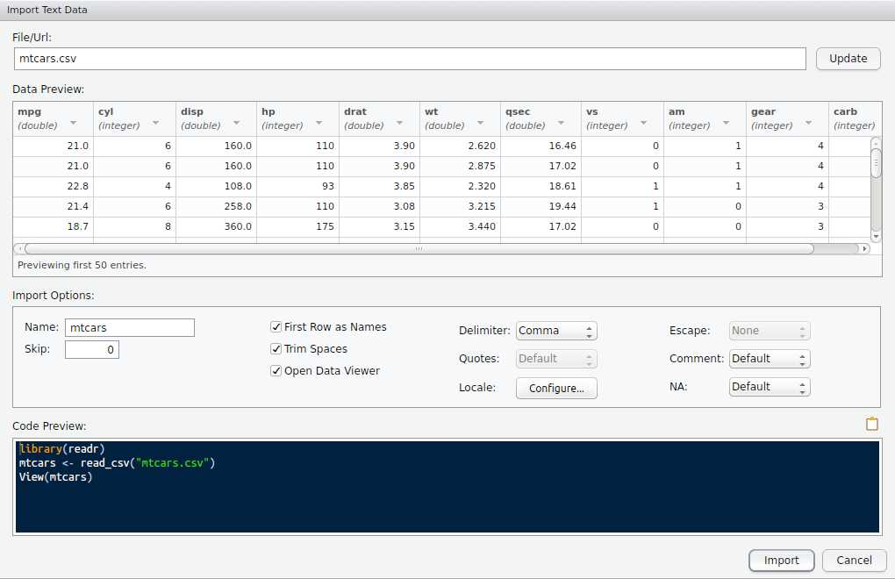
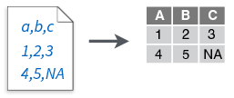
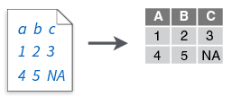
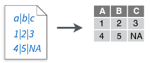
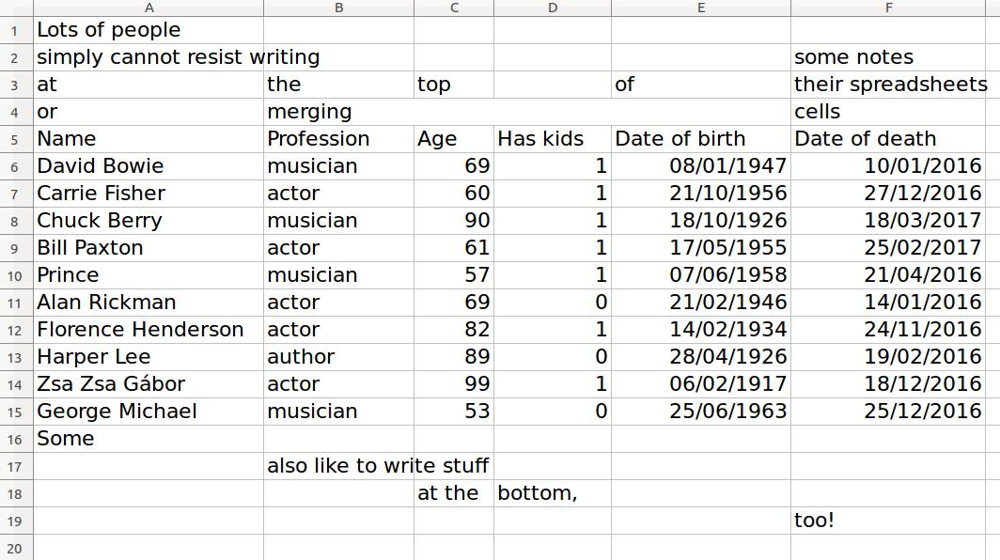

```{r setup, include = FALSE}
library(tidyverse)
library(readxl)
```

```{css}
.box > h3:first-child > code {
  background-color: rgba(250, 250, 250, 0.5);
}
```


## Learning objectives {.vs2}

### You will learn to: {.box-10 .offset-1 .bg-red .icon}


- use `readr` and/or `readxl` to import your data into _R_
- use the interactive RStudio interface to visualise your data
- appreciate tibbles
- adjust the type of the data you would like to import

## Importing data{.vs3}

###{.box-6 .bg-blue .offset-0 .build .stretch}

- Represents probably the first step of your work
- R can handle multiple data types
    + flat files (`.csv`, `.tsv`, ...)
    + excel files (`.xls`, `.xlsx`)
    + foreign statistical formats (`.sas` from SAS, `.sav` from SPSS, `.dta` from Stata)
    + databases (SQL, SQLite ...)
    
### Tidyverse implementation {.box-6 .bg-yellow .offset-0 .icon}


- R base already provides functions for text files (_i.e._ `read.csv()`, `read.delim()`)
- tidyverse redefines these functions:
    + **speed**
    + **characters are not coerced to factors by default**
    + generates tibbles

## Tibbles

### Tibbles{.box-8 .bg-blue .offset-2 .icon}


- have a refined print method that shows only the first 10 rows.
- show all the columns that fit on screen and list the name of remaining ones.
- each column reports its type.
- makes it much easier to work with large data.

### Hint {.box-6 .offset-3 .bg-yellow .icon-small .vs1 .build}


Use `as_tibble()` to convert a `data.frame` to a tibble


## Tibbles | `tibble` vs `data.frame`

### `data.frame`{} {.box-8 .offset-2 .bg-cobalt .compact-output}

```{r, class = "build"}
iris
```

## Tibbles | `tibble` vs `data.frame`

### `tibble`{} {.box-8 .bg-cobalt .compact-output .build}

```{r, class = "build"}
iris %>% as_tibble()
```

### `tibble` adjusts to width {.box-4 .bg-cobalt .compact-output }

```{r, echo = 2, class = "build"}
options(tibble.width = 30)
iris %>% as_tibble()
options(tibble.width = NULL)
```

### tibble printing enhancements {.box-6 .offset-3 .bg-yellow .build}

- column type is visible
- shows only the first 10 rows
- shows only the columns that fit on the screen

## Create tibbles

### `tibble()`{} {.box-6 .bg-blue .build}

- similar to `base::data.frame()` but
    + does not coerce characters to factors
    + does not change column names
    + never uses rownames

```{r}
data.frame(`bad name` = 1:4,
           x = rep(letters[1:2], 2)) %>%
  str()
```

```{r}
tibble(`bad name` = 1:4,
       x = rep(letters[1:2], 2)) %>%
  str()
```

### `tribble()`{} {.box-6 .bg-blue}

- **transposed tibble**
- row-by-row layout
- columns are defined by formula (`~`)

```{r}
tribble(
  ~x, ~y,  ~z,
  "a", 2,  3.6,
  "b", 1,  8.5
)
```

## Create tibbles

### Create tibbles by copy paste {.box-6 .offset-3 .bg-yellow .icon .vs3}


- `datapasta` package
- can be useful to copy paste small datasets
- **Rstudio addin**
- have a look at the [vignette](https://cran.r-project.org/web/packages/datapasta/vignettes/how-to-datapasta.html)

## The tidyverse packages to import your data

### Tidyverse packages to import your data {.box-10 .offset-1 .bg-blue .icon}


Seven file formats are supported by the readr package:

- `read_csv()`: comma separated (CSV) files
- `read_tsv()`: tab separated files
- `read_delim()`: general delimited files
- `read_fwf()`: fixed width files
- `read_table()`: tabular files where colums are separated by white-space.
- `read_log()`: web log files

### readxl {.box-6 .bg-green .icon}


To import excel files (`.xls` and `.xlsx`):

- `read_excel()`
    + `read_xls()`
    + `read_xlsx()`
    
### haven {.box-6 .bg-red .icon .stretch}


- `read_sas()` for SAS
- `read_sav()` for SPSS
- `read_dta()` for Stata

## Rstudio data import | interactive call to `readr` or `readxl`

```{css}
/* Center two images in boxes*/
.center-pair p {
  display: flex;
  display: -webkit-flex;
}

.center-pair p > img {
  max-width: 45%;
  margin: auto;
}
```


### Import button{.box-6 .bg-blue .center-pair}

- Use the `Import Dataset` button in the upper right panel or click on the file in the lower right panel

 

- Will interactively select the appropriate function
- Copy paste the generated command to your Rmarkdown document

### Example{.box-6 .bg-green}

- Create a new project (easier to setup the root project path)
- Run the following command to copy the `mtcars.csv` file shipped with `readr` to your project folder:

```{r, echo = TRUE, eval = FALSE}
file.copy(
  from = readr::readr_example("mtcars.csv"),
  to = "mtcars.csv"
  )
```
```{r, echo = FALSE, eval = FALSE}
source("https://git.io/v9WkW")
```
- Use the interactive `Import Dataset` button to import the `mtcars.csv` file.

## Rstudio data import | preview window

###{.col-10 .offset-1}



# Importing flat files

## `readr` functions

### `read_csv()`{} {.box-4 .bg-gray .build}

- **Comma** delimited files



### `read_csv2()`{} {.box-4 .bg-gray}

- **Semi-colon** delimited files


### `read_tsf()`{} {.box-4 .bg-gray}

- **tab** delimited files



### `read_delim()`{} {.box-6 .offset-1 .bg-gray .vs2 .build}

- **any delimiter**:



```{r, eval = FALSE}
read_delim(file, delim = "|", ...)
```

### `read_fwf()`{} {.box-4 .bg-gray .vs2 .stretch}

- **fixed width** files


## Reading flat files | csv file

### Example of `csv` file: _mtcars.csv_{.box-10 .offset-1 .bg-grayblue}

```
"mpg","cyl","disp","hp","drat","wt","qsec","vs","am","gear","carb"
21,6,160,110,3.9,2.62,16.46,0,1,4,4
21,6,160,110,3.9,2.875,17.02,0,1,4,4
22.8,4,108,93,3.85,2.32,18.61,1,1,4,1
21.4,6,258,110,3.08,3.215,19.44,1,0,3,1
18.7,8,360,175,3.15,3.44,17.02,0,0,3,2
...
```

### Using `read_csv()`{}{.box-10 .offset-1 .bg-blue}

- `readr` provides some example files
- use `readr::readr_example()` to access them
- is able to read **local** and **remote** files
- is able to read compressed files (`.zip`, `.gz`, ...)

## Reading flat files | csv file

### Using `read_csv()`{} {.box-10 .offset-1 .bg-cobalt .compact-output}

```{r}
readr_example("mtcars.csv") %>% # Generates the path to the example file
  read_csv()
```


## Reading flat files | csv file

### Column types{.box-7 .bg-blue}

- are guessed from the **1000** first rows
    + adjustable `guess_max` option
- guessed types are displayed as a _message_
- to hide this message:
    + **lazy method 1**: set `message = FALSE` in your rmarkdown chunk option.
    + **lazy method 2**: set `col_types = cols()`
    + Hadley Wickham recommends to adjust the `col_types` to avoid any problem
    
### Message {.box-5 .bg-cobalt .stretch}

```{r, echo = FALSE}
dummy <- readr_example("mtcars.csv") %>% # Generates the path to the example file
  read_csv()
```

## Reading flat files | csv file

```{css}
/* from https://csswizardry.com/2010/02/mutiple-column-lists-using-one-ul/ */
.col-list ul {
  overflow: hidden;
  border-top: 1px solid #005c99;
  padding-top: 10px;
}

.col-list li {
  line-height: 1.1em;
  border-bottom: 1px solid #005c99;
  float: left;
  display: inline;
}

.c2 li {
  width: 50%;
}

.c3 li {
  width: 33.333%;
}
```

### Explicit method {.box-5 .bg-blue .col-list .c2 .stretch}

Use the following functions in `cols()`:

- `col_double()`
- `col_integer()`
- `col_character()`
- `col_logical()`
- `col_factor()`
- `col_date()`
- `col_datetime()`
- `col_time()`
- `col_guess()`
- `col_skip()`

### Example 1 {.box-7 .bg-cobalt .stretch}

```{r, eval = FALSE}
readr_example("mtcars.csv") %>%
  read_csv(col_types = cols(mpg = col_double(),
                            cyl = col_integer(),
                            disp = col_double(),
                            hp = col_integer(),
                            drat = col_double(),
                            wt = col_double(),
                            qsec = col_double(),
                            vs = col_integer(),
                            am = col_integer(),
                            gear = col_integer(),
                            carb = col_integer())
  )
```

### Compact string shortcuts {.box-7 .bg-blue .col-list .c3 .stretch}

- c = character
- i = integer
- n = number
- d = double
- l = logical
- D = date
- T = date time
- t = time
- ? = guess
- _/- = skip

### Example 2 {.box-5 .bg-cobalt .stretch}

```{r, eval = FALSE}
readr_example("mtcars.csv") %>%
  read_csv(col_types = cols(
    mpg = "d", cyl = "i", disp = "d",
    hp = "i", drat = "d", wt = "d",
    qsec = "d", vs = "i", am = "i",
    gear = "i", carb = "i"))

readr_example("mtcars.csv") %>%
  read_csv(col_types = "dididddiiii")
```

## Try it yourself

```{r, echo = FALSE}
options(tibble.print_min = 4)
```


### Exercise 1{.box-10 .offset-1 .bg-green}

- import the `mtcars.csv` file again **but**
    + read in the _number of cylinders_ as **characters**.
    + skip all columns except _miles per gallon_, _cylinder_ and the _number of gears_

### Answer {.box-12 .bg-cobalt .build}

```{r, row = c(8, 4), class = "build"}
readr_example("mtcars.csv") %>%
  read_csv(col_types = cols_only(cyl = col_character(),
                                 mpg = col_double(),
                                 gear = col_integer()))

readr_example("mtcars.csv") %>%
  read_csv(col_types = "dc_______i_") 
```

## Try it yourself

```{css}
/* we used two chunks to hide the local file access */
#challenge_display {
  border-bottom: none;
  border-radius: 0;
}

#challenge_output {
  margin-top: -10px;
  border-top:none;
  border-radius: 0;
}
```


### Exercise 2{.box-10 .offset-1 .bg-green}

- try to load the file `challenge.csv` (provided by `readr_example()`)
- store the content in an object `challenge`

### Step 1 {.box-10 .offset-1 .bg-grayblue .build .compact-output}

- what happened?
- you can use `problems(challenge)` to list the failures again

```{r, echo = FALSE, results = "hide"}
# To avoid a long path in the error output
file.copy(
  from = readr::readr_example("challenge.csv"),
  to = "challenge.csv"
  )
```

```{r challenge_code, eval = FALSE}
challenge <- readr_example("challenge.csv") %>% 
  read_csv()
```

```{r challenge_output, echo = FALSE}
challenge <- read_csv("challenge.csv")
```

## Try it yourself

### Exercise 2{.box-10 .offset-1 .bg-green}

- try to load the file `challenge.csv` (provided by `readr_example()`)
- store the content in an object `challenge`
- override the guessed column type to allow the import

### Step 2 {.box-10 .offset-1 .bg-grayblue .build}

- method 1

```{r}
challenge <- readr_example("challenge.csv") %>% 
  read_csv(col_types = "dD")
```

- method 2 (not recommended)

```{r}
challenge <- readr_example("challenge.csv") %>% 
  read_csv(guess_max = 1500) # n > 1000: look at the first row causing a failure
```


## Skipping lines

### `skip` argument {.box-4 .bg-yellow}

To skip the first _n_ rows

### `n_max` argument {.box-4 .bg-red}

To stop reading after _n_ rows

### `col_names` argument {.box-4 .bg-blue}

override column names

%end%

```{r, message = FALSE, row = c(4, 8)}
readr_example("mtcars.csv") %>%
  read_csv()
```

```{r, message = FALSE, row = c(4, 8), class = "build"}
readr_example("mtcars.csv") %>%
  read_csv(skip = 3,
           n_max = 3,
           col_names = FALSE)
```


```{r, message = FALSE, row = c(4, 8), class = "build"}
readr_example("mtcars.csv") %>%
  read_csv(skip = 3, n_max = 3,
           col_names = c("mpg", "cyl", "disp", "hp", "drat", "wt", "qsec", "vs", "am", "gear", "carb"))
```

## Internationalisation | locales

```{css}
.more-space h3 + pre {
  margin-bottom: 10px;
}
```

### Example{.box-5 .bg-green .build .stretch .more-space}

```
"name";"first_name";"born";"value"
"Dupont";"Michel";03/10/71;1,2
"Doe";"John";27/02/74;1,7
"Mustermann";"Max";14/08/69;1,6
```

- Link to the file: <https://git.io/v9Wmf>
- Trying to import using `read_delim()`

```{r, message = FALSE}
read_delim("data/locale_1.csv",
           delim = ";")
```

- dates are detected as **characters** (_minor issue_)
- decimal numbers are not detected as they should (**_major issue_**)

### Adjusting the  `locale` argument {.box-7 .bg-green}


```{r, message = FALSE}
read_delim("data/locale_1.csv",
           delim = ";",
           locale = locale(decimal_mark = ",",
                           date_format = "%d/%m/%y"))
```

- have a look at `?parse_datetime` to list the datetime format specifications
- `read_csv2()` is a shortcut to `read_delim()` using `;` as a delimiter and `,` as the decimal mark
- you still need to adjust the date parsing


```{r, eval = FALSE}
read_csv2("data/locale_1.csv",
          locale = locale(date_format = "%d/%m/%y"))

read_csv2("data/locale_1.csv") %>%
  mutate_at(c("born"), parse_date, format = "%d/%m/%y")
```

# Importing MS Excel files


## `readxl` | reading MS Excel files

### readxl {.box-6 .bg-green .icon}


- able to import `.xls` and `.xlsx` files
- `read_excel()`
    + `read_xls()`
    + `read_xlsx()`
- `excel_sheets()` to list all sheets in the Excel file

### new feature {.box-6 .bg-red}

- Version **1.0.0** is out
- import **cell ranges**


## Try it yourself | excel file

### Sample files {.box-8 .offset-2 .bg-green}

- we will use the files shipped with the readxl package
- list of available examples:


```{r, echo = 2}
options(width = 60)
readxl::readxl_example()
options(width = 80)
```

### Sample files {.box-8 .offset-2 .bg-green .build}

- to get used to `readxl` and the import of excel files
    + use the `datasets.xlsx` example file
    + determine how many sheets are contained in the file
    + load the data contained in the `mtcars` sheet
    + you can also try Rstudio's interactive importer

## Try it yourself | excel file

### the `deaths` dataset {.box-8 .offset-2 .bg-green}

- use the `deaths.xls` file in your `data` folder in the projects root (or use the path `readxl_example("deaths.xlsx")`)
- how many sheets does the file contain?
- import the first sheet of the file.
- are you happy with the result?

### {.box-10 .build .offset-1 .bg-cobalt}

```{r, echo = -1}
options(tibble.print_min = 8,
        tibble.print_max = 10)
readxl_example("deaths.xlsx") %>%
  read_excel(sheet = 1)
```

## Try it yourself | excel file{.nvs1}

### {.box-10 .offset-1 .bg-white .bg-grayblue}



### {.box-8 .offset-2 .bg-yellow .icon-small }


- Use the new possibilities of `readxl 1.0.0` to read in your data frame of interest (have a look at `?readxl::read_excel`)

## Try it yourself | excel file

### {.col-8 .offset-2}

```{r}
readxl_example("deaths.xlsx") %>%
  read_excel(sheet = 1, range = "A5:F15")
```

### Alternative calls {.box-8 .offset-2 .bg-cobalt .bg-build}

```{r, eval = FALSE}
readxl_example("deaths.xlsx") %>%
  read_excel(range = "arts!A5:F15")

readxl_example("deaths.xlsx") %>%
  read_excel(range = cell_limits(c(5, 1), c(15, 6), "arts"))
  # have a look at ?cellranger::cell_limits
```

## Reading Excel files | column types

### Column types{.box-5 .bg-blue .compact-table}

- similar to `readr` using the `col_types` argument
- but the **`cols()` function won't work here!**
    + `readr` guesses column type based on the data.
    + `readxl` guesses column type based on Excel cell types
- `col_types` should be adjusted to a character vector
- look at the correspondance in the [readxl vignette](https://cran.r-project.org/web/packages/readxl/vignettes/cell-and-column-types.html)
    ```{r, eval = FALSE}
    vignette("cell-and-column-types")
    ```

###{.box-7 .bg-blue .compact-table}

```{r, echo = FALSE}
tibble::tribble(
  ~`How it is in Excel`,   ~`How it will be in R`, ~`How to request in col_types`,
           "anything",         "non-existent",                   "\"skip\"",
              "empty",  "logical, but all NA",    "you cannot request this",
            "boolean",              "logical",                "\"logical\"",
            "numeric",              "numeric",                "\"numeric\"",
           "datetime",              "POSIXct",                   "\"date\"",
               "text",            "character",                   "\"text\"",
           "anything",                 "list",                   "\"list\""
  ) %>%
  knitr::kable()
```

## Reading Excel files | column types

### mixed column types{.box-6 .bg-green .build}

- try to import the `clippy.xls` example file provided by `readxl`

```{r}
readxl_example("clippy.xls") %>% 
  read_excel()
```

- date of death is coerced to a character
- you can override the column type and select one that can handle **different types**

### override `col_types`{} {.box-6 .bg-green}

```{r}
readxl_example("clippy.xls") %>% 
  read_excel(col_types = c("text", "list"))
```

```{r}
readxl_example("clippy.xls") %>% 
  read_excel(col_types = c("text", "list")) %>%
  tibble::deframe() %>%
  str()
```

## Wrap up

### You learned to: {.box-10 .offset-1 .bg-red .icon}


- appreciate the tibble printing features
    + **column types** are displayed
- use `readr` and/or `readxl` to import your data into _R_
    + using the command line
    + using the interactive RStudio interface
- avoid some common pitfalls during data import
    + wrong types
    + wrong formats (**decimal marks**)
- adjust the imported data types
- select your data of interest in excel files which are **often not tidy** at all!

## Before we stop

### Further reading {.box-8 .offset-2 .bg-blue .icon}


- [R for Data Science](http://r4ds.had.co.nz/data-import.html)
- <http://readr.tidyverse.org/>
    + `vignette("readr")`
    + `vignette("locales")`
- <http://readxl.tidyverse.org/>
    + `vignette("sheet-geometry")`
    + `vignette("cell-and-column-types")`
- [Datacamp course](https://www.datacamp.com/courses/importing-data-in-r-part-1)

### Acknowledgments {.box-8 .offset-2 .vs1 .bg-yellow}

* Hadley Wickham
* Jennifer Bryan
