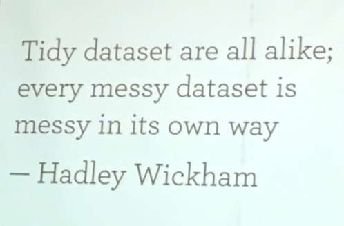
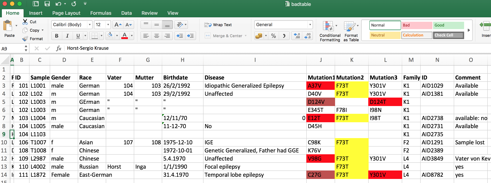
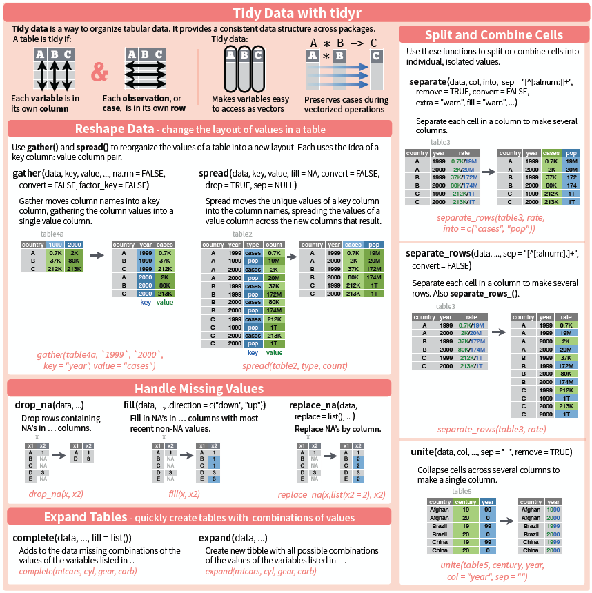

```{r setup, include=FALSE}
knitr::opts_chunk$set(echo = TRUE, fig.align = "center")
# Do not use cache = TRUE with _site.yml! They do not like each other...
```

## Learning objectives
### Definitions {.box-8 .offset-2 .bg-green}

+ Principles of *tidy data* to structure data
+ Find errors in existing data sets
+ Structure data
+ Reshaping data with tidyr


### Comments {.box-8 .offset-2 .bg-blue .build}
+ Cleaning data also requires `dplyr`
+ `tidyr` and `dplyr` are intertwined
+ Focus on "tidy data" 
+ Introduction of `tidyr` ways


## Rationale


```{r, echo=FALSE, warnings=FALSE, out.width = '70%'}


```


## Semantics 
### Definitions {.box-8 .offset-2 .bg-blue}
+ **Variable**: A quantity, quality, or property that you can measure.
+ **Observation**: A set of values that display the relationship between variables. To be an observation, values need to be measured under similar conditions, usually measured on the same observational unit at the same time.
+ **Value**: The state of a variable that you observe when you measure it.

[source: Garret Grolemund](http://garrettgman.github.io/tidying/) and `vignette("tidy-data")`

## Definition

### Tidy data {.col-8 .offset-2 .box .bg-this_col}

1. Each variable is in its own column
2. Each observation is in its own row
3. Each value is in its own cell

```{r echo=FALSE, out.width='90%'}
knitr::include_graphics("http://lsru.github.io/r_workshop/img/tidy-1_600.png")
```

## Tidying messy data

### For clean data ensure that {.col-8 .box .offset-2 .build .bg-this_col}
-	Column names are easy to use and informative
-	Row names are easy to use and informative
-	Obvious mistakes in the data have been removed
-	Variable values are internally consistent
-	Appropriate transformed variables have been added


## Typical flow of data 

###  Source data ➡️ {.col-3 .box .bg-blue}
 * Large scale data sets
	  + MRI, NGS, omics data
 * Single researcher experimental data 
 * External data sets
 * Manually collected data (EDC)

###  Intermediate➡️ {.col-3 .box .bg-green}
Computation or manual clean up
CPU or hands-on time
**"Tidy" data**
Tools: Specialized tools + shell

###  Analysis ➡️  {.col-3 .box .bg-yellow .icon}
Statistical analysis
Exploratory and model building
Hypothesis testing

Tools: R


###  Manuscript{.col-3 .box .bg-red}
Writing stage
Can you reproduce your work?
	* Numbers of your paper
  * Summaries
  * Images
  
Tools: rmarkdown 

###  Currently {.col-9 .box .bg-green .build .icon}
Excel. 
```{r, echo=FALSE, warnings=FALSE, out.width = '8%'}
knitr::include_graphics("img/04_excel_icon.png")
```

###  Currently {.col-3 .box .bg-blue .build}
Word.


## Bad data exercise | online

### {.col-8 .box .bg-green}
- The following table lists missense variants in a gene in a group of patients
- What's wrong with [this Excel]("data/badtable.xlsx") sheet?
- Which problems are "tidy" issues 
```{r, echo=FALSE, warnings=FALSE, out.width = '10%'}
knitr::include_graphics("img/04_excel_icon.png")
```


## Tidy errors
Error | Tidy violation | Comment
------|----------------|--------
Patient names | No | Data protection violation
Identical column names | Yes | Variable error
Inconsistent variables names | No | Bad practice
Non-English columns names | No | Bad practice
Color coding | No | The horror, the horror
Inconsistent dates |No | Use ISO8601 
Multiple columns for one item | Yes | One observation per line
Redundant information | Yes | Each variable is in its own column
Repeated rows | Yes | Each observation is in its own row
Uncoded syndromes | Yes/No | Each value in its own cell
Unnecessary information (Birthdate, comments) | No | bad practice
Name of the table | No | You'll see this often


## Data cleaning exercise | offline 

### Clean the "bad table" {.box-6 .offset-2 .bg-this_col .icon}
 * Bring data into shape such that it conforms to tidy data requirements
 * Pay attention to details of format, less to actual data
 * Do not use R for doing the manipulations
  
  %end%
  
  10 min, discuss

## Common tidy data violations {.vs2}

###  {.col-8 .box .bg-blue .build }
 * Column headers are values, not variable names (`gather`)
 * Multiple variables stored in one column (`separate`)
 * Variables are stored in both rows and columns (`gather`-`spread`)
 * Repeated observations (`nest` or table)
 * Multiple types in one table (`dplyr` data transformation)
 * One type in multiple tables (`dplyr`, combine into table)
 
 
 
# `tidyr` functionality

## tidyr | Introduction: [Cheat sheets](https://www.rstudio.com/resources/cheatsheets/)

```{r, echo=FALSE, out.width = '70%'}

```


## Convert Long / wide format

The wide format is generally untidy _but_ found in the majority of datasets


```{r echo=FALSE, out.width='70%'}
knitr::include_graphics("http://lsru.github.io/r_workshop/img/tidy-gather_600.png")
```
```{r echo=FALSE, out.width='70%'}
knitr::include_graphics("http://lsru.github.io/r_workshop/img/tidy-spread_600.png")
```


## Demo with the iris dataset

```{r, message=FALSE, warning=FALSE}
library("tidyverse", warn.conflicts = F, quietly=T)
as.tibble(iris)
```

## Gather | "melt"
### {.box-8 .bg-cobalt .compact-output .build}
```{r, message=FALSE, warning=FALSE}

iris_melt <- iris %>%
  rownames_to_column(var = "number") %>%
  as_tibble() %>%
  gather(flower, measure, contains("al"))
iris_melt
```

### Comments {.box-6 .bg-blue .build}
 + `contains()` selection, see `dplyr`
 + tibbles don't have rownames


## Spread | "cast"
### {.box-8 .bg-blue .compact-output .build}
```{r}
iris_melt %>%
  spread(flower, measure)
```


## Separate / Unite | Common application

### Dates {.box-6 .bg-blue .build}

```{r, out.width='50%'}
df <- data_frame(year = c(2015, 2014, 2014),
                 month = c(11, 2, 4),
                 day = c(23, 1, 30),
                 value = c("high", "low", "low"))
```

### `unite()` {.box-6 .bg-blue .build}

```{r, out.width='50%'}
df %>%
  unite(date, year, month, day, sep = "-") -> df_unite
```
 
### `separate()` {.box-6 .bg-blue .build}
 - Use **quotes** since we are not refering to objects
 - Default split on non-alphanumeric characters 

```{r, out.width='50%'}
df_unite %>%
  separate(date, c("year", "month", "day"))
```


## Other uses of `tidyr`   {.vs2}

```{r, out.width='50%'}
iris %>%
  gather(flower, measure, 1:4) %>%
  ggplot() +
  geom_boxplot(aes(x = Species, y = measure, fill = flower))
```


## Separate rows | From ugly tables

### Common input {.box-6 .bg-blue .stretch .build}
```{r}
patient_df <- tibble(
    subject_id = 1001:1003, 
    visit_id = c("1,2,3", "1,2", "1"),
    measured = c("9,0, 11", "11, 3" , "12")  )
patient_df
```
Note the incoherent white space


### Combinations of variables {.box-6 .bg-blue .stretch .build}
```{r}
patient_df %>% 
  separate_rows(visit_id, measured, convert=TRUE) -> patient_separate
patient_separate
```

### Comment {.box-6 .bg-green .stretch .build}
To split single variables use `dplyr::separate`

## `dplyr::separate()` | Splitting values

### Set-up {.box-6 .bg-blue .stretch .build}
```{r}
patient <- tibble(
subject_id = 1001:1006,
gender_age = paste(c("m", "f"), floor(runif(6, 21,65 )), sep="-"))
patient
```


### Combinations of variables {.box-6 .bg-blue .stretch .build}
```{r}
patient %>% separate(gender_age, c("sex", "age"), convert=TRUE)
```

## `complete()` | Fill all combinations

### Combinations of variables {.box-6 .bg-blue .stretch .build}
```{r}
patient_separate %>% 
  complete(subject_id, 
           nesting(visit_id), fill=list(measured=0))
```

### Warning {.box-6 .bg-red .build}
 * Use `<NA>`, not 0 for missing data in real life application

```{r}
patient_separate %>% 
  complete(subject_id, 
           nesting(visit_id)) -> patient_complete
patient_complete
```


## Nesting table | Structured data

### `nest()` {.box-6 .bg-blue .build}
```{r out.width = '50%'}
patient_complete %>% 
  nest(visit_id, measured) ->patient_nested
patient_nested
```

### {.box-6 .bg-green .build}
 * Common data structures are hierarchical, e.g. patient-centric with repeat observations
 * Nesting allows to store *collapsed* tibbles and simplifies data management

### `unnest()` {.box-6 .bg-blue .build}
```{r out.width = '50%'}
patient_nested %>% 
  unnest()

```


## Wrap up

### Covered here: {.box-10 .offset-1 .bg-blue }
 * `tidyr` (and `dplyr`) are replacing the `reshape` and `reshape2` packages
- tidy data
    + <http://tidyr.tidyverse.org/>
    + `vignette("tidy-data")`
 - Further reading
    + `tidyjson` - Retrieve json data as nested tibbles

### Acknowledgments {.box-5 .offset-1 .vs1 .bg-yellow .build}

* Hadley Wickham
* Jeremy Stanley

### Thank you for your attention! {.box-5  .bg-this_col .build}