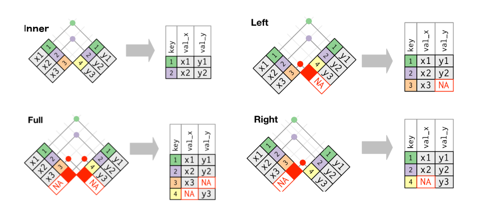
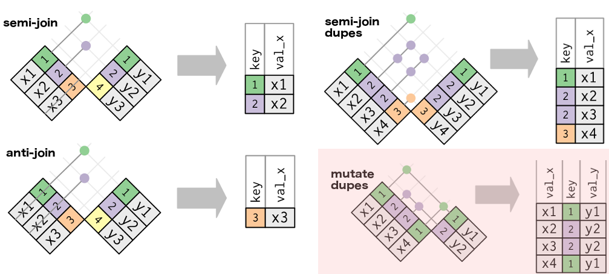
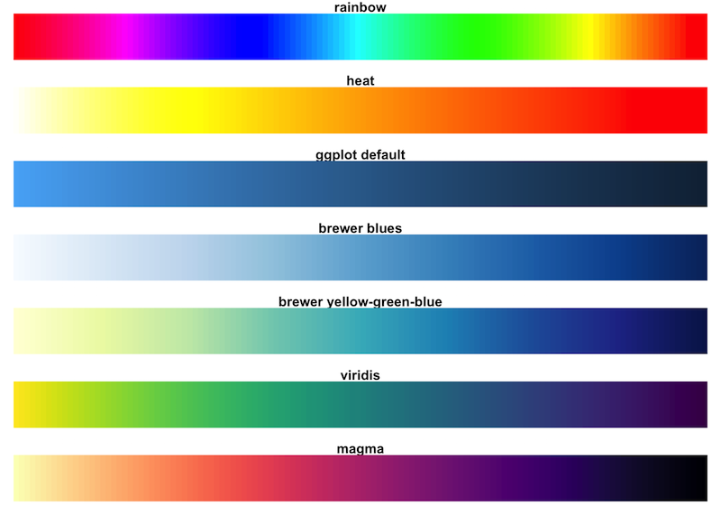

```{r setup, include=FALSE}
knitr::opts_chunk$set(echo = TRUE, fig.align = "center")
# Do not use cache = TRUE with _site.yml! They do not like each other...
```

## Data transformation | Introduction

* Transforming data for use with models is where there majority of time in analysis goes 
 
### `dplyr` in a nutshell {.box-8 .bg-yellow2 .build .stretch}
 * `dplyr` is a tool box for working with data in tibbles or data frames
     + Selection and manipulation of observation, variables and values 
     + Summarizing
     + Grouping
     + Joining and intersecting tibbles
  * In a workflow typically follows reshaping operations from `tidyr`


## dplyr | Introduction: [Cheat sheets](https://www.rstudio.com/resources/cheatsheets/)

```{r, echo=FALSE, out.width = '90%'}
knitr::include_graphics("img/06_dplyr_cheatsheet.png")
```

## dplyr | Introduction: [Cheat sheets](https://www.rstudio.com/resources/cheatsheets/) (cont.)

```{r, echo=FALSE, out.width = '90%'}
knitr::include_graphics("img/06_dplyr_cheatsheet_p2.png")
```


## Installation

```{r, include=FALSE}
library("tidyverse")
library("nycflights13")
```

- `dplyr` is included in the `tidyverse` package

```{r, eval = FALSE}
install.packages("dplyr")
# OR
install.packages("tidyverse")

library("dplyr")
```

- For the examples in the lecture, install a big dataset containing all flights departing NYC in 2013:

```{r, eval = FALSE}
install.packages("nycflights13")
# Load the library
library("nycflights13")
```

- Or use `Rstudio > Tools > Install` Packages to install the packages


```{r}
flights
```

## Inspect data frames / tibbles | glimpse  

Use `glimpse` to show some values and types per column. Environment tab does it too

```{r}
glimpse(flights)
```


## Pipes in R | magrittr

```{r, echo=FALSE, out.width = '70%'}

```

from [Romain François](https://twitter.com/ParisRaddict/status/781267225420435461)


## filter | inspect subsets of data

- How many flights flew to La Guardia, NY in 2013? _Expecting none..._

```{r}
flights %>%
  filter(dest == "LGA")
```

## filter | multiple conditions, AND (`&`)

How many flights flew to Madison in first week of January?

```{r}
# Comma separated conditions are combined with '&'
flights %>%
  filter(dest == "MSN", month == 1, day <= 7)
```


## filter | multiple conditions, OR (`|`)

```{r, eval = FALSE}
flights %>%
  filter(dest == "MSN" | dest == "ORD" | dest == "MDW")
```

For more complicated checks, prefer a set operation.  
The following 2 are equivalent:

```{r, eval = FALSE}
flights %>%
  filter(is.element(dest, c("MSN", "ORD", "MDW")))
```

```{r, eval = FALSE}
flights %>%
  filter(dest %in% c("MSN", "ORD", "MDW"))
```

## arrange | sort columns

### Perform a nested sorting of all flights in NYC: {.box-6 .bg-yellow2 .build}
    1. By which airport they departed
    2. year
    3. month
    4. day

%end%

```{r}
flights %>%
  arrange(origin, year, month, day)
```

## arrange | `desc` to reverse sort columns

Find the longest delays for flights to Madison.

```{r}
flights %>%
  filter(dest == "MSN") %>%
  arrange(desc(arr_delay)) %>%
  select(arr_delay, everything()) # way to reorder arr_delay 1st column
```

## Your turn{.build}

- Find the most delayed (in minutes) flight in 2013

```{r}
flights %>%
  arrange(desc(arr_delay)) %>%
  select(arr_delay, everything()) %>% head(3)
```

```{r}
1272 / 60
```

## select | selecting specific columns

```{r}
flights %>%
  select(origin, year, month, day)
```

## select | helper functions

`select` has many helper functions. See `?select` or have a look at the cheatsheet.

```{r}
flights %>%
  select(origin, year:day, starts_with("dep"))
```

## negative selecting

We can drop columns by "negating" their names. Since helpers give us column names, we can negate them too.
```{r}
flights %>%
  select(-dest, -starts_with("arr"),
         -ends_with("time"))
```

## Recap: Verbs for inspecting data

* `as_tibble` (`dplyr::as_data_frame`) to convert to a tibble (different from `as.data.frame` in _R_ base)
* `glimpse` - some of each column
* `filter` - subsetting
* `arrange` - sorting (`desc` to reverse the sort)
* `select` - picking (and omiting) columns

## rename | renaming columns

- Rename columns with `rename(new_name = old_name)`.
    + To keep the order correct, read/remember the renaming `=` as "was".

```{r}
flights %>%
  rename(y = year, m = month, d = day)
```

## mutate | add or replace columns{.build}

- How much departure delay did the flight make up for in the air?  
- Note that new variables can be used right away

```{r}
flights %>%
  mutate(
    gain = arr_delay - dep_delay,
    speed = (distance / air_time) * 60,
    gain_per_hour = gain / (air_time / 60)) %>%
  select(gain:gain_per_hour)
```

## Could the gain be explained by speed? | random subsampling

```{r, warning = FALSE, fig.height = 3.5}
flights %>%
  mutate(gain = arr_delay - dep_delay,
    speed = (distance / air_time) * 60) %>%
  sample_n(10000) %>% # subsample 1e5 rows randomly
  ggplot(aes(x = gain, y = speed)) +
  geom_point(alpha = 0.4)
```

## Binning to solve overplotting | `geom_hex()` for hexagons

```{r, warning = FALSE, fig.height = 3.5}
flights %>%
  mutate(gain = arr_delay - dep_delay,
    speed = (distance / air_time) * 60) %>%
  ggplot(aes(x = gain, y = speed)) +
  geom_hex(bins = 80) + # play with bins to ajust the granulometry
  viridis::scale_fill_viridis() + theme_classic()
```

## Binning to solve overplotting | `geom_bin2d()` for squares

```{r, warning = FALSE, fig.height = 3.5}
flights %>%
  mutate(gain = arr_delay - dep_delay,
    speed = (distance / air_time) * 60) %>%
  ggplot(aes(x = gain, y = speed)) +
  geom_bin2d(bins = 80) + # play with bins to ajust the granulometry
  viridis::scale_fill_viridis() + theme_classic()
```


## Grouping | `group_by()`

 * Not a summarising transformation but frequently used in conjunction 
 * Grouping by more than one or more variables
 * Use `ungroup()` 

## group_by | Grouping

- Let's compute the average delay per month of flights to Madison.

```{r}
flights %>%
  filter(dest == "MSN") %>%
  group_by(month) %>%
  #Some values are missing, thus tell `mean` to remove them from the calculation.
  summarise(mean_dep_delay = mean(dep_delay, na.rm = TRUE))
```


## group_by | Grouping

- Work per day
- note the tibble info about the 365 groupings

```{r}
by_day <- flights %>%
  group_by(year, month, day)
by_day
```

Note that one level (right most) is removed from grouping.


## summarise

- Now we use `summarise` to compute (several) aggregated values within each group (per day).
- `summarise` returns one row per group.

```{r}
by_day %>%
  summarise(
    flights = n(), # dplyr specific function
    avg_delay = mean(dep_delay, na.rm = TRUE),
    n_planes = n_distinct(tailnum)) # dplyr specific function
```

## Exercise{.build .exercise}

- In average, how many flights is a single plane doing per day?

- Calculate the average delay per day.

- Which day should be avoided?

## Solution | 1. single plane flights per day

```{r}
by_day %>%
  summarise(flights = n(),
            avg_delay = mean(dep_delay, na.rm = TRUE),
            n_planes = n_distinct(tailnum)) %>%
  mutate(avg_flights = flights / n_planes)
```

## Solution | 2. distribution of single plane flights per day

```{r, fig.height = 4, warning = FALSE}
by_day %>%
  summarise(flights = n(),
            avg_delay = mean(dep_delay, na.rm = TRUE),
            n_planes = n_distinct(tailnum)) %>%
  mutate(avg_flights = flights / n_planes)
```

## Solution | 3. average delay per day

```{r, fig.height = 4, fig.width = 10, warning = FALSE}
by_day %>%
  summarise(avg_delay = mean(dep_delay, na.rm = TRUE)) %>%
  unite(date, year, month, day, sep = "-") %>%
  mutate(date = as.Date(date)) %>%
  ggplot() + 
  geom_bar(aes(x = date, y = avg_delay), stat = "identity")
```

## Solution | 4. day to avoid

```{r}
by_day %>%
  summarise(avg_delay = mean(dep_delay, na.rm = TRUE)) %>%
  arrange(desc(avg_delay))
```

## Exercise{.exercise}

- Find the destinations with the highest average arrival delay?
  + discard flights with missing data as arrival delay
  + count the number of flights per destination
  + discard results with less than 10 flights, mean not meaningful

## Solution | destinations with highest average arrival delay

```{r}
flights %>%
  filter(!is.na(arr_delay)) %>%
  group_by(dest) %>%
  summarise(mean = mean(arr_delay),
            n = n()) %>%
  filter(n > 10) %>%
  arrange(desc(mean))
  
```

## Is there a spatial pattern for those delays?

- First, get the GPS coordinates of airports using the `airports` data frame

```{r}
airports
```

## Join two data frames

```{r}
delays <- flights %>%
  filter(!is.na(arr_delay)) %>%
  group_by(dest) %>%
  summarise(mean = mean(arr_delay),
            n = n()) %>%
  filter(n > 10) %>%
  arrange(desc(mean)) %>%
  inner_join(airports, by = c("dest" = "faa")) # provide the equivalence since columns have a different name
```

We could have used **left_join** but 4 rows with a 3-letters acronym have no correspondance in the `airports` data frame. **inner_join** narrows down the lines that are present in both data frames.

## Join types

```{r, echo = FALSE}
knitr::include_graphics("http://www.dofactory.com/Images/sql-joins.png")
```

Of note: **anti_join** can select rows which identifiers are **absent** in the second data frame.


## Join as data frames | **mutating** joins

```{r, echo=FALSE, out.width="100%"}

```

credit: [Hadley Wickham, R for data science](http://r4ds.had.co.nz/relational-data.html)

## Join as data frames | **filtering** joins

```{r, echo=FALSE, out.width="100%"}

```

credit: [Hadley Wickham, R for data science](http://r4ds.had.co.nz/relational-data.html)


## Gradient using viridis scales

```{r, eval = FALSE}
install.packages("maps")
library("maps")
```


`viridis` [vignette](https://cran.r-project.org/web/packages/viridis/vignettes/intro-to-viridis.html)

```{r, echo=FALSE, out.width = '70%'}

```


## plot on a map

```{r, fig.height=4, message=FALSE, warning=FALSE}
library("ggplot2")
library("maps") # US map
ggplot(delays) +
  geom_point(aes(x = lon, y = lat, colour = mean), size = 3, alpha = 0.8) +
  viridis::scale_color_viridis() +
  borders("state")
```

## plot on a map, with text

```{r, fig.height = 4}
library("ggrepel")
filter(delays, lon > -140) %>% # remove Honolulu
  ggplot() + geom_point(aes(x = lon, y = lat, colour = mean), size = 3, alpha = 0.8) +
  geom_text_repel(aes(x = lon, y = lat, label = name), size = 2.5) +
  viridis::scale_color_viridis() +
  theme_classic() +
  borders("state")
```

## plot on a map, with conditional text

<!-- How about the call to a function in data? -->

```{r geom_label_conditional, fig.height = 4}
filter(delays, lon > -140) %>% # remove Honolulu
  ggplot() +
  geom_point(aes(x = lon, y = lat, colour = mean),
                      size = 3, alpha = 0.8) +
  viridis::scale_color_viridis() +
  borders("state") +
  geom_label_repel(data = delays %>% filter(mean > 20),
            aes(x = lon, y = lat + 1, label = name), fill = "brown", colour = "white", size = 3) +
  theme_classic()
```

## subset data inside ggplot pipelines

```{r subset_ggplot, fig.height = 4}
subset_mean <- function(df) {
  filter(df, mean > 20)
}

filter(delays, lon > -140) %>% # remove Honolulu
  ggplot() +
  geom_point(aes(x = lon, y = lat, colour = mean),
                      size = 3, alpha = 0.8) +
  viridis::scale_color_viridis() +
  borders("state") +
  geom_label_repel(data = subset_mean,
            aes(x = lon, y = lat + 1, label = name), fill = "brown", colour = "white", size = 3) +
  theme_classic()
```


## tally / count

`tally` is a shortcut to counting the number of items per group.

```{r}
flights %>%
  group_by(dest, month) %>%
  tally() %>% head(3) # could sum up with multiple tally calls
```
`count` does the grouping for you
```{r}
flights %>%
  count(dest, month) %>% head(3)
```

## That covers 80% of dplyr


- select
- filter
- arrange
- glimpse
- rename
- mutate
- group_by, ungroup
- summarise

## Other 20%


- assembly: `bind_rows`, `bind_cols`
- windows function, `min_rank`, `dense_rank`, `cumsum`. See [vignette](https://cran.r-project.org/web/packages/dplyr/vignettes/window-functions.html)
- column-wise operations: `mutate_each`, `transmute`, `summarise_each`
- column-wise conditional operations: `mutate_at`, `mutate_if`, `summarise_at`, `summarise_if`
- `do`: arbitrary code on each chunk. To be replaced by `tidyr::nest() %>% mutate(purrr::map())`
- different types of tabular data ([dplyr SQL backend](https://cran.r-project.org/web/packages/dplyr/vignettes/databases.html), databases, `data.tables`)

## `dplyr 0.6` | Forthcoming changes

## Missing features
parallel dplyr
dbplyr -- databases access


## Bigger data, go for `data.table`

</br>

See this interesting [thread](http://stackoverflow.com/questions/21435339/data-table-vs-dplyr-can-one-do-something-well-the-other-cant-or-does-poorly) about comparing `data.table` versus `dplyr`

[`data.table`](https://cran.r-project.org/web/packages/data.table/index.html), see [introduction](https://github.com/Rdatatable/data.table/wiki) is very efficient but the syntax is not so easy.


As a summary:

 _tl;dr   data.table for speed, dplyr for readability and convenience_
[Prashanth Sriram](https://www.quora.com/Which-is-better-to-use-for-data-manipulation-dplyr-package-or-data-table-library)

</br>

Hadley recommends that for data > 1-2 Gb, if speed is your main matter, go for `data.table`
