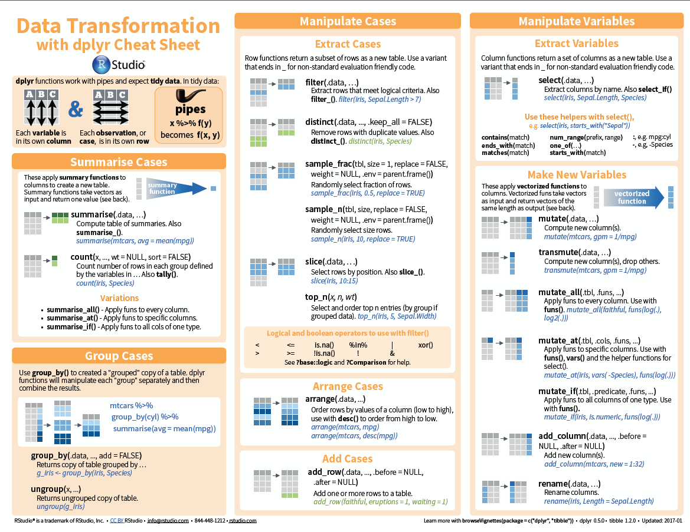
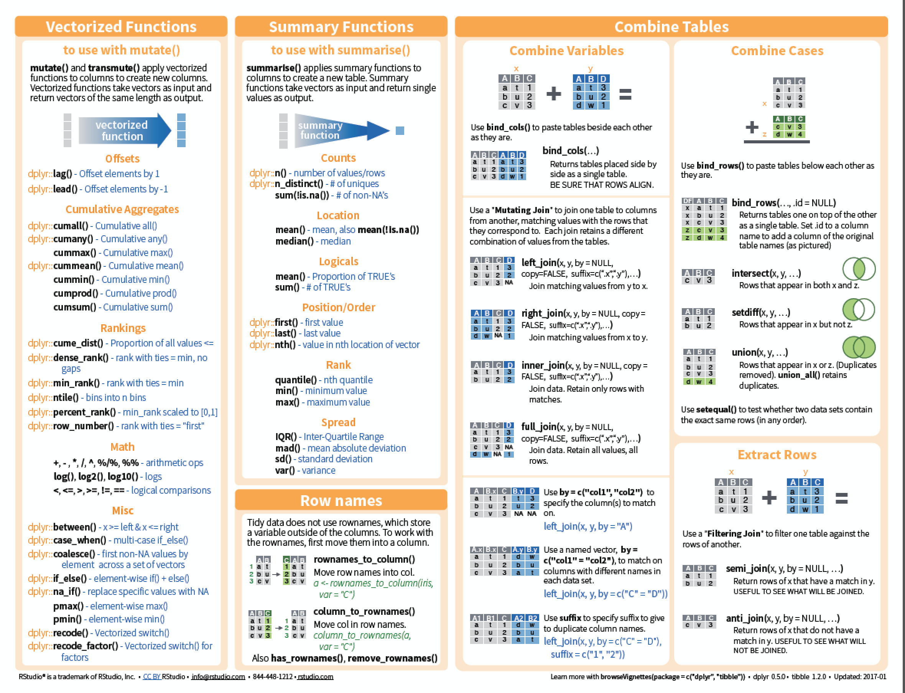
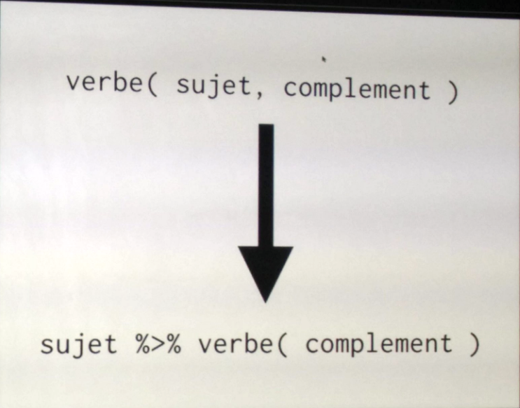

```{r setup, include=FALSE}
knitr::opts_chunk$set(echo = TRUE)
options(max.print = 500)
# Do not use cache = TRUE with _site.yml! They do not like each other...
```

## Data transformation | Introduction

 * Preparing data is the most time consuming part of of data analysis  
 
### `dplyr` in a nutshell {.box-8 .bg-yellow2 .build .stretch}
 * `dplyr` is a tool box for working with data in tibbles/data frames
 * The most import data manipulation operations are covered
     + Selection and manipulation of observation, variables and values 
     + Summarizing
     + Grouping
     + Joining and intersecting tibbles
  * In a workflow typically follows reshaping operations from `tidyr`
  * Fast, in particular for in-memory data by writing key pieces in C++ (using Rcpp)
  * Standard  interface to work with data in a `data.frame`, a `data.table` or database.

## Learning objectives

### `dplyr` in a nutshell {.box-8 .bg-green .build .stretch}
 * Learn the basic vocabulary of `dplyr`
 * Exercise commands
 


## dplyr | Introduction: [Cheat sheets](https://www.rstudio.com/resources/cheatsheets/)

```{r, echo=FALSE, out.width = '90%'}

```

## dplyr | Introduction: [Cheat sheets](https://www.rstudio.com/resources/cheatsheets/) (cont.)

```{r, echo=FALSE, out.width = '90%'}

```


## Installation {.vs2}

```{r, include=FALSE}
library("tidyverse")
library("biomaRt")

```

- `dplyr` is included in the `tidyverse` package
- `biomaRt` is part of bioconductor (check)

```{r, eval = FALSE}
install.packages("dplyr")
# OR
install.packages("tidyverse")

source("https://bioconductor.org/biocLite.R")
biocLite("biomaRt")


```

## Retrieving sample data

### Gene from chromosome 21 from biomaRt {.box-10 .offset-1 .bg-blue}

```{r, eval = T}
# Load the library
library(biomaRt)
gene_mart <- useMart(biomart="ENSEMBL_MART_ENSEMBL", host="www.ensembl.org")
gene_set <- useDataset(gene_mart , dataset="hsapiens_gene_ensembl")

gene_by_exon <- getBM(
  mart = gene_set,
  attributes = c(
    "ensembl_gene_id",
    "ensembl_transcript_id",
    "ensembl_exon_id",
    "chromosome_name",
    "start_position",
    "end_position",
    "hgnc_symbol",
    "hgnc_id",
    "strand",
    "gene_biotype"
    ), 
  filter = "chromosome_name",
  value = "21"
  )
```


## `as_tibble()` 

### Important with large tables {.box-10 .offset-1 .bg-blue}

```{r}
as_tibble(gene_by_exon)
```

## `glimpse()` | Inspect data frames / tibbles   

 * Use `glimpse()` to show some values and types per column. 
 * The *Environment* tab in RStudio tab does it too

```{r}
glimpse(gene_by_exon)
```


## Pipes in R | magrittr {.vs1}

```{r, echo=FALSE, out.width = '60%'}

```

from [Romain François](https://twitter.com/ParisRaddict/status/781267225420435461)


## `filter()` | inspect subsets of data

- Take a look at the amyloid precursor protein gene **APP** 
- Note the rendering of the `data.frame`, not a tibble.

```{r}
gene_by_exon %>%
  filter(hgnc_symbol == "APP")
```

## `filter()` | Multiple conditions, AND (`&`)

### Genes in a particular range

```{r}
# Comma separated conditions are combined with '&'
gene_by_exon %>%
   filter(start_position > 10000000, end_position < 12000000)
```


## `filter()` | Multiple conditions, OR (`|`)

### Genes at the close to the telomers {.box-10 .offset-1}

```{r, eval = FALSE}
gene_by_exon %>%
  filter(start_position < 100000 | end_position >46665124 )
```

### Set operations {.box-10 .offset-1}
For more complicated checks.
The following 2 are equivalent:

```{r, eval = FALSE}
gene_by_exon %>%
  filter(is.element(hgnc_symbol, c("APP", "ATP50", "PRMT2")))
```

```{r, eval = FALSE}
gene_by_exon %>%
  filter(hgnc_symbol %in% c("APP", "ATP50", "PRMT2"))
```


## `arrange()` | Sort columns

### Perform a nested sorting of all Genes: {.box-10 .bg-yellow2 .build}
    1. hgnc_symbol
    2. gene_biotype
    3. end_position

```{r}
gene_by_exon %>%
  arrange(hgnc_symbol, gene_biotype, end_position) %>% 
  dplyr::select(hgnc_symbol, gene_biotype, end_position, everything())
```

## `arrange()` | `desc` to reverse sort columns

Find the *last* gene on chromosome 21.

```{r}
gene_by_exon %>%
  arrange(desc(end_position)) %>%
  dplyr::select(end_position, everything()) # way to reorder arr_delay 1st column
```

## `select()` | Selecting specific *columns*
`select()` is part of the `biomaRt` package, need to address `dplyr`-package!

```{r}
gene_by_exon %>%
  dplyr::select(hgnc_symbol, chromosome_name, start_position, end_position)
```

## `select()` | Negative selection 

### Dropping columns {.box-10 .offset-1 .bg-blue}
We can drop columns by "negating" their names. Since helpers give us column names, we can negate them too. Note that the 

```{r}
gene_by_exon %>%
  dplyr::select(-strand, -starts_with("ensembl"),
         -ends_with("id"))
```

## `select()` helper functions

### `select()` has many helper functions {.box-10 .offset-1 .bg-blue}
 * `contains()`, `starts_with()`, `ends_with()` for literal strings
 * `matches()` for regex
 * `one_of()` variables in a character vector
 * `everything()` all remaining variable
 * Can be combined

```{r}
gene_by_exon %>%
  dplyr::select(hgnc_symbol, 
                starts_with("ensembl"),
                contains("position"),
                -contains("exon"))
```


## Verbs for inspecting data

### Summary {.box-10 .offset-1 .bg-blue}
* `as_tibble()` (`dplyr::as_data_frame`) to convert to a tibble (different from `as.data.frame` in _R_ base)
* `glimpse()` - some of each column
* `filter()` - subsetting
* `arrange()` - sorting (`desc` to reverse the sort)
* `select()` - picking (and omiting) columns

# Value transformation | `mutate()` 

## `rename()` | Renaming columns


- Rename columns with `rename(new_name = old_name)`.
    + To keep the order correct, read/remember the renaming `=` as "was".
    + Rename will replace column names

```{r}
gene_by_exon %>%
  rename(stop = end_position, start = start_position)
```

## `mutate()` | Add or replace columns{.build}


### Gene length {.box-12 .bg-blue}
 - Note that new variables can be used right away

```{r}
gene_by_exon %>%
  mutate(  length = end_position - start_position) %>% 
  dplyr::select(hgnc_symbol, length)  
```


## `distinct()` | Unique rows

This is not a gene set for statistics

```{r}
gene_by_exon %>%
  filter(gene_biotype =="protein_coding") %>% 
  mutate(  length = end_position - start_position) %>% 
  dplyr::select(hgnc_symbol, length) %>% 
  distinct()
```


```{r}
gene_by_exon %>%
  group_by(gene_biotype) %>%
   mutate(  length = end_position - start_position) %>% 
    #Some values are missing, thus tell `mean` to remove them from the calculation.
  summarise(by_type_length = floor(mean(length, na.rm = TRUE))) %>% 
  arrange(desc(by_type_length))
```

## `mutate_at(), mutate_all(), mutate_if()` | Changing many columns

### Usage{.box-12 .bg-blue}
 * Use the `select` helpers with `mutate_at()`
 * Use column conditions for `mutate_if()`
 * `vars()` to wrap variables and `funs()` to wrap functions 
 
### Coordinate conversion {.box-12 .bg-cobalt}
 
```{r eval = FALSE}
gene_by_exon %>% 
  mutate_at(vars(contains("position")), funs(. + 1))

```

### Coordinate conversion {.box-12 .bg-cobalt}
 
```{r, row = c(5, 7)}
gene_by_exon %>% 
  mutate_if(is.numeric, funs(. + 1))
```

# Grouping and summarizing

## `group_by()` | Grouping

 * Not a summarising transformation but frequently used in conjunction 
 * Grouping by more than one or more variables
 * Use `ungroup()` 

### Let's compute the average number of exons {.box-12 .bg-cobalt}

```{r}
gene_by_exon %>%
  group_by(ensembl_gene_id, hgnc_symbol) %>% 
  summarise(nexon =n_distinct(ensembl_exon_id)) %>% 
  head(5)

```

## tally / count

`tally` is a shortcut to counting the number of items per group.

```{r}
gene_by_exon %>%
  group_by(hgnc_symbol) %>%
  tally() %>% head(3) # could sum up with multiple tally calls
```
`count` does the grouping for you
```{r}
gene_by_exon %>%
  count(hgnc_symbol) %>% head(3)
```


# Joining data frames


## Sample data from Clinvar

```{r cache=TRUE}

clinvar <- tribble(~symbol, ~gene_interest, 
                   "ATP50", "yes",
                   "APP",   "yes",
                   "DIP2A", "yes")

```

### Join two data frames {.box-12 .bg-blue}

```{r eval=FALSE}
gene_annotation <- gene_by_exon %>% 
  inner_join(clinvar, by = c("hgnc_symbol"="symbol")) # provide the equivalence since columns have a different name
gene_annotation
```


## Relational operations | **mutating** joins

### Inner join {.box-5 .offset-1 .bg-yellow2 .stretch}


credit: [Hadley Wickham, R for data science](http://r4ds.had.co.nz/relational-data.html)

### Outer join {.box-5 .bg-yellow2 .stretch}


## `lead() and lag()` | Comparing rows above and below

### Calculate intergenic distance {.box-8 .offset-1 .bg-blue}

```{r}
gene_by_exon %>%
  dplyr::select(ensembl_gene_id, start_position, end_position) %>% 
  distinct() %>% 
  arrange(start_position) %>% 
  mutate(intergenic_length = start_position - lag(end_position)) 
```


## That covers 80% of dplyr


- select
- filter
- arrange
- glimpse
- rename
- mutate
- group_by, ungroup
- summarise

## Other 20%
- assembly: `bind_rows`, `bind_cols`
- windows function, `min_rank`, `dense_rank`, `cumsum`. See [vignette](https://cran.r-project.org/web/packages/dplyr/vignettes/window-functions.html)
- `do`: arbitrary code on each chunk. To be replaced by `tidyr::nest() %>% mutate(purrr::map())`
 `data.tables`)


## Data base access

### SQL mapping {.box-8 .offset-2 .bg_green}
 - `dplyr` code can be translated into SQL and query databases online (using `dbplyr`)
 - different types of tabular data ([dplyr SQL backend](https://cran.r-project.org/web/packages/dplyr/vignettes/databases.html), databases,

## Bigger data, go for `data.table`

### {.box-10 .offset-1 .bg-blue .icon}

 + See this interesting [thread](http://stackoverflow.com/questions/21435339/data-table-vs-dplyr-can-one-do-something-well-the-other-cant-or-does-poorly) about comparing `data.table` versus `dplyr` 
 + [`data.table`](https://cran.r-project.org/web/packages/data.table/index.html), see  [introduction](https://github.com/Rdatatable/data.table/wiki) is very efficient but the syntax is not so easy.
 + Main advantage: inline replacement (tidyverse is frequently copying)
 + As a summary:      _tl;dr   data.table for speed, dplyr for readability and convenience_ [Prashanth Sriram](https://www.quora.com/Which-is-better-to-use-for-data-manipulation-dplyr-package-or-data-table-library)
  + Hadley recommends that for data > 1-2 Gb, if speed is your main matter, go for `data.table` 
  + `dtplyr` is a `dplyr` interface to `data.table` but slower than native `data.table`


