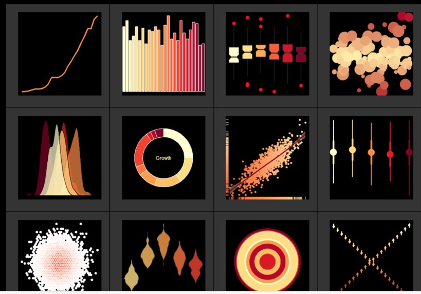
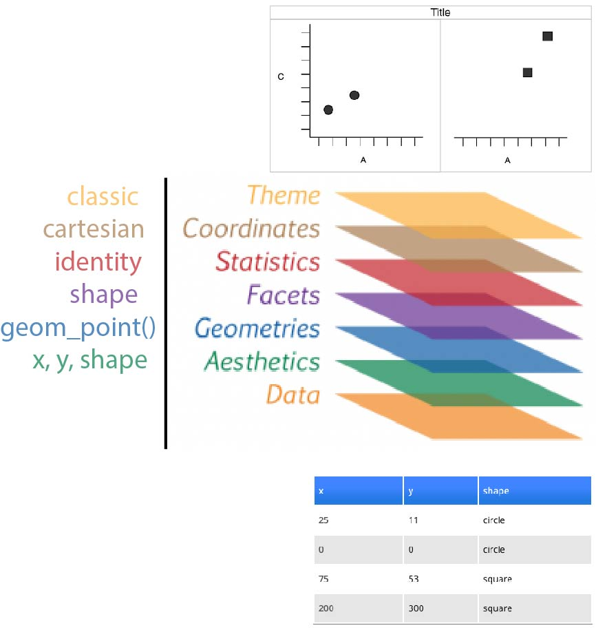
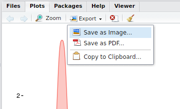

```{r, echo = FALSE, warning = FALSE, message = FALSE}
library(tidyverse)
knitr::opts_chunk$set(fig.align = "center")
```


# ggplot2



## Before, there was `ggplot1`

Released in **2005** until **2008** by [Hadley Wickham](https://github.com/hadley/ggplot1).

> If the pipe ( %>% in 2014) had been invented before, `ggplot2` would have never existed | Hadley Wickham

### Original syntax {.box-6 .bg-yellow .build}

```{r, eval = FALSE}
# devtools::install_github("hadley/ggplot1")
p <- ggplot(mtcars, list(x = mpg, y = wt)) %>% 
scbrewer(ggpoint(p, list(colour = gear)))
```

### with the pipe {.box-6 .bg-yellow2 .build}

```{r, eval = FALSE}
# devtools::install_github("hadley/ggplot1")
library(ggplot1)
mtcars %>% 
  ggplot(list(x = mpg, y = wt)) %>% 
  ggpoint(list(colour = gear)) %>% 
  scbrewer()
```


```{css}
.bg-green2 > h3:first-child > a:hover {
  color: white !important;
}
```


### [ggplot2](my link) {.box-8 .offset-1 .bg-grgold .build .stretch}

```{r, eval = FALSE}
library(ggplot2)
mtcars %>% 
  ggplot(aes(x = mpg, y = wt)) + 
  geom_point(aes(colour = as.factor(gear))) +
  scale_color_brewer("gear", type = "qual")
```


### Issue {.box-3 .bg-red .build .stretch}

Introduced a break in the workflow from ` %>% ` to `+`


## What is `ggplot2` | released in 2007 {.vs2}

- `ggplot2` stands for **g**rammar of **graphics** plot version 2
    + Inspired by Leland Wilkinsons work on the [grammar of graphics](https://www.amazon.com/Grammar-Graphics-Statistics-Computing/dp/0387245448) in 2005.
    + The idea is to split a graph into layers: for example axis, curve(s), labels.

### {.col-8}


### {.col-4}

<span class = "small">[Wickham H. 2007. _J. Comp. Graph. Stat._ **19**:3–28](http://www.tandfonline.com/doi/abs/10.1198/jcgs.2009.07098)</span> 


<span class = "small">source: [thinkR](http://www.thinkr.fr/guide-survie-ggplot2-datajournalistes/)</span>


## Simple example | Wickham 2007


### dataset {.box-6 .stretch}

------------------
x     y    shape
----  ---- -------
25    11   circle

0     0    circle

75    53   square

200   300  square

------------------

### 3 layers combined {.box-6}


### Faceting (treillis / latticing) {.box-8 .offset-2 .bg-grgold .build}

What is we want to split _circles_ and _squares_?


## Faceting | Wickham 2007 {.vs1}

### Split by the **shape** {.col-8 .offset-2}


%end%


### Redundancy {.box-8 .offset-2 .bg-grgold .build}

Now, **dot shapes** and **facets** give the same information. Shapes could be freed for another meaningful variable


## layers {.vs2}

```{r, echo = FALSE, out.width = "50%"}

```


## for real

```{r, row = TRUE, fig.height=4}
tribble(
    ~x,   ~y,    ~shape,
   25L,  11L,  "circle",
    0L,   0L,  "circle",
   75L,  53L,  "square",
  200L, 300L,  "square"
  ) %>%
  ggplot(aes(x = x, y = y, shape = shape)) +
  geom_point(size = 4) +
  facet_wrap(~ shape) +
  coord_cartesian() +
  theme_classic(base_size = 18)
```

### Tip {.box-8 .bg-yellow}

awesome [addin](https://rstudio.github.io/rstudioaddins/): [datapasta](https://github.com/MilesMcBain/datapasta), paste as *tribbles* (transposed *tibbles*)

by Miles McBrain 

## Motivation for this layered system | football example

> [Data visualisation] is not meant just to be seen but to be read, like written text - Alberto Cairo

### Questions {.box-5 .bg-yellow2 .build}

1. which countries have the best teams?
2. which leagues are the most/least balanced?
3. what is the 'quality gap' between a given pair of leagues?
4. how does the nth best team in league x today compare to its predecessors?
5. how have all of the above changed over time?

### Stat solutions  {.box-4 .bg-green .build .stretch}

1. linear comparison
2. distribution of parts within the whole
3. difference in area between two curves
4. value in context
5. evolution of an already detailed pattern over time
  
### Visual solutions  {.box-3 .bg-grgold .build .stretch}

1. points

2. points on a line

3. ribbon*

4. shaded range

5. faceted plots

%end%

<span class = "small">source [John Burn-Murdoch](http://johnburnmurdoch.github.io/slides/r-ggplot/) working at the Financial Times</span> 


## 1. which countries have the best teams in 2016?

```{r, echo = FALSE}
# https://github.com/johnburnmurdoch/johnburnmurdoch.github.io/blob/master/slides/r-ggplot/r-scripts.R
#allSeasons <- read_csv("https://raw.githubusercontent.com/johnburnmurdoch/johnburnmurdoch.github.io/master/slides/r-ggplot/changing-tides-of-football.csv")
#write_rds(allSeasons, "allseasons.rds")
```
```{r}
library(tidyverse)
allSeasons <- read_rds("allseasons.rds")
oneSeason <- allSeasons %>% filter(year == 2016)
```

### {.col-12 .build}

```{r, row = TRUE, fig.height=3, fig.width=3}
ggplot(oneSeason
       ,aes(x = year, y = score, colour = country)) + 
  geom_point(size = 3) +
  scale_x_discrete() +
  theme_bw()
```


## Draw your first plot

```{r, fig.height = 4}
library("ggplot2")
ggplot(iris) +
  geom_point(aes(x = Petal.Width, y = Petal.Length))
```

`ggplot` uses a `data.frame` and builds the plot **layer by layer**.

## Geoms

Geoms, or geometric objects, define the type of plot which will be drawn.

Examples of `geom` are:

- `geom_point()` to draw a scatter plot
- `geom_boxplot()` to draw boxplots
- `geom_line()` to draw lines
- `geom_histogram()` to draw histograms
- `geom_density()` to draw density curves
- Have a look at the [cheatsheet](https://www.rstudio.com/wp-content/uploads/2015/12/ggplot2-cheatsheet-2.0.pdf) or the ggplot2 online [documentation](http://docs.ggplot2.org/) to list more possibilities.

## Mapping aesthetics

**aesthetics** map the variables of a `data.frame` to the variable each ggplot2 `geom` is expecting.

For example `geom_point()` (used to draw a scatter plot) requires the _**x**_ and _**y**_ coordinates for each point.

```{r, fig.height = 4, eval = FALSE}
ggplot(iris) +
  geom_point(aes(x = Petal.Width, y = Petal.Length))
```

```{r, results = "asis", echo = FALSE}
iris %>%
  head() %>%
  knitr::kable()
```


## Mapping aesthetics

**aesthetics** map the variables of a `data.frame` to the variable each ggplot2 `geom` is expecting.

For example `geom_point()` (used to draw a scatter plot) requires the _**x**_ and _**y**_ coordinates for each point.

```{r, fig.height = 4}
ggplot(iris) +
  geom_point(aes(x = Petal.Width, y = Petal.Length))
```


```{r}
knitr::knit_exit()
```


## Mapping aesthetics

We can specify additional arguments such as the `colour`, the transparency (`alpha`) or the `size`.

```{r, fig.height = 4}
ggplot(iris) +
  geom_point(aes(x = Petal.Width, y = Petal.Length),
             colour = "blue", alpha = 0.6, size = 3)
```

## Mapping aesthetics | colour

`colour`, `alpha` or `size` can also be mapped to a column in the data frame.

For example: We can attribute a different color to each species:

```{r, fig.height = 3.5}
ggplot(iris) +
  geom_point(aes(x = Petal.Width, y = Petal.Length, colour = Species), alpha = 0.6, size = 3)
```

Note that the `colour` argument now is **inside** `aes()` and **must** refer to a column in the dataframe.

## Mapping aesthetics | shape

```{r}
ggplot(iris) +
  geom_point(aes(x = Petal.Width, y = Petal.Length, shape = Species, colour = Species), alpha = 0.6, size = 3)
```

## Title and axis labels

It is easy to adjust axis labels and the title

```{r, fig.height = 4, fig.align = "center"}
ggplot(iris) +
  geom_point(aes(x = Petal.Width, y = Petal.Length, colour = Species), alpha = 0.6, size = 3) +
  xlab("Width") +
  ylab("Length") +
  ggtitle("Iris: petal")
```

## Facets

`facet_grid()` is used to lay out panels in a grid: Specify a **formula** with the rows on the left and columns on the right separated by a tilde `~`. A dot (`.`) specifies that no facetting should be performed.

```{r, fig.height = 3, fig.align = "center"}
ggplot(iris) +
  geom_point(aes(x = Petal.Width, y = Petal.Length,
                 shape = Species, colour = Species), alpha = 0.6, size = 3) +
  facet_grid(. ~ Species)
```

## Histograms

```{r, fig.height = 4, fig.align = "center"}
ggplot(iris) +
  geom_histogram(aes(x = Petal.Length, fill = Species), alpha = 0.5) 
```

Note that the filling colour can also be adjusted on some geoms.

## Density plot

The density is the count divided by the total number of occurences.

```{r}
ggplot(iris) +
  geom_density(aes(x = Petal.Length, fill = Species), alpha = 0.6)
```

## Overlaying plots | Density plot and histogram

```{r}
ggplot(iris) +
  geom_histogram(aes(x = Petal.Length, y = ..density..), fill = "darkgrey", binwidth = 0.1) +
  geom_density(aes(x = Petal.Length, fill = Species, colour = Species), alpha = 0.4) +
  theme_classic()
```

## stat functions

- We used a new variable in the previous plot: `..density..`
- In ggplot2, variables surrounded by two pair of dots (`..<variable>..`) are intermediate values calculated by ggplot2 using stat functions

- Every `geom` uses a `stat` function to transform the data:
    + For example `geom_histogram()` and `geom_density()` need to perform calculations in order to display the histogram or the density curve (Not as simple as plotting _x_ and _y_ values from two columns)
    + `geom_histogram()` uses `stat_bin()` to divide the distributions into _bins_ and count the number of observations in each _bin_.
    + `stat_bin()` computes for example: `count`, `density`, `ncount` and `ndensity` (see `?stat_bin()`)
    + Here `..density..` specifies that we would like to use such a computed `density` column.
    
## Barcharts | Categorical variables

- By default, `geom_bar()` counts the number of occurences for each values of a categorical variable.
- `geom_bar()` uses `stat_count()` to compute these values (creating a new `count` column)

```{r, fig.height = 3.5}
ggplot(iris) +
  geom_bar(aes(x = Species)) # or: geom_bar(aes(x = Species, y = ..count..))
```


## Barcharts | Categorical variables

- To map a continous variable on the _y_ axis, we need to override the default call to `stat_count()`
- `stat = "identity"` will force `geom_bar()` to use `stat_identity()` instead (leaving the original data unchanged)
- `Petal.Length` and not `..Petal.Length..` as it is not "new" and is already present in the original data frame

```{r, fig.height = 3.2}
ggplot(iris) +
  geom_bar(aes(x = Species, y = Petal.Length), stat = "identity")
```

## Stacked barchart | Categorical variables

```{r}
mtcars %>%
  ggplot() +
  geom_bar(aes(x = factor(cyl), fill = factor(gear)))
```

## Dodged barchart (side by side) | Categorical variables

```{r}
mtcars %>%
  ggplot() +
  geom_bar(aes(x = factor(cyl), fill = factor(gear)),
           position = "dodge")
```

## Stacked barchart for proportions | Categorical variables

```{r}
mtcars %>%
  ggplot() +
  geom_bar(aes(x = factor(cyl), fill = factor(gear)),
           position = "fill")
```

## Stacked barchart for proportions | Categorical variables

We can easily switch to polar coordinates:

```{r}
mtcars %>%
  ggplot() +
  geom_bar(aes(x = factor(cyl), fill = factor(gear)),
           position = "fill") +
  coord_polar()
```

## Boxplot | Categorical variables

```{r}
ggplot(mtcars) +
  geom_boxplot(aes(x = factor(cyl), y = mpg))
```

## Boxplot | Categorical variables

```{r}
ggplot(mtcars) +
  geom_boxplot(aes(x = factor(cyl), y = mpg,
                   fill = factor(am)))
```

## Custom colors

- It is possible to manually adjust the colors using `scale_fill_manual()` and `scale_color_manual()`
- Is not very handy as you **must** provide as much colors as groups

```{r, fig.height = 4}
ggplot(mtcars) +
  geom_boxplot(aes(x = factor(cyl), y = mpg,
                   fill = factor(am), color = factor(am))) +
  scale_fill_manual(values = c("red", "lightblue")) +
  scale_color_manual(values = c("purple", "blue"))
```

## Custom colors | Using predefined color palettes

```{r, echo = c(1, 3), fig.height = 5.5}
library(RColorBrewer)
par(mar = c(0, 4, 0, 0))
display.brewer.all()
```

## Custom colors | Using predefined color palettes

```{r, fig.height = 4}
ggplot(mtcars) +
  geom_boxplot(aes(x = factor(cyl), y = mpg,
                   fill = factor(am), colour = factor(am))) +
  scale_fill_brewer(palette = "Pastel2") +
  scale_colour_brewer(palette = "Set1")
```

## Using or exporting plots

<div class = "float-r">

</div>
- Using the Export button in the _Plots_ panel
- Integrate them in your Rmarkdown reports
    + If required, adjust the chunk options: `fig.height`, `fig.align`


## Extensions

`ggplot2` introduced the possibility for the community to contribute and create **extensions**. 

They are referenced on a [dedicated site](https://www.ggplot2-exts.org/)


## Art | by Marcus Volz

<blockquote class="twitter-tweet"><p lang="en" dir="ltr">A compilation of some of my gifs created with <a href="https://twitter.com/hashtag/rstats?src=hash">#rstats</a> <a href="https://twitter.com/hashtag/ggplot2?src=hash">#ggplot2</a> <a href="https://twitter.com/hashtag/gganimate?src=hash">#gganimate</a> <a href="https://twitter.com/hashtag/tweenr?src=hash">#tweenr</a> <a href="https://t.co/nCppSOZv4W">https://t.co/nCppSOZv4W</a></p>&mdash; Marcus Volz (@mgvolz) <a href="https://twitter.com/mgvolz/status/849375922297991168">4 avril 2017</a></blockquote>

```{r, echo = FALSE}
vembedr::embed_youtube("DQiKHlpy70Q")
```

