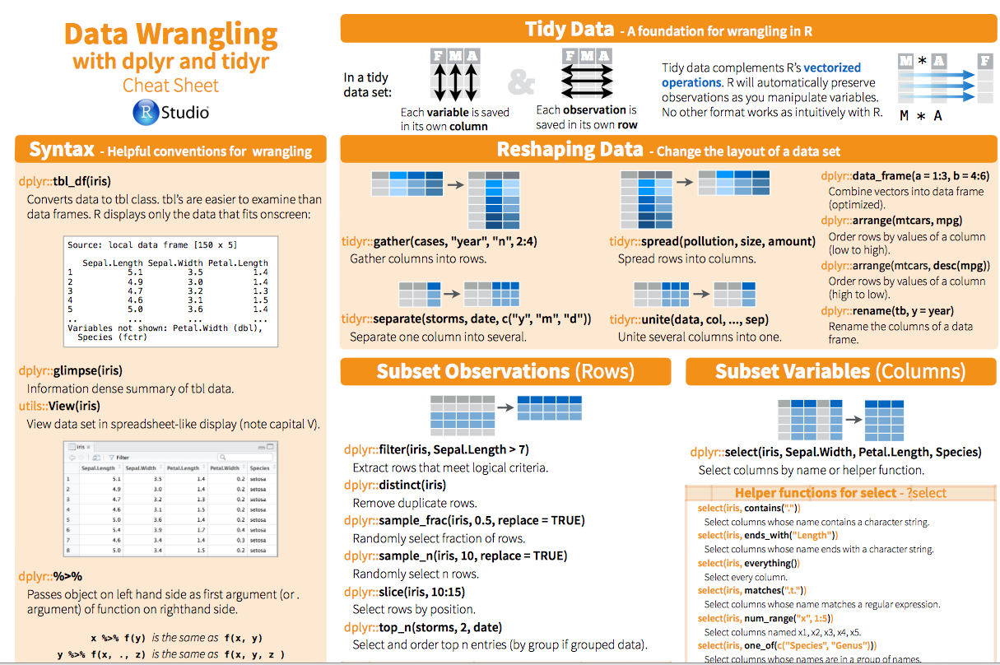

```{r setup, include=FALSE}
knitr::opts_chunk$set(echo = TRUE, fig.align = "center")
# Do not use cache = TRUE with _site.yml! They do not like each other...
```

## tidyr | Introduction: cheatsheet

```{r, echo=FALSE, out.width = '90%'}

```


## Rationale


```{r, echo=FALSE, out.width = '70%'}
knitr::include_graphics("img/06_tidy-dataset.png")
```


## Definitions

+ **Variable**: A quantity, quality, or property that you can measure.
+ **Observation**: A set of values that display the relationship between variables. To be an observation, values need to be measured under similar conditions, usually measured on the same observational unit at the same time.
+ **Value**: The state of a variable that you observe when you measure it.

[source: Garret Grolemund](http://garrettgman.github.io/tidying/)

## Rules

1. Each variable is in its own column
2. Each observation is in its own row
3. Each value is in its own cell

```{r echo=FALSE, out.width='90%'}
knitr::include_graphics("http://lsru.github.io/r_workshop/img/tidy-1_600.png")
```

## Convert Long / wide format

The wide format is generally untidy _but_ found in the majority of datasets


```{r echo=FALSE, out.width='70%'}
knitr::include_graphics("http://lsru.github.io/r_workshop/img/tidy-gather_600.png")
```
```{r echo=FALSE, out.width='70%'}
knitr::include_graphics("http://lsru.github.io/r_workshop/img/tidy-spread_600.png")
```


## Demo with the iris dataset

```{r}
head(iris, 3)
```

gather

```{r, message=FALSE, warning=FALSE}
library("tidyverse")
iris_melt <- iris %>%
  rownames_to_column(var = "number") %>%
  as_tibble() %>%
  gather(flower, measure, contains("al"))
iris_melt
```

##

spread

```{r}
iris_melt %>%
  spread(flower, measure)
```

## Separate / Unite

```{r, echo = FALSE}
df <- data_frame(year = c(2015, 2014, 2014),
                 month = c(11, 2, 4),
                 day = c(23, 1, 30),
                 value = c("high", "low", "low"))
```

- unite

```{r}
df %>%
  unite(date, year, month, day, sep = "-") -> df_unite
```

- separate, use **quotes** since we are not refering to objects

```{r}
df_unite %>%
  separate(date, c("year", "month", "day"))
```


## Why tidy is useful?

```{r, out.width='50%'}
iris %>%
  gather(flower, measure, 1:4) %>%
  ggplot() +
  geom_boxplot(aes(x = Species, y = measure, fill = flower))
```
