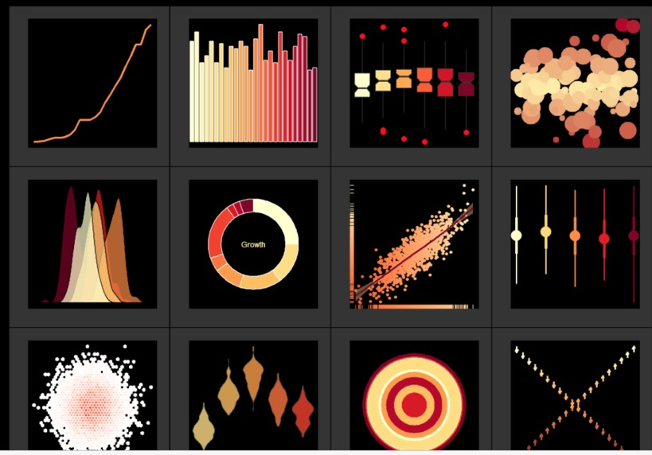
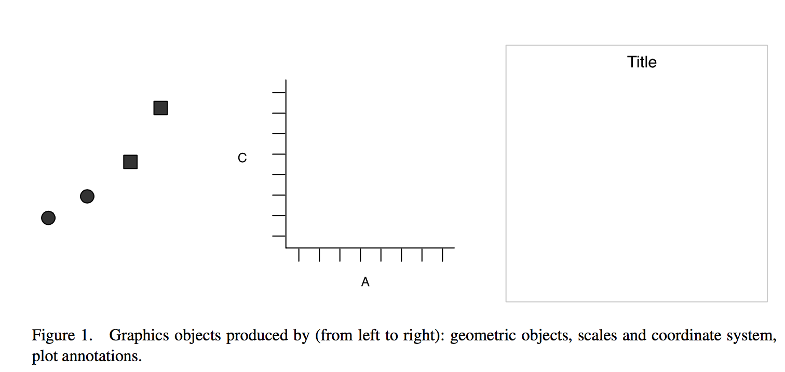
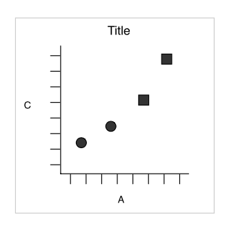
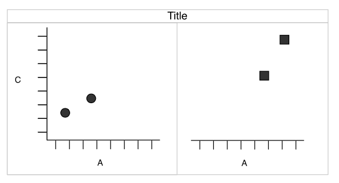
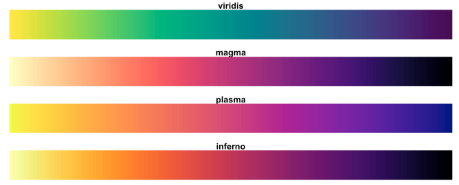
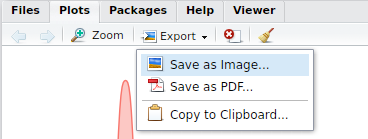
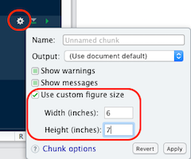
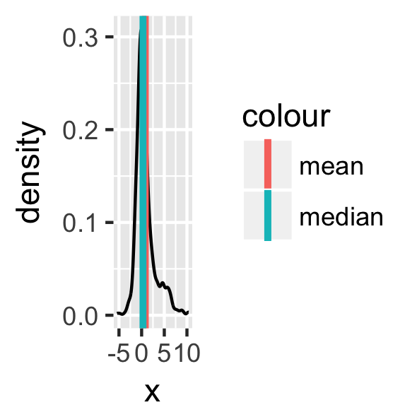
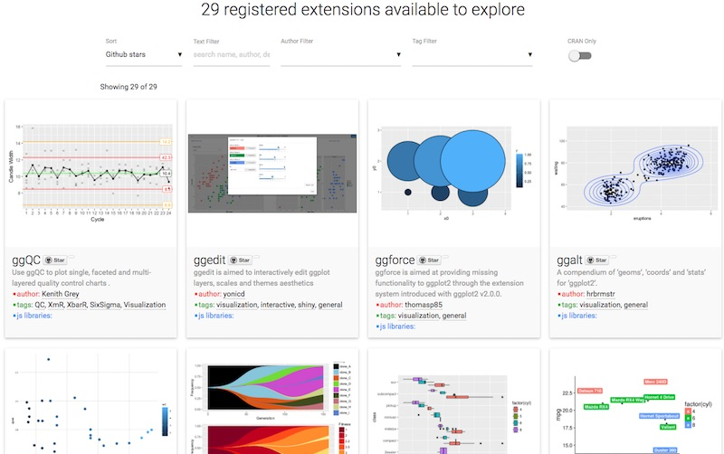

```{r setup, include = FALSE}
library(tidyverse)
```


# ggplot2



## Learning objectives {.vs2}

By the end you should be able to:

- Understand the basic grammar of ggplot2 (data, geoms, aesthetics, facets).
- Make quick exploratory plots of your multidimensional data.
- Know how to find help on `ggplot2` when you run into problems.


## Before, there was `ggplot1`

Released in **2005** until **2008** by [Hadley Wickham](https://github.com/hadley/ggplot1).

> If the pipe ( %>% in 2014) had been invented before, `ggplot2` would have never existed | Hadley Wickham

### Original syntax {.box-6 .bg-yellow .build}

```{r, eval = FALSE}
# devtools::install_github("hadley/ggplot1")
p <- ggplot(mtcars, list(x = mpg, y = wt)) %>% 
scbrewer(ggpoint(p, list(colour = gear)))
```

### with the pipe {.box-6 .bg-yellow2 .build}

```{r, eval = FALSE}
# devtools::install_github("hadley/ggplot1")
library(ggplot1)
mtcars %>% 
  ggplot(list(x = mpg, y = wt)) %>% 
  ggpoint(list(colour = gear)) %>% 
  scbrewer()
```

```{css}
.bg-green2 > h3:first-child > a:hover,
.bg-green2 > h3:first-child > a {
  color: white !important;
}

.bg-grgold a:hover,
.bg-grgold a {
  color: white !important;
}

/* from https://csswizardry.com/2010/02/mutiple-column-lists-using-one-ul/ */
.col-list ul {
  overflow: hidden;
}

.col-list li {
  float: left;
  display: inline;
  padding-left: 50px;
}

.col-list li:before {
    content: "\2022";
    font-size: 150%;
}

.c2 li {
  width: 50%;
}

.c3 li {
  width: 33.333%;
}
```


### ggplot2 {.box-8 .offset-1 .bg-grgold .build .stretch}

```{r, eval = FALSE}
library(ggplot2)
mtcars %>% 
  ggplot(aes(x = mpg, y = wt)) + 
  geom_point(aes(colour = as.factor(gear))) +
  scale_color_brewer("gear", type = "qual")
```


### Issue {.box-3 .bg-red .build .stretch}

Introduced a break in the workflow from ` %>% ` to `+`


## What is `ggplot2` | released in 2007 {.vs2}

- `ggplot2` stands for **g**rammar of **graphics** plot version 2
    + Inspired by Leland Wilkinsons work on the [grammar of graphics](https://www.amazon.com/Grammar-Graphics-Statistics-Computing/dp/0387245448) in 2005.
    + The idea is to split a graph into layers: for example axis, curve(s), labels.
    + **3** main elements are necessary: **data**, **aesthetics** and at least one **geometry**

### {.col-8}



### {.col-4}


<span class = "small">source: [thinkR](http://www.thinkr.fr/guide-survie-ggplot2-datajournalistes/)</span>

%end%

<span class = "small">[Wickham H. 2007. _J. Comp. Graph. Stat._ **19**:3–28](http://www.tandfonline.com/doi/abs/10.1198/jcgs.2009.07098)</span>


## Simple example | Wickham 2007


### dataset {.box-6 .stretch}

------------------
x     y    shape
----  ---- -------
25    11   circle

0     0    circle

75    53   square

200   300  square

------------------

### 3 layers combined {.box-6}

- **aesthetics**: _x_ = x, _y_ = y, _shape_ = shape
- **geometric** object: dot / point


### Faceting (treillis / latticing) {.box-8 .offset-2 .bg-grgold .build}

What is we want to split _circles_ and _squares_?


## Faceting | Wickham 2007 {.vs1}

### Split by the **shape** {.col-8 .offset-2}



%end%


### Redundancy {.box-8 .offset-2 .bg-grgold .build}

Now, **dot shapes** and **facets** give the same information. Shapes could be freed for another meaningful variable


## layers {.vs2}

```{r, echo = FALSE, out.width = "50%"}
knitr::include_graphics("img/07_ggplot2_layers.jpg")
```


## for real

```{r, row = TRUE, fig.height=4}
tribble(
    ~x,   ~y,    ~shape,
   25L,  11L,  "circle",
    0L,   0L,  "circle",
   75L,  53L,  "square",
  200L, 300L,  "square"
  ) %>%
  ggplot(aes(x = x, y = y, shape = shape)) +
  geom_point(size = 4) +
  facet_wrap(~ shape) +
  coord_cartesian() +
  theme_classic(base_size = 18)
```

### Tip {.box-8 .bg-yellow}

awesome [addin](https://rstudio.github.io/rstudioaddins/): [datapasta](https://github.com/MilesMcBain/datapasta), paste as *tribbles* (transposed *tibbles*)

by Miles McBrain 

## Motivation for this layered system | football example {.vs1}

> *Data visualisation* is not meant just to be seen but to be read, like written text - Alberto Cairo

```{r, echo = FALSE}
# https://github.com/johnburnmurdoch/johnburnmurdoch.github.io/blob/master/slides/r-ggplot/r-scripts.R
#allSeasons <- read_csv("https://raw.githubusercontent.com/johnburnmurdoch/johnburnmurdoch.github.io/master/slides/r-ggplot/changing-tides-of-football.csv")
#write_rds(allSeasons, "data/allseasons.rds")
```
Using the following dataset from the [Euro Club Index](http://www.euroclubindex.com/asp/Methodology.asp)

```{r}
library(tidyverse)
allSeasons <- read_rds("data/allseasons.rds")
oneSeason <- allSeasons %>% filter(year == 2016)
allSeasons
```

<span class = "small">source [John Burn-Murdoch](http://johnburnmurdoch.github.io/slides/r-ggplot/) working at the Financial Times</span> 

## questions & solutions

### Questions {.box-5 .bg-yellow2 .build .compact-output}

1. which countries have the best teams?
2. which leagues are the most/least balanced?
3. what is the 'quality gap' between a given pair of leagues?
4. how does the nth best team in league x today compare to its predecessors?
5. how have all of the above changed over time?

### Stat solutions  {.box-4 .bg-green .build .stretch}

1. linear comparison
2. distribution of parts within the whole
3. difference in area between two curves
4. value in context
5. evolution of an already detailed pattern over time
  
### Visual solutions  {.box-3 .bg-grgold .build .stretch}

1. points

2. points on a line

3. ribbon

4. shaded range

5. faceted plots

%end%

<span class = "small">source [John Burn-Murdoch](http://johnburnmurdoch.github.io/slides/r-ggplot/) working at the Financial Times</span> 


## 1. which countries have the best teams in 2016?

### {.col-12 .build}

```{r, row = c(8, 4), fig.height=3, fig.width=3}
oneSeason %>%
  ggplot(aes(x = year, y = score, colour = country)) + 
  geom_point(size = 3) +
  scale_x_discrete() +
  theme_bw(base_size = 18)
```

- `size = 3` increases the size of *all* dots. Not in `aes()`
- `scale_x_discrete` is to force the 1 value on the x axis to be discrete 
- `theme_bw()` is a pre-defined *black/white* theme, where all fonts are set to size = 18

### Issue {.offset-3 .box-6 .bg-red .build}

we can't see much. Improve the **x** mapping

## 1. which countries have the best teams in 2016? | with rank {.nvs1}

### {.col-12 .build}

```{r, row = c(5, 7), fig.height=4, fig.width=5}
oneSeason %>%
  ggplot(aes(x = rank, y = score,
             colour = country)) + 
  geom_point(size = 3) +
  theme_bw(18)
```

- `scale_x_discrete` is useless now, we have a continuous variable.
- omit `base_size =` in `theme_bw()` as it is the first argument.

### Spain {.offset-2 .box-8 .bg-grgold .build}

Now obvious that Spain does well, even for low ranking clubs


## 2. which leagues are most/least balanced in 2016? {.nvs1}

### {.col-12 .build}

```{r, row = c(5, 7), fig.height=4, fig.width=5}
oneSeason %>%
  ggplot(aes(rank, score, 
             colour = country)) +
   geom_line() + 
   geom_point(size = 3) + 
   theme_bw(18)
```
- `aes()` define in `ggplot()` are passed on all subsequent `geom`
- `x` and `y` could be omitted, better to specify them though.


### Issue {.offset-2 .box-8 .bg-red .build}

Hard to see differences, ENG seems more coherent

## 2. which leagues are most/least balanced in 2016? | with range {.vs2}

### {.col-12 .build}

```{r, row = c(8, 4), fig.height=4, fig.width=5}
oneSeason %>%
  group_by(country) %>%
  summarise(min = min(score),
            max = max(score),
            range = max - min) %>%
  mutate(country = forcats::fct_reorder(country, range)) %>%
  ggplot(aes(x = "2016", y = range, fill = country)) +
  geom_col(position = "dodge") +
  theme_classic(18)
```


### Tip x-axis {.box-4 .bg-yellow .build .stretch}

force the discretization using 2016 as character

### Tip fill  {.box-4 .bg-yellow .build .stretch}

use dodging to get all bars on the same x index

### Tip fill order {.box-4 .bg-yellow .build}

reorder levels based on a numeric variable using `fct_reorder`


## 3. _Quality gap_ between England and Spain in 2016? | score diff at each rank  {.vs1}

### {.col-12 .build}

```{r, row = c(7, 5), fig.height=4, fig.width=5}
oneSeason %>%
  select(score, rank, country) %>%
  filter(country %in% c("ENG", "ESP")) %>%
  spread(country, score) %>%
  rowwise() %>%
  mutate(gap = ESP - ENG,
         min = min(ESP, ENG),
         max = max(ESP, ENG)) %>%
  ggplot(aes(x = rank, fill = gap > 0)) + 
  geom_rect(aes(xmin = rank - 0.5, 
                xmax = rank + 0.5, 
                ymin = min, ymax = max), alpha = 0.8) + 
  theme_classic(18) +
  scale_fill_manual(name = "gap", labels = c("ENG", "ESP"), 
                    values = c("royalblue", "red3")) +
  labs(title = "quality gap",
       subtitle = "between England and Spain",
       caption = "by John Burn-Murdoch")
```
- spread so diff is easy to compute between column
- `rowwise()` mandatory to get the right min and max

### Spain clubs {.offset-2 .box-8 .bg-grgold .build}

are performing better at every rank except #11


## 4.How does the _nth_ best English team in 2016 compare to its predecessors? 

### {.col-12 .build}

```{r, row = c(7, 5), fig.height=5, fig.width=5}
oneSeason %>%
  filter(country == "ENG") %>%
  ggplot(aes(x = rank, y = score)) + 
  geom_ribbon(aes(ymin = atw, ymax = atb),
              fill = "royalblue", alpha = 0.5) + 
  geom_line(size = 1.5, colour = "royalblue") + 
  geom_point(size = 3, colour = "royalblue") + 
  theme_bw(18) + 
  scale_fill_manual(name = "gap", labels = c("ENG", "ESP"), 
                    values = c("royalblue", "red3")) +
  labs(title = "Comparison of the nth best \nteam to its predecessors",
       subtitle = "in England in 2016",
       caption = "by John Burn-Murdoch")
```

## 5. How to visualise over time? | facet: best country {.nvs1}

### {.col-12 .build}

```{r, row = c(4, 8), fig.height=6, fig.width=6}
allSeasons %>%
  ggplot(aes(rank, score, 
             colour = country)) +
  geom_line() + 
  #geom_point(size = 1.5) + 
  theme_classic(18) +
  facet_wrap(~ year)
```

## 5. How to visualise over time? | facet: gap code 

### {.col-12 .build}

```{r, eval = FALSE, fig.height=6, fig.width=6}
allSeasons %>%
  select(score, year, rank, country) %>%
  filter(country %in% c("ENG", "ESP")) %>%
  spread(country, score) %>%
  rowwise() %>%
  mutate(gap = ESP - ENG,
         min = min(ESP, ENG),
         max = max(ESP, ENG)) %>%
  ggplot(aes(x = rank, fill = gap > 0)) + 
  geom_rect(aes(xmin = rank - 0.5, 
                xmax = rank + 0.5, 
                ymin = min, ymax = max), alpha = 0.8) + 
  theme_classic(18) +
  scale_fill_manual(name = "gap", labels = c("ENG", "ESP"), 
                    values = c("royalblue", "red3")) +
  labs(title = "quality gap",
       subtitle = "between England and Spain",
       caption = "by John Burn-Murdoch") +
  facet_wrap(~ year)
```

### {.box-8 .offset-2 .build .bg-grgold}

With tidy data, add only the `facet` layer to get all panels

## 5. How to visualise over time? | facet: gap plot 


```{r, echo = FALSE, fig.height=7, fig.width=7}
allSeasons %>%
  select(score, year, rank, country) %>%
  filter(country %in% c("ENG", "ESP")) %>%
  spread(country, score) %>%
  rowwise() %>%
  mutate(gap = ESP - ENG,
         min = min(ESP, ENG),
         max = max(ESP, ENG)) %>%
  ggplot(aes(x = rank, fill = gap > 0)) + 
  geom_rect(aes(xmin = rank - 0.5, 
                xmax = rank + 0.5, 
                ymin = min, ymax = max), alpha = 0.8) + 
  theme_classic(18) +
  scale_fill_manual(name = "gap", labels = c("ENG", "ESP"), 
                    values = c("royalblue", "red3")) +
  labs(title = "quality gap",
       subtitle = "between England and Spain",
       caption = "by John Burn-Murdoch") +
  facet_wrap(~ year)
```

# your turn


## iris dataset {.vs1}


```{r}
iris <- as_tibble(iris)
iris
```

### global definition of the iris dataset {.box-6 .bg-grgold .stretch}

as a `tibble` to avoid printing all 150 rows

### change default theme {.box-6 .bg-yellow .build}

I set for this course the following to avoid the grey background and print bigger text
```{r}
ggplot2::theme_set(ggplot2::theme_bw(18))
```


## Draw your first plot

```{r, fig.height = 4}
iris %>%
  ggplot() +
  geom_point(aes(x = Petal.Width, y = Petal.Length))
```


## geometric objects | geoms define the type of plot which will be drawn.

### `geom_point()` {.box-4 .bg-cobalt .build}

```{r, echo = FALSE}
iris %>%
  ggplot() +
  geom_point(aes(x = Petal.Width, y = Petal.Length))
```

### `geom_line()` {.box-4 .bg-cobalt .build}

```{r, echo = FALSE}
oneSeason %>%
  ggplot(aes(rank, score, 
             colour = country)) +
  geom_line()
```

### `geom_bar()` {.box-4 .bg-cobalt .build}

```{r, echo = FALSE}
oneSeason %>%
  ggplot(aes(rank, score, 
             fill = country)) +
  geom_col(position = "dodge")
```


### `geom_boxplot()` {.box-4 .bg-cobalt .build}

```{r, echo = FALSE}
ggplot(mtcars) +
  geom_boxplot(aes(x = factor(cyl), y = mpg))
```

### `geom_histogram()` {.box-4 .bg-cobalt .build}

```{r, echo = FALSE}
ggplot(iris) +
  geom_histogram(aes(x = Sepal.Width), bins = 20)
```

### `geom_density()` {.box-4 .bg-cobalt .build}

```{r, echo = FALSE}
ggplot(iris) +
  geom_density(aes(x = Sepal.Width, fill = Species, colour = Species), alpha = 0.6)
```


- Have a look at the [cheatsheet](https://www.rstudio.com/wp-content/uploads/2016/11/ggplot2-cheatsheet-2.1.pdf) or the ggplot2 online [documentation](http://ggplot2.tidyverse.org/) to list more possibilities.

## Mapping aesthetics

**aesthetics** map the columns of a `data.frame`/`tibble` to the variable each ggplot2 `geom` is expecting.

For example `geom_point()` requires **at least** the _**x**_ and _**y**_ coordinates for each point.

```{r, fig.height = 4, eval = FALSE}
ggplot(iris) +
  geom_point(aes(x = Petal.Width, y = Petal.Length))
```

```{r, results = "asis", echo = FALSE}
iris %>%
  head(3) %>%
  knitr::kable()
```

## Unmapped paramaters

Additional arguments such as the `colour`, the transparency (`alpha`) or the `size`.

### {.col-6}

```{r, fig.height = 4}
ggplot(iris) +
  geom_point(aes(x = Petal.Width,
                 y = Petal.Length),
             colour = "blue", alpha = 0.6, 
             size = 3)
```

### Important {.box-6 .bg-red}

see that paramaters define **outside** the aesthetics `aes()` are applied to **all** data

## Mapping aesthetics | colour

`colour`, `alpha` or `size` can also be mapped to a column in the data frame.

For example: We can attribute a different color to each species:

### {.col-6}

```{r, fig.height = 3.5}
ggplot(iris) +
  geom_point(aes(x = Petal.Width,
                 y = Petal.Length,
                 colour = Species),
             alpha = 0.6, size = 3)
```

### Important {.box-6 .bg-red}

Note that the `colour` argument now is **inside** `aes()` and **must** refer to a column in the dataframe.

## Mapping aesthetics | shape {.vs1}

```{r}
ggplot(iris) +
  geom_point(aes(x = Petal.Width, y = Petal.Length, shape = Species, colour = Species),
             alpha = 0.6, size = 3)
```

## Labels {.vs2}

It is easy to adjust axis labels and the title

```{r, row = TRUE, fig.height = 4}
ggplot(iris) +
  geom_point(aes(x = Petal.Width,
                 y = Petal.Length,
                 colour = Species), 
             alpha = 0.6, size = 3) +
  labs(x = "Width",
       y = "Length",
       title = "Iris",
       subtitle = "petal measures",
       caption = "Fisher, R. A. (1936)")
```

## Histograms

```{r, fig.height = 4, row = TRUE}
ggplot(iris) +
  geom_histogram(aes(x = Petal.Length,
                     fill = Species),
                 alpha = 0.6) 
```


## Density plot

The density is the count divided by the total number of occurences.

```{r, row = TRUE}
ggplot(iris) +
  geom_density(aes(x = Petal.Length,
                   fill = Species),
               alpha = 0.6)
```

## Overlaying plots | Density plot and histogram

```{r}
ggplot(iris) +
  geom_histogram(aes(x = Petal.Length, y = ..density..), fill = "darkgrey", binwidth = 0.1) +
  geom_density(aes(x = Petal.Length, fill = Species, colour = Species), alpha = 0.4) +
  theme_classic()
```


## stat functions {.vs1}

- We used a new variable in the density plot: `..density..`
- In `ggplot2`, variables surrounded by two pair of dots (`..<variable>..`) 
are intermediate values calculated by `ggplot2` using stat functions

- Every `geom` uses a `stat` function to transform the data:
    + For example `geom_histogram()` and `geom_density()` need to perform calculations 
    in order to display the histogram or the density curve (Not as simple as plotting _x_ and _y_ values from two columns)
    + `geom_histogram()` uses `stat_bin()` to divide the distributions into _bins_ 
    and count the number of observations in each _bin_.
    + `stat_bin()` computes for example: `count`, `density`, `ncount` and `ndensity` (see `?stat_bin()`)
    + Here `..density..` specifies that we would like to use such a computed `density` column.
    
## Barcharts | Categorical variables

- By default, `geom_bar()` counts the number of occurences for each values of a categorical variable.
- `geom_bar()` uses `stat_count()` to compute these values (creating a new `count` column)

```{r, row = TRUE, fig.height = 4}
ggplot(iris) +
  geom_bar(aes(x = Species)) # or: geom_bar(aes(x = Species, y = ..count..))
```


## Barcharts | Categorical variables {.vs2}

- To map a continous variable on the _y_ axis, we need to override the default call to `stat_count()`
- `stat = "identity"` will force `geom_bar()` to use `stat_identity()` instead (leaving the original data unchanged)
- `Petal.Length` and not `..Petal.Length..` as it is not "new" and is already present in the original data frame

```{r, row = TRUE, fig.height = 3}
ggplot(iris) +
  geom_bar(aes(x = Species, y = Petal.Length), stat = "identity")
```

### Update v2.1 {.box-6 .bg-grgold .build}

since version 2.1, thanks to Bob Rudis, `geom_col` does require a **y** variable

### `geom_col` {.box-6 .bg-cobalt .stretch .build}

```{r, eval = FALSE}
ggplot(iris) +
  geom_col(aes(x = Species, y = Petal.Length))
```

## Stacked barchart | categorical variables

```{r}
mtcars %>%
  ggplot() +
  geom_bar(aes(x = factor(cyl),
               fill = factor(gear)))
```

## Dodged barchart (side by side) | categorical variables

```{r, row = TRUE}
mtcars %>%
  mutate(cyl = factor(cyl),
         gear = factor(gear)) %>%
  complete(cyl, gear) %>%
  ggplot() +
  geom_bar(aes(x = cyl, 
               fill = gear),
           position = "dodge")
```

### Complete {.box-8 .bg-grgold .build}

the combination `gear` 4 / `cyl` 8 is missing. Using `tidyr::complete()` to avoid bars with different widths.

## Stacked barchart for proportions | categorical variables

```{r, row = TRUE}
mtcars %>%
  mutate(cyl = factor(cyl),
         gear = factor(gear)) %>%
  complete(cyl, gear) %>%
  ggplot() +
  geom_bar(aes(x = cyl, 
               fill = gear),
           position = "fill")
```

## Stacked barchart for proportions | pie charts

We can easily switch to polar coordinates:

```{r, row = TRUE}
mtcars %>%
  mutate(cyl = factor(cyl),
         gear = factor(gear)) %>%
  complete(cyl, gear) %>%
  ggplot() +
  geom_bar(aes(x = cyl, 
               fill = gear),
           position = "fill") +
  coord_polar()
```

## Boxplot | IQR, median {.vs1}

```{r, row = TRUE}
ggplot(mtcars) +
  geom_boxplot(aes(x = factor(cyl),
                   y = mpg))
```

## Boxplot | dodge by default {.vs1}

```{r, row = TRUE}
ggplot(mtcars) +
  geom_boxplot(aes(x = factor(cyl),
                   y = mpg,
                   fill = factor(am)))
```

## Custom colors {.nvs1}

- It is possible to manually adjust the colors using `scale_fill_manual()` and `scale_color_manual()`
- Is not very handy as you **must** provide as much colours as groups

```{r, fig.height = 4}
ggplot(mtcars) +
  geom_boxplot(aes(x = factor(cyl),
                   y = mpg,
                   fill = factor(am),
                   color = factor(am))) +
  scale_fill_manual(values = c("red", "lightblue")) +
  scale_color_manual(values = c("purple", "blue"))
```

## Predefined color palettes

```{r, echo = c(1, 3), fig.height = 5.5}
library(RColorBrewer)
par(mar = c(0, 4, 0, 0))
display.brewer.all()
```

## Custom colors | using brewer

```{r, fig.height = 4}
ggplot(mtcars) +
  geom_boxplot(aes(x = factor(cyl),
                   y = mpg,
                   fill = factor(am),
                   colour = factor(am))) +
  scale_fill_brewer(palette = "Pastel2") +
  scale_colour_brewer(palette = "Set1")
```

## colour gradient | ggplot2 default is ugly


### default {.bg-cobalt .box-6}

```{r, row = TRUE}
mtcars %>%
  ggplot(aes(x = wt,
             y = mpg,
             colour = hp)) +
  geom_point(size = 3)
```
### viridis {.bg-cobalt .box-6}

```{r, row = TRUE}
mtcars %>%
  ggplot(aes(x = wt,
             y = mpg,
             colour = hp)) +
  geom_point(size = 3) +
  viridis::scale_colour_viridis()
```

%end% 

[viridis](https://cran.r-project.org/web/packages/viridis/vignettes/intro-to-viridis.html) is color blind friendly and nice in b&w

### 4 different scales {.col-8 .offset-2}

```{r, echo = FALSE, out.width = "70%"}

```

## aesthetic trick {.vs1}

Actually, one can use a plain character inside `aes()`, will be used to build the legend. Useful for few layers when lazy enough to create the variable in the dataframe.

```{r, row = c(7, 5)}
set.seed(123)
dens <- tibble(x = c(rnorm(500), 
                     rnorm(200, 3, 3)))
ggplot(dens) +
  geom_line(aes(x), stat = "density") +
  geom_vline(aes(xintercept = mean(x),
                 colour = "mean"),
             size = 1.1) +
  geom_vline(aes(xintercept = median(x),
                 colour = "median"),
             size = 1.1) -> p
p
```

## the data argument | each layer can get its own 


```{r, fig.height=4.5}
dens_mode <- tibble(mode = density(dens$x)$x[which.max(density(dens$x)$y)])
p + geom_vline(data = dens_mode,
               aes(xintercept = mode, colour = "mode"), size = 1.1) +
  theme(legend.position = "top") +
  scale_colour_hue(name = NULL) # could be: labs(colour = NULL)
```


## Facets | facet_wrap()


the easiest way to create facet is to provide `facet_wrap()` with a column name

```{r, row = c(5, 7), fig.height = 3}
ggplot(mtcars) +
  geom_point(aes(x = wt, y = mpg)) +
  facet_wrap(~ cyl)
```

```{r, row = c(5, 7), fig.height = 2.5}
ggplot(mtcars) +
  geom_point(aes(x = wt, y = mpg)) +
  facet_wrap(~ cyl, ncol = 2)
```


## Facets | free scales


```{r, row = c(5, 7), fig.height = 3}
ggplot(mtcars) +
  geom_point(aes(x = wt, y = mpg)) +
  facet_wrap(~ cyl, scales = "free_x")
```

```{r, row = c(5, 7), fig.height = 3}
ggplot(mtcars) +
  geom_point(aes(x = wt, y = mpg)) +
  facet_wrap(~ cyl, scales = "free")
```


## Facets | facet_grid() to lay out panels in a grid

### Specify a **formula** {.box-6 .bg-yellow}

the rows on the left and columns on the right separated by a tilde `~` (_i.e_ **by**)

%end% 

```{r, row = c(4, 8), fig.height = 4}
ggplot(mtcars) +
  geom_point(aes(x = wt, y = mpg)) +
  facet_grid(am ~ cyl)
```

## Facets | facet_grid() cont.

### Specify one row/column {.box-6 .bg-yellow} 

A dot (`.`) specifies that no faceting should be performed. Mimic `facet_wrap()`

%end%

```{r, row = c(4, 8), fig.height = 4}
ggplot(mtcars) +
  geom_point(aes(x = wt, y = mpg)) +
  facet_grid(. ~ cyl)
```


## Facets | labeller {.vs1}

Add the column names with `labeller`

```{r, row = c(5, 7), fig.height = 4.5}
ggplot(mtcars) +
  geom_point(aes(x = wt, y = mpg)) +
  facet_grid(am ~ cyl,
             labeller = label_both)
```


## Exporting | interactive or passive mode {.nvs1 .build}

### right panel {.box-6 .bg-grgold}

- Using the Export button in the _Plots_ panel


### {.col-6}




### Rmarkdown reports {.box-6 .bg-grgold }

- If needed, adjust the chunk options: 
  + size: `fig.height`, `fig.width`
  + ratio: `fig.asp`... 
  + [others](https://yihui.name/knitr/options/?version=1.1.214&mode=desktop)
      
### {.col-6 }




### ggsave {.box-6 .bg-grgold }

- save the `ggplot` object, 2nd argument
- guess the type of graphics by the extension

```{r eval = FALSE}
ggsave("aes_trick.png", p,
       width = 60, height = 30, units = "mm")
ggsave("aes_trick.pdf", p,
       width = 50, height = 50, units = "mm")
```

### {.col-6 }



## Extensions

`ggplot2` introduced the possibility for the community to contribute and [create **extensions**](http://ggplot2.tidyverse.org/articles/extending-ggplot2.html). 

They are referenced on a [dedicated site](https://www.ggplot2-exts.org/)

```{r, echo = FALSE, out.width = "85%"}

```


## Art | by Marcus Volz

<blockquote class="twitter-tweet"><p lang="en" dir="ltr">A compilation of some of my gifs created with <a href="https://twitter.com/hashtag/rstats?src=hash">#rstats</a> <a href="https://twitter.com/hashtag/ggplot2?src=hash">#ggplot2</a> <a href="https://twitter.com/hashtag/gganimate?src=hash">#gganimate</a> <a href="https://twitter.com/hashtag/tweenr?src=hash">#tweenr</a> <a href="https://t.co/nCppSOZv4W">https://t.co/nCppSOZv4W</a></p>&mdash; Marcus Volz (@mgvolz) <a href="https://twitter.com/mgvolz/status/849375922297991168">4 avril 2017</a></blockquote>

```{css}
.vembedr {
  border-radius: 25px; /* adjust it to your needs */
  overflow: hidden;
}

.vembedr iframe {
  display: block;
  border: none;
}
```


```{r, echo = FALSE}
vembedr::embed_youtube("DQiKHlpy70Q") %>% htmltools::div(class = "vembedr")
```


## Missing features {.nvs1 .build}

### geoms list [here](http://ggplot2.tidyverse.org/reference/index.html#section-layer-geoms) {.box-6 .bg-yellow2}

- `geom_tile()` heatmap
- `geom_bind2()` 2D binning
- `geom_abline()` slope

### stats list [here](http://ggplot2.tidyverse.org/reference/index.html#section-layer-stats) {.box-6 .bg-yellow2 .stretch}


- `stat_ellipse()` 
- `stat_summary()` easy mean 95CI etc.
- `geom_smooth()` linear/splines/non linear

### plot on multi-pages {.box-6 .bg-grgold .stretch}

- `ggforce::facet_grid_paginate()` facets
- `gridExtra::marrangeGrob()` plots

### positions list [here](http://ggplot2.tidyverse.org/reference/index.html#section-layer-position-adjustment) {.box-6 .bg-grgold .stretch}

- `position_jitter()` random shift 

### coordinate / transform {.box-6 .bg-blue .stretch}

- `coord_cartesian()` for zooming in
- `coord_flip()` exchanges _x_ & _y_
- `scale_x_log10()` and _y_
- `scale_x_sqrt()` and _y_

### customise [_theme_](http://ggplot2.tidyverse.org/reference/index.html#section-themes) elements {.box-6 .bg-blue .stretch .col-list .c2}

- legend & guide tweaks
- major/minor grids
- font, faces
- margins
- labels & ticks
- strip positions

### programming {.box-12 .bg-yellow2}

- `aes_string()` for plotting inside `function`

