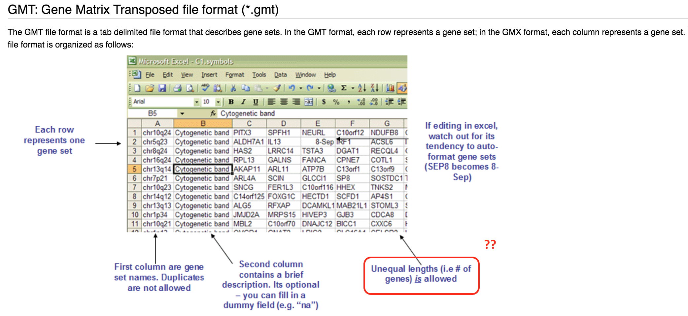
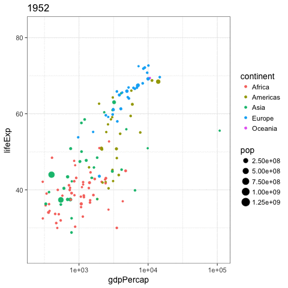

```{r setup, include=FALSE}
knitr::opts_chunk$set(fig.align = "center")
ggplot2::theme_set(ggplot2::theme_bw(14))
library(tidyverse)
```


## Reading {.vs2}


### {.col-8}

- Jennifer Bryan [lessons & tutorial](https://jennybc.github.io/purrr-tutorial/)
- Hadley Wickham [R for data science, iteration](http://r4ds.had.co.nz/iteration.html)
- Hadley Wickham [R for data science, many models](http://r4ds.had.co.nz/many-models.html)
- Hadley Wickham [managing many models (video)](https://www.youtube.com/watch?v=rz3_FDVt9eg)
- Ian Lyttle [purrr applied for engineering](http://ijlyttle.github.io/isugg_purrr/presentation.html#%281%29)
- Robert Rudis [purrr, comparison with base](https://rud.is/b/2016/07/26/use-quick-formula-functions-in-purrrmap-base-vs-tidtyverse-idiom-comparisonsexamples/)
- Rstudio's blog [purrr 0.1 release](https://blog.rstudio.org/2015/09/29/purrr-0-1-0/)
- Rstudio's blog [purrr 0.2 release](https://blog.rstudio.org/2016/01/06/purrr-0-2-0/)

### {.col-4}


## functional programming {.vs1}


>  **functional programming** is a programming paradigm—a style of building the structure and elements of computer programs—that treats computation as the evaluation of mathematical functions and avoids changing-state and mutable data | Wikipedia

_purrr_ is basically to iterate through **`.x`**, applying **`.f`** to each element.

### {.col-2}

### general map {.box .col-8 .bg-blue}
`map(.x, .f, ...)`

### {.col-2}

%end%

> R is weakly typed, we need variants `map_int()`, `map_dbl()`, etc since we don't know what `.f` will return. | Hadley Wickham

## For loops emphasise on objects and not actions {.vs2}

compare (notice `seq_along` instead of `1:length(mtcars)`)
```{r}
means <- vector("double", ncol(mtcars))
for (i in seq_along(mtcars)) {
  means[i] <- mean(mtcars[[i]])
}
means
```

and
```{r}
map_dbl(mtcars, mean)
```

## everything in a _data.frame_ | actually a _tibble_ {.vs2}

### pros {.col-6 .bg-green .box}
- easy
- works with `dplyr`
- nicely structured

### cons {.col-6 .bg-red .box .stretch}
- same length requirement
- atomic vectors

### solution {.col-12 .box .bg-yellow}
- lists! But inside the *tidyverse*
    + `tibble` deals with list-column
    + works with `dplyr`
    + groups are respected
    + easily created with `tidyr::nest()`
    + perfect input for `purrr::map`


## lists as a column in a tibble {.vs1}


### {.col-5}


### {.col-7 .stretch}

```{r}
tibble(numbers = 1:8,
       my_list = list(a = c("a", "b"), b = 2.56, 
                      c = c("a", "b"), d = rep(TRUE, 4),
                      d = 2:3, e = 4:6, f = "Z", g = 1:4))
```

### {.box .col-5}
check out what `data.frame` will do


## GMT format | Gene Set Enrichment Analysis

Won't work with a *data.frame*

```{r, echo = FALSE, out.width = "90%"}

```


[source broadinstitute](http://software.broadinstitute.org/cancer/software/gsea/wiki/index.php/Data_formats#GMT:_Gene_Matrix_Transposed_file_format_.28.2A.gmt.29)

## GMT format | Dummy example

```{r, echo = FALSE}
gmt <- read_rds("gmt.rds")
options(tibble.print_min = 5)
gmt
```

### gene ontologies {.box .col-4 .bg-cobalt}

```{r}
count(gmt, go_id)
```

### Ensembl ids {.box .col-8 .bg-cobalt}

```{r}
count(gmt, go_id, data)
```

%end% 

### {.col-2}

### {.box .bg-yellow .col-8}
How to create a GMT from this unequal data?

## Creating a GMT file | nesting


### Reminder {.box .col-10 .bg-green} 

a list can contain _anything_, here 2 *tibbles*

%end%

```{r}
gmt %>%
  group_by(go_id, go_name) %>%
  nest(data)
```

## Creating a GMT file | nesting and expanding


```{r}
gmt %>%
  group_by(go_id, go_name) %>%
  nest() %>%
  mutate(gene_id = map(data, flatten_chr), # convert to a string vector
         n    = map_int(gene_id, length),  # just to know how many
         # collapse string vector with underscores
         gene_id = map_chr(gene_id, paste, collapse = "_")) %>%
  select(-data) -> gmt_nest
select(gmt_nest, -gene_id)
```
display separately the column with the collapsed Ensemble gene ids

```{r}
select(gmt_nest, gene_id) 
```

## Creating a GMT file | separate

one gene ids per column, fill with `NA` right-wise to manage unequal columns

```{r}
# separate by underscore, naming columns with dummy number to the max
gmt_nest %>%
  separate(gene_id, into = as.character(seq_len(max(gmt_nest$n))), fill = "right") -> gmt_sep
gmt_sep
```

## Creating a GMT file | polishing

Replace `NA` by empty items for export

```{r}
gmt_fin <- gmt_sep
gmt_fin[is.na(gmt_fin)] = " "
gmt_fin
```

# purrr

## map, put on an antenna


```{r, eval = FALSE}
antennate <- function(x) put_on(x, antenna)
map(legos, antennate)
```


## map, put on an antenna


```{r, eval = FALSE}
antennate <- function(x) put_on(x, antenna)
map(legos, antennate)
```


## map2, vectorized 2 series elements in parallel


```{r, eval = FALSE}
enhair <- function(x, y) x %>% put_on(y)
map2(legos, hairs, enhair)
```


## map2, vectorized 2 series elements in parallel


```{r, eval = FALSE}
enhair <- function(x, y) x %>% put_on(y)
map2(legos, hairs, enhair)
```


## Managing multiple models

Tutorial based on the great conference by [Hadley Wickham][1]


[1]:https://www.youtube.com/watch?v=rz3_FDVt9eg

## purrr::map / dplyr::do {.vs2}

progress bar will be [added](https://github.com/hadley/purrr/issues/149)

```{r, echo=FALSE, out.width='60%'}
knitr::include_graphics("http://lsru.github.io/r_workshop/img/purrr_do.png")
```


## Nested map

- apply several functions to all columns. Use `map_if`/`map_at` to exclude some

```{r}
funs <- list(mean = mean, median = median, sd = sd)
funs %>%
  map(~ mtcars %>% map_dbl(.x))
```
## map, shortcut {.vs2}

- between quotes, shortcut for extracting

```{r}
map(funs, ~ mtcars %>% map_dbl(.x)) %>%
  map_dbl("mpg")
```

## Gapminder | Global vs individual trend
```{r, fig.height = 4.5}
library("gapminder")
gapminder %>%
  ggplot(aes(x = year, y = lifeExp, group = country)) +
  geom_line()
```

## Keep related things together | nest

Nest _per_ country
```{r}
by_country <- gapminder %>%
  mutate(year1950 = year - 1950) %>%
  group_by(continent, country) %>%
  nest()
by_country
```


## Keep related things together | linear models

Linear model _per_ country
```{r}
by_country_lm <- by_country %>%
  mutate(model = map(data, ~ lm(lifeExp ~ year1950, data = .x)))
by_country_lm
```

## broom cleanup

```{r, echo=FALSE, out.width='90%'}
knitr::include_graphics("http://lsru.github.io/r_workshop/img/broom_cleanup.png")
```

## Tidying model coefficients | extract from nested lists

### useful info {.box .col-3 .bg-green}
- coefficients estimates:
    + **slope**
    + **intercept**
- $r^2$ 
- residuals

### {.col-9}
```{r}
library("broom")
models <- by_country_lm %>%
  mutate(glance  = map(model, glance),
         rsq     = glance %>% map_dbl("r.squared"),
         tidy    = map(model, tidy),
         augment = map(model, augment))
models
```

# Exploratory plots

## Does linear models fit all countries?

```{r, out.width='60%'}
models %>%
  ggplot(aes(x = rsq, y = reorder(country, rsq))) +
  geom_point(aes(colour = continent)) +
  theme(axis.text.y = element_text(size = 6))
```

## Exploratory plots | focus on non-linear trends

```{r, cache=FALSE}
models %>%
  filter(rsq < 0.55) %>%
  unnest(data) %>%
  ggplot(aes(x = year, y = lifeExp)) +
  geom_line(aes(colour = continent)) +
  facet_wrap(~ country)
```


## All in all

```{r, fig.height = 4}
models %>%
  unnest(tidy) %>%
  select(continent, country, rsq, term, estimate) %>%
  spread(term, estimate) %>%
  ggplot(aes(x = `(Intercept)`, y = year1950)) +
  geom_point(aes(colour = continent, size = rsq)) +
  geom_smooth(se = FALSE, method = "loess") +
  scale_size_area() + labs(x = "Life expectancy (1950)", y = "Yearly improvement")
```


## animation made easy

[gganimate](https://github.com/dgrtwo/gganimate) by David Robinson

```{r, eval=FALSE}
library("gganimate")
p <- ggplot(gapminder, aes(gdpPercap, lifeExp, size = pop, 
                           color = continent, frame = year))+
  geom_point()+scale_x_log10()
gg_animate(p, 'img/07_gapminder.gif')
```

```{r, echo=FALSE, out.width='50%'}

```


## Acknowledgments {.vs2}

* Hadley Wickham
* Robert Rudis
* Jennifer Bryan
* Ian Lyttle
* David Robinson
* Eric Koncina

[LEGO pictures](https://github.com/jennybc/lego-rstats) by Jennifer Bryan, courtesy CC licence
