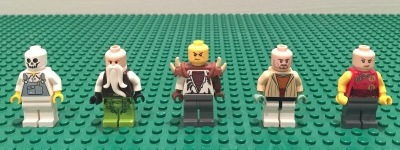
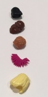
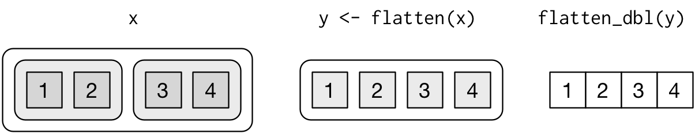
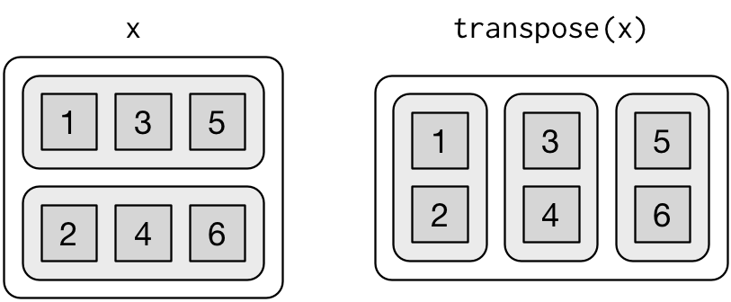

```{r setup, include=FALSE}
knitr::opts_chunk$set(fig.align = "center")
ggplot2::theme_set(ggplot2::theme_bw(14))
library(tidyverse)
```

## Learning objectives {.vs2}

### You will learn to: {.box-10 .offset-1 .bg-red .icon}


- use a functional programming approach to simplify your code
- pass functions as arguments to higher order functions
- use `purrr::map` to replace `for` loops
- deal with nested lists

## Reminder | Lists and vectors

### Atomic vectors{.box-6 .bg-blue .stretch}

Each **atomic** vector contains only a single type of data

- The type of each atom is the same
- The size of each atom is 1 (single element)
- Examples:
    ```{r, eval = FALSE}
    # Logical
    c(TRUE, FALSE, TRUE)
    
    # double
    c(1, 5, 7)
    
    # character
    c("character", "sequence")
    ```

### Coercion{.box-6 .bg-blue .stretch}

Is the conversion between types

- can be **explicit** using `as.*()` functions

```{r}
v_example <- c(1, 3, 7)
str(as.character(v_example))
```

- can be **automatic**

```{r}
v_example <- c(1, 3)
str(v_example)
str(c(v_example, "seven"))
```

%end%

<span class = "small">Adapted from the tutorial of [Jenny Bryan](https://jennybc.github.io/purrr-tutorial/bk00_vectors-and-lists.html)</span>

## Reminder | Lists and vectors

### Lists{.box-6 .offset-3 .bg-blue}

- are **vectors** which are **not atomic**.
  + Elements can be of different types
  + The length of each element (atom) might be greater than 1.
- example
    ```{r}
    my_list <- list(1, 3, "seven")
    str(my_list)
    is.vector(my_list)
    is.atomic(my_list)
    ```

%end%

<span class = "small">Adapted from the tutorial of [Jenny Bryan](https://jennybc.github.io/purrr-tutorial/bk00_vectors-and-lists.html)</span>

## Purrr | functional programming

```{r, echo = FALSE}
options(width = 40)
```


```{css}
.center-pic img {
  display: block;
  margin: auto;
  margin-top: 5px;
  margin-bottom:5px;
}

.center-pic .caption {
  text-align: center;
}

.small img {
  max-height: 64px;
}
```

### Overview {.box-8 .offset-2 .bg-blue .icon}


purrr enhances R's **functional programming** toolkit by providing a complete and consistent set of tools for **working with functions and vectors** (`purrr` overview on github page)

### {.col-10 .offset-1 .build}

> **functional programming** is a programming paradigm -- a style of building the structure and elements of computer programs -- that treats computation as the evaluation of mathematical functions and avoids changing-state and mutable data | Wikipedia{.bg-red}

## Purrr | focuses on functions

### functional programming features{.box-6 .bg-blue}

- pass functions as arguments to other functions
- code that does not change state (a same call should yield the same result)

### Iteration {.box-6 .bg-red .icon}

FOR EACH `x` DO `f`

### Example {.box-12 .bg-green .compact-output}

Calculate the mean of each column of the `mtcars` dataset

```{css}
.col-h250 {
  max-height: 260px;
  overflow: hidden;
  padding-top: 0;
}
```

<div class = "row"><div class = "col-6 col-h250 build">

### `for` loops

```{r}
means <- vector("double", ncol(mtcars))
for (i in seq_along(mtcars)) {
  means[i] <- mean(mtcars[[i]])
}
means
```

</div><div class = "col-6 col-h250 build">

### base R apply family


```{r}
apply(mtcars, 2, mean) %>% str()
lapply(mtcars, mean) %>% str()
```

</div></div>

<span class = "small">From [R for Data Science](http://r4ds.had.co.nz/)</span>

```{r, echo = FALSE}
options(width = 80)
```

## apply vs map

### The apply family of functions{.box-6 .bg-green .compact-table}

-------------------------------  ---------  -------------------------------
 function                          input                 output
-------------------------------  ---------  -------------------------------
 `apply()`                          array      vector or array or list

 `lapply()`                         list       list

 `sapply()`                         list       vector or array or list
 
 `vapply()`                         list       specified but inconsistent
-------------------------------  ---------  ------------------------------

### Warning {.box-6 .bg-red}

- Most members of the `apply()` family are inconsistent.
- Exception: `lapply()`
- `apply()` family still useful to avoid dependencies (package development)

### The `purrr::map()` family of functions {.box-8 .offset-2 .bg-blue}

- are designed to be consistent
- `map()` is the general function and close to `base::lapply()`
- `map()` introduces shortcuts (absent in `lapply()`)
- six variants to specify the type of vectorized output (`map_lgl()`, `map_int()`, `map_dbl()`, `map_chr()`, `map_df()`, `walk()`)

## `Purrr::map()`

### Illustration {.box-12 .bg-blue .center-pic}

- `purrr::map()` is **type stable**
    + applies a function to each element of a list
    + returns a list
    + `map(YOUR_LIST, YOUR_FUNCTION)`

```{r, eval = FALSE}
antennate <- function(x) put_on(x, antenna)
map(legos, antennate)
```

<div class = "row build"><div class = "col-5">



</div><div class = "col-2">


</div><div class = "col-5">


</div></div>

<span class = "small">[LEGO pictures from Jenny Bryan](https://github.com/jennybc/lego-rstats)</span>

## Purrr | map shortcuts

### Example {.box-8 .offset-2 .bg-green}

- Split the mtcars dataset by each value of cylinder
    ```{r}
    spl_mtcars <- mtcars %>%
      split(.$cyl)
    str(spl_mtcars, max.level = 1)
    ``` 
- On each element (dataframe) of the list, we would like to:
    + fit a linear model (miles per gallon explained by the weight)
    + extract the $r^2$ value

<span class = "small">From [R for Data Science](http://r4ds.had.co.nz/)</span>

## `purrr::map()` | example

### 1 - map the linear model {.box-6 .bg-green}

- reminder:
    ```{r, eval = FALSE}
    map(YOUR_LIST, YOUR_FUNCTION)
    # is equivalent to:
    YOUR_LIST %>% map(YOUR_FUNCTION)
    ```

- `YOUR_LIST` = `spl_mtcars`
- `YOUR_FUNCTION` can be an anonymous function (declared on the fly)

```{r}
str(spl_mtcars, max.level = 1)
```

### {.col-6 .compact-output}

```{r}
spl_mtcars %>% 
  map(function(df) lm(mpg ~ wt, data = df))
```

## `purrr::map()` | example

### 2 - extract $r^2$ {.box-10 .offset-0 .bg-green}

- map uses a list as an argument and **returns a list**
- we can map a new function on the output of the previous call

### {.col-10 .offset-2 .compact-output}

```{r}
spl_mtcars %>% 
  map(function(df) lm(mpg ~ wt, data = df)) %>%
  map(summary) %>%
  map(function(x) x$r.squared)
```

### Tip {.box-6 .offset-3 .bg-blue .vs1 .icon .small}


The code above can be simplified using shortcuts provided by `purrr`

## `purrr::map()` | shortcuts

- One sided formula to create anonymous functions (using `~` and the placeholder `.` which refers to the current list element)
    ```{r, eval = FALSE}
    map(YOUR_LIST, function(df) lm(mpg ~ wt, data = df))
    
    # is equivalent to:
    
    map(YOUR_LIST, ~ lm(mpg ~ wt, data = .))
    ``` 

Our previous code can be simplified:

### Initial code{.box-7 .bg-cobalt}

```{r, eval = FALSE}
spl_mtcars %>% 
  map(function(df) lm(mpg ~ wt, data = df)) %>%
  map(summary) %>%
  map(function(x) x$r.squared)
```

### Using shortcuts{.box-5 .bg-cobalt}

```{r, eval = FALSE}
spl_mtcars %>% 
  map(~lm(mpg ~ wt, data = .)) %>%
  map(summary) %>%
  map(~.$r.squared)
```

%end%

- Use a string to extract **named components**

### Using shortcuts{.box-5 .offset-7 .bg-cobalt}

```{r, eval = FALSE}
spl_mtcars %>% 
  map(~lm(mpg ~ wt, data = .)) %>%
  map(summary) %>%
  map("r.squared")
```


## The map function family{.nvs1}

### Reminder {.box-6 .bg-blue}

- `purrr::map()` (like base `base::lapply()`)
    + uses a **list** as an input
    + outputs a **list**
    
### Choosing output type{.box-6 .bg-red}

- purrr provides a family of functions to generate specific outputs
    + `map()` makes a **list**.
    + `map_lgl()` makes a **logical** vector.
    + `map_int()` makes an **integer** vector.
    + `map_dbl()` makes a **double** vector.
    + `map_chr()` makes a **character** vector.
    + `map_df()` makes a data frame (row-binding elements)

### using `map()`{} {.box-6 .bg-cobalt .compact-output}

```{r, eval = TRUE}
spl_mtcars %>% 
  map(~lm(mpg ~ wt, data = .)) %>%
  map(summary) %>%
  map("r.squared") %>% 
  str()
```

### using `map_dbl()`{} {.box-6 .bg-cobalt .compact-output}

```{r, eval = TRUE}
spl_mtcars %>% 
  map(~lm(mpg ~ wt, data = .)) %>%
  map(summary) %>%
  map_dbl("r.squared") %>% 
  str()
```


## Application example | importing data

### Exercise{.box-10 .bg-green .offset-1}

- go back to the `deaths` MS Excel example file
    + store the path to the file in the object `path` using the following command: `path <- readxl_example("deaths.xls")`
    + don't forget the **pitfalls** you already faced during the `readr` lecture!
    + use a **functional programming approach** to load the data spread accross multiple sheets
    
## Application example | importing data

### Solution {.box-10 .bg-cobalt .offset-1 .compact-output}

```{r}
library(readxl)
path <- readxl_example("deaths.xls")

path %>%
  excel_sheets() %>%
  map_df(read_excel, path = path, range = "A5:F15")
```

## Application example | importing data

### `map_df()` arguments {.box-6 .bg-blue}

- map_df() has an `.id` argument
- creates a variable with the given name containing the index or name of the data frame

### `set_names()`{} {.box-6 .bg-blue .compact-output}

- to set names in a vector
    ```{r}
    set_names(1:5)
    set_names(1:5, nm = letters[1:5])
    ```
- is a wrapper for `setNames` which does some checkings and is stricter
  
    ```{r, error = TRUE}
    setNames(1:5, nm = letters[1:2])
    set_names(1:5, nm = letters[1:2])
    ```


## Application example | importing data

### Enhanced solution {.box-10 .bg-cobalt .offset-1 .compact-output}

```{r}
path %>%
  excel_sheets() %>%
  set_names() %>% # creates a named vector
  map_df(read_excel, path = path, range = "A5:F15", .id = "profession_area") %>%
  janitor::clean_names()
```


## Purrr | Iterating on 2 lists

### `map(legos, antennate)`{} {.box-6 .bg-red .center-pic}


```{r, eval = FALSE}
map(legos, antennate)
```

### `map2()`{} {.box-6 .bg-red .center-pic .stretch}




```{r, eval = FALSE}
enhair <- function(x, y) x %>% put_on(y)
map2(legos, hairs, enhair)
```


## The tidyverse focuses on data frames

### pros {.box-6 .bg-green}

- easy
- works with `dplyr`
- nicely structured

### cons {.box-6 .bg-red .stretch}

- same length requirement
- atomic vectors

### solution {.box-8 .offset-2 .bg-yellow .icon .vs1}


- **Use lists!** But inside the *tidyverse*
    + `tibble` introduces **list-columns**
    + works with `dplyr`
    + groups are respected
    + easily created with `tidyr::nest()`
    + perfect input for `purrr::map`

## Lists as a column in a tibble

### Example {.box-12 .offset-0 .bg-grayblue .icon}


```{r}
tibble(numbers = 1:8,
       my_list = list(a = c("a", "b"), b = 2.56, 
                      c = c("a", "b"), d = rep(TRUE, 4),
                      d = 2:3, e = 4:6, f = "Z", g = 1:4))
```

## Example

### Rewriting our previous example {.box-4 .bg-cobalt .build .stretch}

```{r, class = "build shadow"}
mtcars %>%
  group_by(cyl) %>%
  nest()
```

### Use mutate and map {.box-8 .bg-cobalt .build .stretch}

```{r, class = "build shadow"}
mtcars %>%
  group_by(cyl) %>%
  nest() %>%
  mutate(model = map(data, ~lm(mpg ~ wt, data = .)),
         summary = map(model, summary),
         r_squared = map_dbl(summary, "r.squared"))
```

###{.box-8 .offset-2 .bg-red .build}

- very powerful
- next lecture will show you how `dplyr`, `tidyr`, `tibble`, `purrr` and `broom` nicely work together


## Nested lists

### Visualising lists {.box-8 .bg-gray .offset-2}

```{r, eval = FALSE}
x1 <- list(c(1, 2), c(3, 4))
x2 <- list(list(1, 2), list(3, 4))
x3 <- list(1, list(2, list(3)))
```


_from [R for Data Science](http://r4ds.had.co.nz/lists.html)_


## Removing a level of hierarchy

### `flatten()` function {.box-4 .bg-blue}

- family
    + `flatten()`
    + `flatten_int()`
    + `flatten_dbl()`
    + `flatten_lgl()`
    + `flatten_chr()`

### flatten a list {.box-8 .bg-greenwhite .stretch}

```{r}
x <- list(list(a = 1, b = 2), list(c = 3, d = 4))

flatten(x) %>% str()

flatten(x) %>% flatten_dbl() %>% str()
```




_from [R for Data Science](http://r4ds.had.co.nz/lists.html)_

## Removing a level of hierarchy

### `base::unlist()` vs `flatten()`{} {.box-10 .bg-red .compact-output .offset-1}

- base _R_ provides `unlist()` but `flatten()` is more consistent
    + `unlist()` will always succeed
    ```{r, error = TRUE}
    unlist(1:3)
    flatten(1:3)
    
    my_list <- list("One", 2, 3)
    unlist(my_list) %>% str()
    flatten(my_list) %>% str()
    flatten_dbl(my_list)
    ```


## Transpose a list

### the `transpose()`function{.box-6 .bg-bluewhite}



_from [R for Data Science](http://r4ds.had.co.nz/lists.html)_

### Example {.box-6 .bg-green .compact-output}

```{r, row = c(7, 5)}
x <- list(
  x = list(a = 1,
           b = 3,
           c = 5),
  y = list(a = 2,
           b = 4,
           c = 6)
)
x %>% str()
x %>% transpose() %>%
  str()
```


## Nested lists

### Example {.box-12 .bg-green .compact-output}

- Let's adapt an example provided by Hadley Wickham

```{r, row = c(7, 5)}
l1 <- list(
  group1 = list(
    individual1 = list(param1 = 1:2, param2 = 3:4),
    individual2 = list(param1 = 5:6, param2 = 7:8)
  ),
  group2 = list(
    individual1 = list(param1 = 9:10, param2 = 11:12),
    individual2 = list(param1 = 13:14, param2 = 15:16)
  )
)

l1 %>% str()
```


### Visualisation{.box-6 .offset-3 .bg-yellow .icon-small .vs1 .build}


- Visualise and interactively browse nested lists using `listviewer::jsonedit()`

## Nested lists

### The `listviewer` package {.box-8 .offset-2 .bg-cobalt}

```{css}
.chunk > .jsonedit {
  background: white;
  width: 100% !important;
  height: 400px !important;
}
```


```{r}
l1 %>% listviewer::jsonedit()
```

## Nested lists | extracting elements

### Example {.box-10 .offset-1 .bg-green}

- try to extract all _param1_ values for _individual2_ in both groups


```{r, class = "build"}
# Extract individual2 using a string shortcut
l1 %>%
  map("individual2") %>% str()
```


```{r, class = "build"}
# chain 2 map calls to get param1 out of both groups

l1 %>%
  map("individual2") %>%
  map("param1") %>% str()
```

## Nested lists | extracting elements

### Example {.box-10 .offset-1 .bg-green}


- Do it in a single step using a character vector with `map()`!

```{r}
l1 %>%
  map("individual2") %>%
  map("param1") %>% str()

l1 %>%
  map(c("individual2", "param1")) %>% str()
```

## Nested lists | map a function over lower levels

### Example {.box-8 .offset-2 .bg-green}

- Calculate the mean of both _param_ for each individual
- We would need to recursively use `map()`

```{r, eval = T}
l1 %>% map(~map(., ~map(., mean))) %>% str()
```

## Nested lists | map a function over lower levels

### `at_depth()`{} {.box-4 .offset-1 .bg-blue .build}

- is a recursive `map()`
- map a function to a lower level of a list
    ```{r, eval = FALSE}
    x %>% at_depth(0, fun)
    # is equivalent to
    # fun(x)
    
    x %>% at_depth(1, fun)
    # is equivalent to
    # map(x, fun)
    
    x %>% at_depth(2, fun)
    # is equivalent to
    # map(x, . %>% map(fun))
    ```

### Example {.box-6 .bg-green}

- Our previous call becomes much simplier

```{r, eval = FALSE}
l1 %>% map(~map(., ~map(., mean)))
```

```{r}
l1 %>% at_depth(3, mean) %>% str()
```

## Reduce a list to a single value{.nvs1}

### reduce{.box-6 .build .bg-blue .compact-pre}

- combines a list from the **left**

    ```{r}
    1:4 %>% reduce(`-`)

    ((1 - 2) - 3) - 4
    ```


### reduce_right{.box-6 .bg-blue .compact-pre}

- combines a list from the **right**

    ```{r}
    1:4 %>% reduce_right(`-`)

    1 - (2 - (3 - 4))
    ```


### working recursively {.box-12 .bg-green .build .compact-output}

<div class = "row"><div class = "col-5">

```{r, eval = FALSE, echo = TRUE}
1:4 %>% reduce(`+`)

c(1, 2, 3, 4)
c(   3, 3, 4)
c(      6, 4)
c(        10)
```

```{r}
my_add <- function(x, y) {
  print(paste("x =", x, "y =", y))
  x + y
}
```
</div><div class = "col-7 middle">
```{r, row = c(7, 5)}
reduce(1:4, my_add)
reduce_right(1:4, my_add)
```
</div></div>

## accumulate recursive folds across a list{.vs2}

### accumulate{.box-6 .build .bg-blue .compact-pre .stretch}

- similar to `reduce()` but keeps intermediate results

    ```{r}
    1:4 %>% accumulate(`+`)
    ```

### accumulate_right{.box-6 .build .bg-blue .compact-pre .stretch}

- accumulates a list from the **right**

    ```{r}
    1:4 %>% accumulate_right(`+`)
    ```

## Purrr | Pure functions

### {.col-6}

<blockquote class="twitter-tweet" data-lang="fr"><p lang="en" dir="ltr">Make your pure <a href="https://twitter.com/hashtag/rstats?src=hash">#rstats</a> functions purr with purrr, a new package for functional programming: <a href="http://t.co/91Efuz0txk">http://t.co/91Efuz0txk</a></p>&mdash; Hadley Wickham (@hadleywickham) <a href="https://twitter.com/hadleywickham/status/648959790056509440">29 septembre 2015</a></blockquote>
<script async src="https://platform.twitter.com/widgets.js" charset="utf-8"></script>

### {.col-6}

> A function is called "pure" if all its inputs are _declared_ as inputs - none of them are hidden - and likewise all its outputs are _declared_ as outputs | {.bg-blue}[Kris Jenkins](http://blog.jenkster.com/2015/12/what-is-functional-programming.html)

## _"Purify"_ functions | Pure functions

### Impure function {.box-6 .bg-green}

- has hidden inputs or outputs
- hidden inputs or outputs are called _**side-effects**_

```{r}
start <- 10

impure <- function(x) {
  print(start)
  x + start
}

result <- impure(2)

result
```


### Pure function {.box-6 .bg-green}

- no hidden inputs and/or outputs

```{r}
pure <- function(x, start) {
  x + start
}

result <- pure(2, start)
result
```

## _"Purify"_ functions

### Example{.box-12 .bg-green}

- Even `log()` has side-effects
- Use `purrr::safely()` to catch every output

### Impure `log()`{} {.box-6 .bg-cobalt .build .compact-output}

```{r, error = TRUE}
(res <- log(10))
res <- log("a")
res
```

### Purified `log()`{} {.box-6 .bg-cobalt .compact-output}

```{r}
safe_log <- purrr::safely(log)
(res <- safe_log(10))
res <- safe_log("a")
res
```

## Useful functions | transpose

Let's go further with the `safe_log()` example

###{.col-12 .compact-output .build}

```{r, row = c(4, 8)}
# Example from the help page
x <- list("a", 1, 2)
y <- x %>% map(safely(log))
y %>% str()
```

###{.col-12 .compact-output .build}

```{r, row = c(4, 8)}
y %>% transpose() %>% str()
```


## Side effects are still required

```{r, echo = FALSE}
my_print <- function(x) {
  print(x)
  return(NULL)
}
```

### `walk`{} {.box-6 .bg-blue}

- alternative to `map()` to call functions for its side effects
    + output on screen
    + save files to disk
- returns the input and can be used in a pipeline (` %>% `)


### Example {.box-6 .bg-green}

```{r}
x <- list(1, "a", 3)

x %>% 
  walk(print)
```

### {.col-6 .build}

```{r, row = TRUE}
x %>% 
  walk(print) %>%
  str()

x %>% 
  map(print) %>%
  str()
```
### {.col-6}

```{r, row = TRUE}
x %>% 
  walk(my_print) %>%
  str()

x %>% 
  map(my_print) %>%
  str()
```


## Before we stop{.nvs1}

### Further reading {.box-10 .offset-1 .bg-blue .icon}


- Jennifer Bryan [lessons & tutorial](https://jennybc.github.io/purrr-tutorial/)
- Hadley Wickham [R for data science, iteration](http://r4ds.had.co.nz/iteration.html)
- Hadley Wickham [R for data science, many models](http://r4ds.had.co.nz/many-models.html)
- Ian Lyttle [purrr applied for engineering](http://ijlyttle.github.io/isugg_purrr/presentation.html#%281%29)
- Robert Rudis [purrr, comparison with base](https://rud.is/b/2016/07/26/use-quick-formula-functions-in-purrrmap-base-vs-tidtyverse-idiom-comparisonsexamples/)
- Rstudio's blog [purrr 0.1 release](https://blog.rstudio.org/2015/09/29/purrr-0-1-0/)
- Rstudio's blog [purrr 0.2 release](https://blog.rstudio.org/2016/01/06/purrr-0-2-0/)
- What is Functional Programming? by Kris Jenkins ([Blog version](http://blog.jenkster.com/2015/12/what-is-functional-programming.html) and [Talk video](https://www.youtube.com/watch?v=tQRtTSIpye4))
- Bruno Rodrigues [Functional programming and unit testing for data munging with R](http://www.brodrigues.co/fput/)

### Acknowledgments {.box-10 .offset-1 .bg-yellow}

* Hadley Wickham
* Robert Rudis
* Jennifer Bryan ([LEGO pictures](https://github.com/jennybc/lego-rstats), courtesy CC licence)
* Ian Lyttle
* David Robinson
