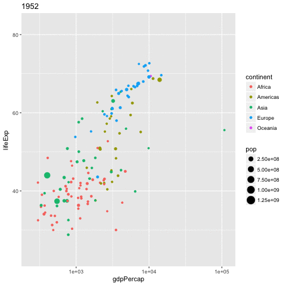

```{r, echo = FALSE, warning = FALSE, message = FALSE}
library(tidyverse)
knitr::opts_chunk$set(fig.align = "center")
```


```{css}
.bg-green2 > h3:first-child > a:hover,
.bg-green2 > h3:first-child > a {
  color: white !important;
}

.bg-grgold a:hover,
.bg-grgold a {
  color: white !important;
}

article.maximise {
  margin-top: -20px;
}
/* from https://csswizardry.com/2010/02/mutiple-column-lists-using-one-ul/ */
.col-list ul {
  overflow: hidden;
}

.col-list li {
  float: left;
  display: inline;
  padding-left: 50px;
}

.col-list li:before {
    content: "\2022";
    font-size: 150%;
}

.c2 li {
  width: 50%;
}

.c3 li {
  width: 33.333%;
}
```

## Learning objectives {.vs2}

- use `dplyr` / `purrr` for efficient data manipulation
- tidying linear models using `broom` 
- managing workflow by keeping related things together in **one** `tibble`. 


## Managing multiple models

Tutorial based on the great conference by [Hadley Wickham][1]


[1]:https://www.youtube.com/watch?v=rz3_FDVt9eg

## purrr::map / dplyr::do {.vs2}

progress bar will be [added](https://github.com/hadley/purrr/issues/149)

```{r, echo=FALSE, out.width='60%'}
knitr::include_graphics("http://lsru.github.io/r_workshop/img/purrr_do.png")
```


## Gapminder | global vs individual trend
```{r, fig.height = 4.5}
library("gapminder")
gapminder %>%
  ggplot(aes(x = year, y = lifeExp, group = country)) +
  geom_line()
```

## Keep related things together | nest

Nest _per_ country
```{r}
by_country <- gapminder %>%
  mutate(year1950 = year - 1950) %>%
  group_by(continent, country) %>%
  nest()
by_country
```


## Keep related things together | linear models

Linear model _per_ country
```{r}
by_country_lm <- by_country %>%
  mutate(model = map(data, ~ lm(lifeExp ~ year1950, data = .x)))
by_country_lm
```

## broom cleanup

```{r, echo=FALSE, out.width='90%'}
knitr::include_graphics("http://lsru.github.io/r_workshop/img/broom_cleanup.png")
```

## Tidying model coefficients | extract from nested lists

### useful info {.box .col-3 .bg-green}
- coefficients estimates:
    + **slope**
    + **intercept**
- $r^2$ 
- residuals

### {.col-9}
```{r, warning=FALSE}
library("broom")
models <- by_country_lm %>%
  mutate(glance  = map(model, glance),
         rsq     = glance %>% map_dbl("r.squared"),
         tidy    = map(model, tidy),
         augment = map(model, augment))
models
```

# Exploratory plots

## Does linear models fit all countries?

```{r, out.width='60%'}
models %>%
  ggplot(aes(x = rsq, y = reorder(country, rsq))) +
  geom_point(aes(colour = continent)) +
  theme(axis.text.y = element_text(size = 6))
```

## Exploratory plots | focus on non-linear trends

```{r, cache=FALSE}
models %>%
  filter(rsq < 0.55) %>%
  unnest(data) %>%
  ggplot(aes(x = year, y = lifeExp)) +
  geom_line(aes(colour = continent)) +
  facet_wrap(~ country)
```


## All in all

```{r, fig.height = 4}
models %>%
  unnest(tidy) %>%
  select(continent, country, rsq, term, estimate) %>%
  spread(term, estimate) %>%
  ggplot(aes(x = `(Intercept)`, y = year1950)) +
  geom_point(aes(colour = continent, size = rsq)) +
  geom_smooth(se = FALSE, method = "loess") +
  scale_size_area() + labs(x = "Life expectancy (1950)", y = "Yearly improvement")
```


## animation made easy

### [gganimate](https://github.com/dgrtwo/gganimate) by David Robinson {.box-6 .bg-cobalt}
```{r, eval=FALSE}
library(gganimate)
gapminder %>%
ggplot(aes(x = gdpPercap, 
           y = lifeExp,
           size = pop, 
           color = continent,
           frame = year)) +
  geom_point() +
  scale_x_log10() -> p
gganimate(p, 'img/09_gapminder.gif')
```

### {.col-6}

```{r, echo=FALSE, out.width='90%'}

```


