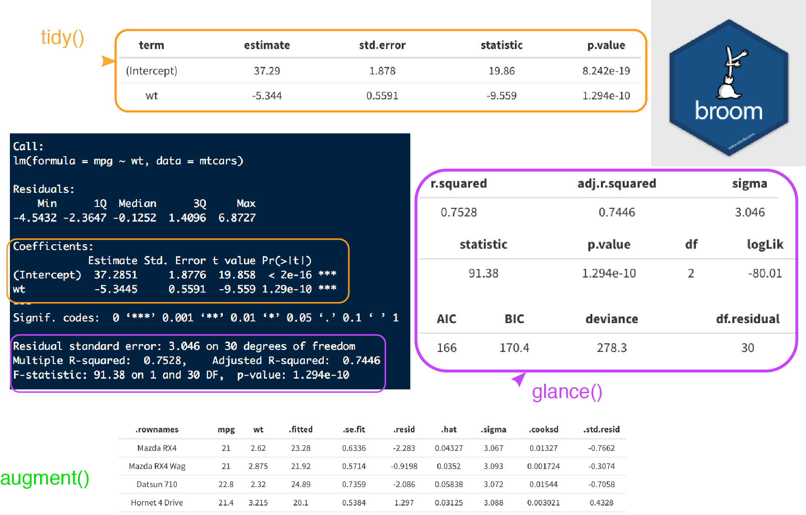

```{r, include = FALSE}
library(tidyverse)
ggplot2::theme_set(ggplot2::theme_bw(14))
```


```{css}
.bg-green2 > h3:first-child > a:hover,
.bg-green2 > h3:first-child > a {
  color: white !important;
}

.bg-grgold a:hover,
.bg-grgold a {
  color: white !important;
}
/* from https://csswizardry.com/2010/02/mutiple-column-lists-using-one-ul/ */
.col-list ul {
  overflow: hidden;
}

.col-list li {
  float: left;
  display: inline;
  padding-left: 50px;
}

.col-list li:before {
    content: "\2022";
    font-size: 150%;
}

.c2 li {
  width: 50%;
}

.c3 li {
  width: 33.333%;
}
```

## Learning objectives {.vs2}

### You will learn to: {.box-10 .offset-1 .bg-yellow2 .icon}


- use `dplyr` / `purrr` for efficient data manipulation
- tidying linear models using `broom` 
- managing workflow by keeping related things together in **one** `tibble`. 


## Managing multiple models

Tutorial based on the great conference by [Hadley Wickham][1]


[1]:https://www.youtube.com/watch?v=rz3_FDVt9eg

## purrr::map / dplyr::do {.vs2}

progress bar will be [added](https://github.com/hadley/purrr/issues/149)

```{r, echo=FALSE, out.width='60%'}
knitr::include_graphics("http://lsru.github.io/r_workshop/img/purrr_do.png")
```

## Gapminder | [gapminder](http://www.gapminder.org/) is a fact tank {.vs2}


### dataset {.box-7 .bg-grgold .stretch .icon} 


- from an independent Swedish foundation
- [R package](https://github.com/jennybc/gapminder) maintained by [Jenny Bryan!](https://github.com/jennybc)
- install from CRAN: `gapminder`

### Hans Rosling {.box-5 .bg-yellow2 .icon}


- died last February
- fundamentaly optimistic
- great [talk](https://www.ted.com/talks/hans_rosling_shows_the_best_stats_you_ve_ever_seen)


## Gapminder | global vs individual trend
```{r, fig.height = 4.5}
library("gapminder")
gapminder %>%
  ggplot(aes(x = year, y = lifeExp, group = country)) +
  geom_line()
```

## Keep related things together | nest

### Nest _per_ country {.box-6}
```{r}
by_country <- gapminder %>%
  mutate(year1950 = year - 1950) %>%
  group_by(continent, country) %>%
  nest()
by_country
```

### helpers {.box-6}

- `year1950` will help to get count oldest date
- add `continent` to `group_by()` to keep the info


## Germany {.vs1}

### from original tibble {.box-6}
```{r}
gapminder %>%
  filter(country == "Germany") %>%
  select(-country, -continent)
```

### from nested tibble {.box-6}
```{r}
by_country %>%
  filter(country == "Germany") %>%
  pull(data) # dplyr 0.6, .$data for dplyr 0.5
```

## What happens in the DATA FRAME, stays in the data frame {.vs2}

```{css}
.vembedr {
  border-radius: 25px; /* adjust it to your needs */
  overflow: hidden;
}

.vembedr iframe {
  display: block;
  border: none;
}
```

```{r, echo = FALSE}
vembedr::embed_youtube("4MfUCX_KpdE", 
                       query = list(start = vembedr::secs("15m43s"), end = vembedr::secs("16m01s"))) %>%
  htmltools::div(class = "vembedr")
```


## Keep related things together | linear models {.vs2}

### Linear model _per_ country {.box-12}
```{r}
by_country_lm <- by_country %>%
  mutate(model = map(data, ~ lm(lifeExp ~ year1950, data = .x)))
by_country_lm
```


## broom cleanup

```{r, echo=FALSE, out.width='90%'}

```

## Tidying model coefficients | extract from nested lists {.vs2}

### useful info {.box .col-3 .bg-green}
- coefficients estimates:
    + **slope**
    + **intercept**
- $r^2$ 
- residuals

### {.col-9}
```{r, warning=FALSE}
library("broom")
models <- by_country_lm %>%
  mutate(glance  = map(model, glance),
         rsq     = glance %>% map_dbl("r.squared"),
         tidy    = map(model, tidy),
         augment = map(model, augment))
models
```

# Exploratory plots

## Does linear models fit all countries? |snake plot {.nvs1}

```{r, out.width='60%'}
models %>%
  ggplot(aes(x = rsq, y = reorder(country, rsq))) +
  geom_point(aes(colour = continent)) +
  theme(axis.text.y = element_text(size = 6))
```

## Exploratory plots | focus on non-linear trends {.nvs1}

```{r, row = c(5, 7), fig.height=6}
models %>%
  filter(rsq < 0.55) %>%
  unnest(data) %>%
  ggplot(aes(x = year, y = lifeExp)) +
  geom_line(aes(colour = continent)) +
  facet_wrap(~ country) +
  theme(legend.justification = c(1, 0),
        legend.position = c(1, 0))
```


## All in all | by Hadley Wickham {.nvs1}

```{r, fig.height = 4}
models %>%
  unnest(tidy) %>%
  select(continent, country, rsq, term, estimate) %>%
  spread(term, estimate) %>%
  ggplot(aes(x = `(Intercept)`, y = year1950)) +
  geom_point(aes(colour = continent, size = rsq)) +
  geom_smooth(se = FALSE, method = "loess") +
  scale_size_area() + labs(x = "Life expectancy (1950)", y = "Yearly improvement")
```


## animation made easy

### [gganimate](https://github.com/dgrtwo/gganimate) by David Robinson {.box-6 .bg-cobalt}
```{r, eval=FALSE}
library(gganimate)
gapminder %>%
ggplot(aes(x = gdpPercap, 
           y = lifeExp,
           size = pop, 
           color = continent,
           frame = year)) +
  geom_point() +
  scale_x_log10() -> p
gganimate(p, 'img/09_gapminder.gif')
```

### {.col-6}

```{r, echo=FALSE, out.width='100%'}
knitr::include_graphics("img/09_gapminder.gif")
```


## No missing features, but biobroom {.vs3}

### David Robinson {.box-6 .bg-yellow2}

- from John Storey' lab
- [bioconductor package](https://www.bioconductor.org/packages/release/bioc/html/biobroom.html)
- see [vignette](https://www.bioconductor.org/packages/release/bioc/vignettes/biobroom/inst/doc/biobroom_vignette.html)


### tidy objects from {.box-6 .bg-grgold .icon}


- DESeq2
- edgeR
- limma
- ExpressionSet
- MSnSet
