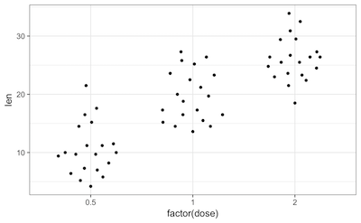
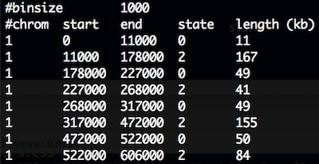

```{r setup, include=FALSE}
library("tidyverse")
ggplot2::theme_set(ggplot2::theme_bw(14))
```

> This practical aims at performing exploratory plots and how-to build layer by layer to be familiar with
the grammar of graphics. In the last part, a supplementary exercise will focus on plotting genome-wide CNV. 
You will also learn to use the _forcats_ package which allows you to adjust the ordering of categorical variables appearing on your plot.

## Scatter plots

The `mtcars` dataset is provided by the `ggplot2` library (have a look above at the first lines printed using the `head()` function). As for every (or near to every) function, most datasets shipped with a library contain also a useful help page (`?`).


(@) Plot the fuel consumption on the _y_ axis and the cars weight on the _x_ axis.

```{r, solution = TRUE}
mtcars %>%
  ggplot(aes(x = wt, y = mpg)) +
  geom_point()
```

(@) The `geom_smooth()` layer can be used to add a trend line. Try to overlay it to your scatter plot.

```{asis,  boxtitle = "Tip", box = "lightblue"}
by default `geom_smooth` is using a loess regression (< 1,000 points) and adds standard error intervals. 

- The `method` argument can be used to change the regression to a linear one: `method = "lm"`
- to disable the ribbon of standard errors, set `se = FALSE`
```

```{r, solution = TRUE}
mtcars %>%
  ggplot(aes(x = wt, y = mpg)) +
  geom_point() +
  geom_smooth()
```

(@) It would be more useful to draw a regression line on the scatter plot and without the standard error. Using the help (`?`), adjust the relevant setting in `geom_smooth()`.

```{r, solution = TRUE}
mtcars %>%
  ggplot(aes(x = wt, y = mpg)) +
  geom_point() +
  geom_smooth(method = "lm", se = FALSE)
```

(@) Ajust some aesthetics in order to:
    + associate the shape of the points to the number of cylinders
    + associate a colour gradient to the quarter mile time
    + If you're feeling succesful, try to adjust the colour gradient from yellow for fast accelerating cars to blue for slow accelerating cars.
    + have a look at the _R_ package [viridis](https://github.com/sjmgarnier/viridis) which provides palettes color-blind friendly and suitable for grey printing

```{asis,  boxtitle = "Tip", box = "lightblue"}
The `cyl` variable is of type _double_, thus a continuous variable. To map as the shape aesthetics, mind coercing the variable to a factor
```

```{r, solution = TRUE}
mtcars %>%
  ggplot(aes(x = wt, y = mpg, color = qsec)) +
  geom_point(aes(shape = factor(cyl)), size = 3) +
  geom_smooth(method = "lm", se = FALSE) +
  scale_color_continuous(low = "yellow", high = "blue") +
  theme_bw()
```

```{r, solution = TRUE}
# install.packages("viridis")
library("viridis")
mtcars %>%
  ggplot(aes(x = wt, y = mpg, color = qsec)) +
  geom_point(aes(shape = factor(cyl)), size = 3) +
  geom_smooth(method = "lm") +
  viridis::scale_color_viridis() +
  theme_bw()
```

(@) Find a way to produce both of the following plots:

```{r, echo = FALSE, fig.width = 4, fig.height = 4}
mtcars$cyl <- factor(mtcars$cyl)
mtcars$am <- factor(mtcars$am)
mtcars %>%
  ggplot(aes(x = wt, y = mpg)) +
  geom_point(aes(color = cyl, shape = am),
             size = 3) +
  geom_smooth(method = "lm") +
  theme_bw() +
  labs(y = "Miles per gallon",
       x = "Weight of car (,1000 lbs)",
       title = "Effect of car weights on fuel consumption",
       subtitle = "global linear regression",
       caption = "1974 Motor Trend US magazine")
```

```{r, echo = FALSE, fig.width = 4, fig.height = 4}
mtcars$cyl <- factor(mtcars$cyl)
mtcars$am <- factor(mtcars$am)
mtcars %>%
  ggplot(aes(x = wt, y = mpg, color = cyl)) +
  geom_point(aes(shape = am), size = 3) +
  geom_smooth(method = "lm") +
  theme_bw() +
  labs(y = "Miles per gallon",
       x = "Weight of car (1,000 lbs)",
       title = "Effect of car weights on fuel consumption ",
       subtitle = "per cylinder linear regression",
       caption = "1974 Motor Trend US magazine")
```

```{asis,  boxtitle = "Tip", box = "lightblue"}
Remember that:

- all aesthetics defined in the `ggplot(aes())` command will be inherited by all following layers
- `aes()` of individual geoms are specific (and overwrite the global definition if present).
```

## Categorical data

We will now look at another built-in dataset called `ToothGrowth`. This dataset contains the teeth length of 60 guinea pigs which received 3 different doses of vitamin C (in mg/day), delivered either by orange juice (`OJ`) or ascorbic acid (`VC`).

(@) Is this dataset tidy?

```{asis, solution = TRUE}
yes, each row is an observation, each column a variable.
```

(@) plot the distributions as boxplots of the teeth lengths by the dose received

```{r, solution = TRUE, fig.width = 4, fig.height = 4}
ToothGrowth %>%
  ggplot(aes(x = factor(dose), y = len)) +
  geom_boxplot()
```

(@) attribute a different filling colour to each delivery method

```{r, solution = TRUE, fig.width = 4, fig.height = 4}
ToothGrowth %>%
  ggplot(aes(x = factor(dose), y = len, fill = supp)) +
  geom_boxplot()
```

When the dataset is tidy, it is easy to draw a plot telling us the story: vitamin C affects the teeth growth and the delivery method is only important for lower concentrations.

---

Boxplots are nice but misleading. The size of the dataset is not visible and the shapes of distrubutions could be better represented.

(@) plot again length of the teeth by the received dose but using `geom_dotplot()`

```{asis,  boxtitle = "Tip", box = "lightblue"}
change the following options in `geom_dotplot()`:

- `binaxis = "y"` for the y-axis
- `stackdir = "center"`
- `binwidth = 1` for no binning, display all dots
```

```{r, solution = TRUE, fig.width = 4, fig.height = 4}
ToothGrowth %>%
  ggplot(aes(x = factor(dose), y = len)) +
  geom_dotplot(binaxis = "y", stackdir = "center", binwidth = 1)
```

(@) add a `geom_violin()` to the previous plot to get a better view of the distribution shape.

```{asis,  boxtitle = "Tip", box = "lightblue"}
The order of the layers matters. Plotting is done respectively. 
Set the option `trim = FALSE` to the violin for a better looking shape
```

```{r, solution = TRUE, fig.width = 4, fig.height = 4}
ToothGrowth %>%
  ggplot(aes(x = factor(dose), y = len)) +
  geom_violin(trim = FALSE) +
  geom_dotplot(binaxis = "y", stackdir = "center", binwidth = 1)
```

Now we are missing summary values like the median which is shown by the boxplots. We should add one.

(@) add the median using `stat_summary()` to the previous plot

```{asis,  boxtitle = "Tip", box = "lightblue"}
by default `stat_summary()` adds the mean and +/- standard error via geom_pointrange().
specify the `fun.y = "median"` and appropriate `geom`, `colour`.
```

```{r, solution = TRUE, fig.width = 4, fig.height = 4}
ToothGrowth %>%
  ggplot(aes(x = factor(dose), y = len)) +
  geom_violin(trim = FALSE) +
  geom_dotplot(binaxis = "y", stackdir = "center", binwidth = 1) +
  #stat_summary(fun.y = "median", geom = "point", colour = "red", size = 4) +
  #geom_point(stat = "summary", fun.y = "median", colour = "red", size = 4)
  geom_pointrange(stat = "summary", fun.data = "mean_cl_boot")
```

next year replaces `stat_summary(fun.y = "median", geom = "point", colour = "red", size = 4)`
by `geom_point(stat = "summary", fun.y = "median", colour = "red", size = 4)`

(@) change the `stat_summary()` in the previous plot from **median** to **mean_cl_boot** and polish the labels.

different summary statistics from the library `Hmisc` are available. Let's try the **mean_cl_boot** that computes the non-parametric bootstrap to obtain 95% confidence intervals (`mean_cl_normal` assumes normality)

```{r, solution = TRUE, fig.width = 4, fig.height = 4}
ToothGrowth %>%
  ggplot(aes(x = factor(dose), y = len)) +
  geom_violin(trim = FALSE) +
  geom_dotplot(binaxis = "y", stackdir = "center", binwidth = 1) +
  stat_summary(fun.data = "mean_cl_boot", colour = "red") +
  labs(x = "vit C [mg/day]",
       y = "Tooth length",
       title = "The Effect of Vitamin C on Tooth Growth in Guinea Pigs",
       caption = "C. I. Bliss (1952) The Statistics of Bioassay. Academic Press.")
```

Of note, a `ggplot` extension named `ggbeeswarm` proposes a very neat dotplot that fits the distribution.

```{r, eval = FALSE}
ToothGrowth %>%
  ggplot(aes(x = factor(dose), y = len)) +
  ggbeeswarm::geom_quasirandom()
```



## Supplementary exercises: genome-wide copy number variants (CNV) detection

Let's have a look at a real output file for CNV detection. The used tool is called **Reference Coverage Profiles**: [RCP](https://www.ncbi.nlm.nih.gov/pmc/articles/PMC4330915/). It was developed by analyzing the depth of coverage in over 6000 high quality (>40×) genomes. In the end, for every _kb_ a state is assigned 
and similar states are merged eventually.

**state** means:

- 0, no coverage
- 1, deletion
- 2, expected diploidy
- 3, duplication
- 4, > 3 copies

### Reading data

The file is accessible [here](https://cdn.rawgit.com/LSRU/tv_course/2d5e33a6/practicals/data/CNV.seg.gz). 
It is gzipped but `readr` will take care of the decompression. Actually, `readr` can even read the file directly from the website so you don't need to download it locally.

`CNV.seg.gz` has 5 columns and the first 10 lines look like:



(@) load the file `CNV.seg.gz` in R.

```{asis, boxtitle = "Warning", box = "orange"}
several issues must be fixed:

- comment should be discarded.
- chromosome will be read as integers since first 1000 lines are **1**. But, X, Y are at the file's end.
- first and last column names are unclean. `#chrom` comtains a hash and `length (kb)`. Would be neater to fix this upfront.
```

```{r, solution = TRUE}
cnv <- read_tsv("data/CNV.seg.gz", skip = 2,
                col_names = c("chr", "start", "end", "state", "length_kb"),
                col_types = cols(chr = col_character()))
cnv
```

### exploratory plots

(@) plot the counts of the different states. We expect a majority of diploid states.

```{r, solution = TRUE}
cnv %>%
  ggplot(aes(x = state)) +
  geom_bar()
```

(@) plot the counts of the different states per chromosome. Might be worth freeing the **count** scale.

```{r, solution = TRUE}
cnv %>%
  ggplot(aes(x = state)) +
  geom_bar() +
  facet_wrap(~ chr, scales = "free_y")
```

(@) using the previous plot, reorder the levels of chromosomes to let them appear in the karyotype order (1:22, X, Y)

```{asis,  boxtitle = "Tip", box = "lightblue"}
we could explicity provide the full levels lists in the desired order. However, in the tibble, the chromosomes appear in the wanted order. See the `fct_inorder()` function in the **forcats** package to take advantage of this.
```

```{r, solution = TRUE}
cnv %>%
  mutate(chr = forcats::fct_inorder(chr)) %>%
  ggplot(aes(x = state)) +
  geom_bar() +
  facet_wrap(~ chr, scales = "free_y")
```

(@) sexual chromosomes are not informative, collapse them into a **gonosomes** level

```{asis,  boxtitle = "Tip", box = "lightblue"}
See the `fct_collapse()` function in the **forcats**
```

```{r, solution = TRUE}
cnv %>%
  mutate(chr = forcats::fct_inorder(chr),
         chr = forcats::fct_collapse(chr,
                                     gonosomes = c("X", "Y"))) %>%
  ggplot(aes(x = state)) +
  geom_bar() +
  facet_wrap(~ chr, scales = "free_y")
```

(@) plot the genomic segments length per state

```{asis,  boxtitle = "Tip", box = "lightblue"}
- The distributions are completely skewed: transform to log-scale to get a decent plot.
- Add the summary mean and 95CI by bootstrap using the **ToothGrowth** example
```
```{r, solution = TRUE}
cnv %>%
  ggplot(aes(x = factor(state), y = log10(length_kb))) +
  geom_violin() +
  stat_summary(fun.data = "mean_cl_boot", colour = "red")
```

### count gain / loss summarising events per chromosome

(@) filter the tibble only for *autosomes* and remove segments with no coverage and diploid (_i.e_ states 0 and 2 respectively). Save as `cnv_auto`.

```{r, solution = TRUE}
cnv_auto <- cnv %>%
  filter(state == 1 | state > 2,
         !chr %in% c("X", "Y"))
```

(@) We are left with state 1 and 3 and 4. Rename **1** as _loss_ and the others as _gain_
(@) count the events per chromosome and per state
(@) for _loss_ counts, set them to negative so the barplot will be display up / down. Save as `cnv_auto_chr` 

```{r, solution = TRUE, fig.width=9}
cnv_auto %>%
  mutate(state = if_else(state == 1, "loss", "gain")) %>%
  mutate(chr = forcats::fct_inorder(chr)) %>%
  count(chr, state) %>%
  mutate(n = if_else(state == "loss", -n, n)) -> cnv_auto_chr
```

(@) plot `cnv_auto_chr` using the count as the `y` variable.

```{r, solution = TRUE, eval = FALSE}
cnv_auto_chr %>%
  ggplot(aes(x = chr, fill = state, y = n)) +
  geom_col() +
  scale_y_continuous(labels = abs) + # absolute values for negative counts
  scale_x_discrete(expand = c(0, 0)) +
  scale_fill_manual(values = c("springgreen3", "steelblue2")) + 
  theme_classic(14) +
  theme(legend.position = c(1, 1),
        legend.justification = c(1, 1)) +
    labs(x = NULL,
         y = "count")
```
this is the final plot, where the following changes were made:

- labels of the `y` axis in absolute numbers
- set `expand = c(0, 0)` on the `x` axis. see [stackoverflow's answer](http://stackoverflow.com/a/22945857/1395352)
- use `theme_classic()`
- set the legend on the top right corner. Use a mix of `legend.position` and `legend.justification` in a `theme()` call.
- remove the label of the `x` axis, you could use _chromosomes_ if you prefer
- change the color of the fill argument with `c("springgreen3", "steelblue2")`

```{r, echo = FALSE}
cnv_auto_chr %>%
  ggplot(aes(x = chr, fill = state, y = n)) +
  geom_col() +
  scale_y_continuous(labels = abs) + # absolute values for negative counts
  scale_x_discrete(expand = c(0, 0)) +
  scale_fill_manual(values = c("springgreen3", "steelblue2")) + 
  theme_classic(14) +
  theme(legend.position = c(1, 1),
        legend.justification = c(1, 1)) +
    labs(x = NULL,
         y = "count")
```

It is now obvious that we have mainly huge deletions on chromosome 10 and amplifications on chromosome 11.


In order to plot the genomic localisations of these events, we want to focus on the main chromosomes that were
affected by amplifications/deletions.

(@) lump the chromsomes by the number of CNV events (states 1, 3 or 4) keeping the 5 top ones and plot the counts


```{asis,  boxtitle = "Tip", box = "lightblue"}
the function `fct_lump` from _forcats_ ease lumping. Just pick `n = 5` to get the top 5 chromosomes 
```

```{r, solution = TRUE}
cnv_auto %>%
  mutate(top_chr = forcats::fct_lump(chr, n = 5)) %>%
  ggplot(aes(x = top_chr)) +
  geom_bar()
```

```{asis, solution = TRUE}
the 5 top chromosomes are then, 10, 11, 3, 12 & 5
```


### genomic plot of top 5 chromosomes

(@) plot the genomic localisations of CNV on the 5 main chromosomes


```{r, solution = TRUE, fig.height=4}
cnv_auto %>%
  filter(chr %in% c("10", "11", "3", "12", "5")) %>%
  mutate(cnv = if_else(state == 1, "loss", "gain"),
         state_start = if_else(state == 1, 1, 3),
         state_end   = if_else(state == 1, 1.5, 2.5)) %>%
  ggplot(aes(x = start, xend = end, 
             y = state_start, yend = state_end, colour = cnv)) +
  scale_x_continuous(expand = c(0, 0),
                     breaks = seq(0, 200e6, 50e6), labels = c(1, seq(50, 200, 50))) +
  theme_classic(14) +
  theme(axis.text.y = element_blank(),
        axis.ticks.y = element_blank(),
        legend.position = c(1, 0),
        legend.justification = c(1, 0)) +
  geom_segment() +
  scale_colour_manual(name = "CNV", values = c("springgreen3", "steelblue2")) +
  facet_grid(chr ~ ., switch = "y") +
  labs(y = "Chromosome",
       colour = "state",
       x = "Genomic positions (Mb)")
```

```{asis, solution = TRUE}
- facet_grid is used to display the chromosome horizontally. Switching the labels allow to get the strip text on the left side.
- on the x axis, using the continuous scale, manual breaks can be defined with respective labels such as Mega-bases.
```

