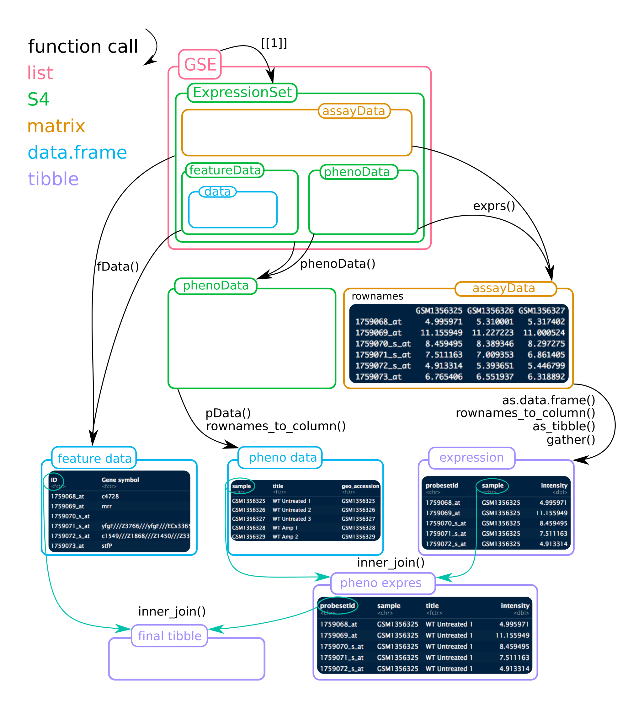

> Objective: practice a wrap-up project that encompasses most of the workshop

## Project - set-up

- On your computer, in a folder with a meaningful name, create a new project using the project manager utility on the upper-right part of the rstudio window.

- Check if you have all those libraries installed
```{r, message=FALSE, warning=FALSE}
library("tidyverse")
library("broom")
library("GEOquery")
theme_set(theme_bw(14)) # if you wish to get this theme by default
```

## Aim

As you already experienced, working with GEO datasets can be a hassle.
But it provides also a nice exercise as it requires to manipulate of a lot of tables (`data.frame` and/or `matrix`).
Here, we will investigate the relationship between the expression of _ENTPD5_ and _mir-182_ as it was described by [Pizzini et al.](https://www.ncbi.nlm.nih.gov/pubmed/23987127). 
Even if the data are already normalised and should be ready to use, you will see that reproducing the claimed results still requires an extensive amount of work.

## Retrieve the GEO study

The GEO dataset of interest is [GSE35834](https://www.ncbi.nlm.nih.gov/geo/query/acc.cgi?acc=GSE35834)

- load the study using the `getGEO` function

```{asis, box = "orange", boxtitle = "Warning"}
after NCBI moved its pages from http to https
make sure that to have GEOquery version > 2.39
```


```{r, solution = TRUE}
gse35834 <- getGEO("GSE35834", GSEMatrix = TRUE)
show(gse35834)
```

- what kind of object is `gse35834`?
```{asis, solution = TRUE}
As shown in the Environment tab, it is a list composed of two elements.
Each list is also a list with a special class 'ExpressionSet'.
```

```{asis, box = "lightblue", boxtitle = "Tip"}
To help figuring out the ExpressionSet object, see the figure below.
Mind that for this project, the list GSE contains **2** ExpressionSets!
```




- Two platforms were used in this study, which ones?  
```{asis, solution = TRUE}
according to the GEO webpage:

- GPL15236 ([HuEx-1_0-st Affymetrix Human Exon 1.0 ST Array](http://www.ncbi.nlm.nih.gov/geo/query/acc.cgi?acc=GPL15236))
- GPL8786 ([miRNA-1_0 Affymetrix miRNA Array](http://www.ncbi.nlm.nih.gov/geo/query/acc.cgi?acc=GPL8786))
```

- How can you assign the mRNA or mir data to each element of `gse35834`?
```{asis, solution = TRUE}
The function `show()` displays

1. GPL15236
2. GPL8786

Thus, gse35834[[1]] is mRNA (22486 probes)
gse35834[[2]] is mir (7815 probes)
```

## Explore the mRNA expression meta-data

You can use `phenoData()` to get informations on samples or `pData()` to retrieve them directly as a `data.frame`.

- Extract the mRNA meta-data as a `tibble` which you will name `rna_meta`
    + rename `geo_accession` to `sample`
    + retain only the columns `source_name_ch1` and starting with `"charact"`
    
```{r, solution = TRUE}
rna_meta <- pData(gse35834[[1]]) %>%
  as_tibble() %>%
  select(sample = geo_accession,
         source_name_ch1,
         starts_with("charact"))
```

## Explore the mir expression meta-data

- Extract the mir meta-data as a `tibble` which you will name `mir_meta`
    + rename `geo_accession` to `sample`
    + retain only the columns `source_name_ch1` and all starting with "charact" 
    
```{r, solution = TRUE}
mir_meta <- pData(gse35834[[2]]) %>%
  as_tibble() %>%
  select(sample = geo_accession,
         source_name_ch1,
         starts_with("charact"))
```

## Join the meta-data

- Explore the two data frames with `View(rna_meta)` and `View(mir_meta)`. Are the samples `GSM*` identical?
```{asis, solution = TRUE}
No, they aren't. This is really annoying as the expression data contain only GSM ids.
```

We would like to somehow join both informations.  
Knowing that both data frames have different `sample` columns, merge them to get the correspondence between RNA `GSM*` and mir `GSM*`. Save the result as `rna_mir`.

```{asis, box = "blue", boxtitle = "Note"}
If 2 data.frames that are joined (by specific columns) have identical names in their remaining columns, the default suffixes '.x' and '.y' are appended to the concerned column names from the first and second data frames respectively.
However, you can make more friendly suffixes that match your actual data using the `suffix = c(".x", ".y")` option. 
```

```{r, solution=TRUE}
inner_join(rna_meta, mir_meta, 
           by = c("characteristics_ch1.1", "characteristics_ch1",
                  "source_name_ch1", "characteristics_ch1.2", 
                  "characteristics_ch1.3", "characteristics_ch1.4", 
                  "characteristics_ch1.5", "characteristics_ch1.6", 
                  "characteristics_ch1.7", "characteristics_ch1.8"),
           suffix = c("_rna", "_mir")) -> rna_mir
```

## Get RNA expression data for the _ENTPD5_ gene

Expression data can be accessed using `exprs()` which returns a matrix.

```{asis, box = "orange", boxtitle = "Warning"}
If you do not pipe the command to `head`, `R` would print **ALL** rows (or until it reaches `max.print`).
```

```{r, eval = FALSE}
exprs(gse35834[[1]]) %>% head()
```

- rows are probes and columns are sample ids in the form of `GSM*`.
- Probe ids by themselves are not meaningful, but `fData()` provides features.

```{r, eval = FALSE}
fData(gse35834[[1]]) %>% head()
```

Again, we need to merge both informations to assign the expression data to the gene of interest.

1. Find the common values that that allow us to join both data frames.
```{asis, solution = TRUE}
the probe ids are the common values
```
2. The `rownames` contain the necessary informations. But as a `matrix` contains, by definition, only a single data type (here numerical values), 
you will need to transform it to a `data.frame` and convert the `rownames` to a column using `rownames_to_column(var = "ID")`.  
Save the result as `rna_expression`
```{r, solution = TRUE}
exprs(gse35834[[1]]) %>%
  as.data.frame() %>%
  rownames_to_column(var = "ID") -> rna_expression
```
3. merge the expression data to the platform annotations (`fData(gse35834[[1]])`).
Save the result as `rna_expression` (Don't worry: `R` is always working on temporary objects and you won't erase the object you are working on).
```{asis, box = "blue", boxtitle = "Note"}
Warnings about *factors being coerced to characters* can be ignored.
```
```{r, solution=TRUE}
rna_expression %>%
 inner_join(fData(gse35834[[1]])) -> rna_expression
```

4. Find the [Entrez](http://www.ncbi.nlm.nih.gov/gene) gene id for _ENTPD5_. Usually, the gene symbol is given in the annotation, but each GEO submission is a new discovery.
```{asis, solution=TRUE}
957, for Homo sapiens
```

5. Filter `rna_expression` for the gene of interest (_ENTPD5_) and tidy the samples:  
A column `sample` for all `GSM*` and a column `rna_expression` containing the expression values.
Save the result as `rna_expression_melt`. At this point you should get a `tibble` of 80 values.
```{r, solution=TRUE}
rna_expression %>%
  filter(ENTREZ_GENE_ID == 957) %>% 
  gather(sample, rna_expression, starts_with("GSM")) -> rna_expression_melt
```

6. Add the meta-data and discard the columns `ID`, `SPOT_ID` and `sample_mir`. Save the result as `rna_expression_melt`.
```{r, solution=TRUE}
rna_expression_melt %>%
  inner_join(rna_mir, by = c("sample" = "sample_rna")) %>%
  select(-ID, -SPOT_ID, -sample_mir) -> rna_expression_melt
```

## Get mir expression data for _miR-182_

1. Repeat the previous step but using `exprs(gse35834[[2]])` for the `mir_expression`.
This time, the mir names are nicely provided by `fData(gse35834[[2]])` in the column `miRNA_ID_LIST`.
```{r, solution = TRUE}
exprs(gse35834[[2]]) %>%
  as.data.frame() %>%
  rownames_to_column(var = "ID") %>%
  # match expression data to platform annotation
  inner_join(fData(gse35834[[2]])) %>% 
  gather(sample, mir_expression, starts_with("GSM")) %>% # melt patients
  filter(miRNA_ID_LIST == "hsa-mir-182") -> mir_expression_melt
```

2. How many rows do you obtain? How many are expected?
```{asis, solution = TRUE}
78 samples for the mir experiment, so we would expect 78 but we are obtaining twice this number.
```

3. Find out what happened, and plot the boxplot distribution of `expression` by `ID` 
```{asis, solution = TRUE}
The mir array contains probes for both strands of mir:

- mature mir
- immature mir, named "*", star.
```
```{r, solution = TRUE}
mir_expression_melt %>%
  ggplot(aes(x = ID, y = mir_expression)) +
  geom_boxplot()
```
```{asis, solution = TRUE}
The immature mir, named star is indeed merely expressed
```

4. Filter out the irrelevant IDs using `grepl` in the `filter` function.
```{asis, box = "green", boxtitle = "Hint"}
adding `!` to a condition means `NOT`.
Example `filter(iris, !grepl("a", Species))`: remove all Species containing the letter "a".
```
```{r, solution = TRUE}
mir_expression_melt %>%
  filter(!grepl("star", ID)) -> mir_expression_melt
```

5. Add the meta-data, count the number of rows. Discard the column `sample_rna` after joining.
```{r, solution = TRUE}
mir_expression_melt %>%
  inner_join(rna_mir, by = c("sample" = "sample_mir")) %>%
  select(-sample_rna) -> mir_expression_melt
```
```{asis, solution = TRUE}
77 rows, we lost GSM875854, which is not present in the meta-data nor the GSE description.
Let it down
```

## join both expression

Join `rna_expression_melt` and `mir_expression_melt` by their common columns EXCEPT `sample`.
Save the result as `expression`.
```{r, solution = TRUE}
expression <- inner_join(rna_expression_melt, mir_expression_melt,
                         by = c("source_name_ch1", "characteristics_ch1",
                                "characteristics_ch1.1", "characteristics_ch1.2",
                                "characteristics_ch1.3", "characteristics_ch1.4",
                                "characteristics_ch1.5", "characteristics_ch1.6",
                                "characteristics_ch1.7", "characteristics_ch1.8"))
```

## Examine gene expression according to meta data

1. Plot the gene expression distribution by Gender. Is there any obvious difference? 
```{r, solution = TRUE}
expression %>%
  ggplot(aes(y = rna_expression, x = characteristics_ch1)) +
  geom_boxplot()
```
```{asis, solution = TRUE}
no relation to gender
```

2. Plot gene AND mir expression distribution by Gender. Is there any obvious difference?

```{asis, box = "blue", boxtitle = "Hint"}
You will need to tidy by gathering rna and mir expression
```

```{r, solution = TRUE}
expression %>%
  gather(expression, value, ends_with("expression")) %>%
  ggplot(aes(y = value, x = characteristics_ch1, fill = expression)) +
  geom_boxplot()
```
```{asis, solution = TRUE}
no relation to gender for both expressions
```

3. Plot gene AND mir expression distributions by source (control / cancer).
To make it easier, a quick hack is `separate(expression, source_name_ch1, c("source", "rest"), sep = 12)` to get `source` as control / cancer. Is there any difference?
```{r, solution = TRUE}
expression %>%
  gather(expression, value, ends_with("expression")) %>%
  separate(source_name_ch1, c("source", "rest"), sep = 12) %>%
  ggplot(aes(y = value, fill = source, x = expression)) +
  geom_boxplot() + ggtitle("GSE35834")
```
```{asis, solution = TRUE}
Like it is stated in the summary of the study, the expression of mir-182 seems indeed higher in cancer
while the ENTPD5 expression seems lower.
```

4. Do the same plot as in 3. but reorder the levels so that normal colon appears first. 
Display _normal_ in "lightgreen" and _cancer_ in "red" using `scale_fill_manual()`.
```{r, solution = TRUE}
expression %>%
  gather(expression, value, ends_with("expression")) %>%
  separate(source_name_ch1, c("source", "rest"), sep = 12)  %>% 
  mutate(source = factor(source, levels = c("normal colon", "colon cancer"))) %>%
  ggplot(aes(y = value, fill = source, x = expression)) +
  geom_boxplot() +
  scale_fill_manual(values = c("lightgreen", "red"))
```

## plot relation ENTPD5 ~ mir-182 as scatter-plot for all patients

- add a linear trend using `geom_smooth()` for all data + per source
```{r, solution = TRUE}
expression %>%
  separate(source_name_ch1, c("source", "rest"), sep = 12) %>%
  ggplot(aes(x = mir_expression, y = rna_expression)) +
  geom_point(aes(colour = source)) +
  geom_smooth(method = "lm", se = FALSE) +
  geom_smooth(aes(colour = source), method = "lm", se = FALSE) +
  labs(y = "gene expression ENTPD5",
       x = "hsa-mir-182 expression") +
  ggtitle("GSE35834")
```

- does it support the claim of the study?
```{asis, solution = TRUE}
the two dot clouds between normal and cancer origin do split by

- high mir expression / low gene expression
- mild mir expression / high gene expression

but the trend is not so clear
```

## linear models

- get the estimate from the linear trend for each source.
linear models are outputted by `lm()` as lists. Since `data.frame` are much easier to work with,
[David Robinson](http://varianceexplained.org/) developed [`broom`](https://cran.r-project.org/web/packages/broom/index.html).
```{r, solution = TRUE}
library("broom")
expression %>%
  separate(source_name_ch1, c("source", "rest"), sep = 12) %>%
  group_by(source) %>%
  do(tidy(lm(rna_expression ~ mir_expression, data = .))) %>%
  filter(term != "(Intercept)")
```

The estimate of the intercept is not meaningful thus it is filtered out.
One can easily see that the slope is not significant when data are slipped by source.

- Perform the linear regression and tidy the results for all data, is it significant?
```{r, solution = TRUE}
expression %>%
  do(tidy(lm(rna_expression ~ mir_expression, data = .))) %>%
  filter(term != "(Intercept)")
```
```{asis, solution=TRUE}
with a pvalue of 7.54e-6, the negative is highly significant
```

- replace `tidy` by `glance` to extract the $r^2$. Is this value satisfactory?
```{r, solution = TRUE}
expression %>%
  do(glance(lm(rna_expression ~ mir_expression, data = .)))
```
```{asis, solution = TRUE}
with a r^2 of 0.236, i.e only 23.6% of the variance explained, a linear fit sounds bad due to outliers
```

## Perform a linear model for the expression of _ENTPD5_ and ALL mirs

- Count how many `hsa-mir`, which are not star, are present on the array GPL8786
```{r, solution = TRUE}
fData(gse35834[[2]]) %>%
  filter(grepl("^hsa", ID)) %>%
  filter(!grepl("star", ID)) %>%
  nrow()
```

- Retrieve the expression values for the 677 human mir like you did before.
Same procedure, except that you don't filter for mir-182. Save as `all_mir_rna_expression`
```{r, solution = TRUE}
exprs(gse35834[[2]]) %>%
  as.data.frame() %>%
  rownames_to_column(var = "ID") %>%
  filter(grepl("^hsa", ID)) %>%
  # match expression data to platform annotation
  gather(sample, mir_expression, starts_with("GSM")) %>%
  filter(!grepl("star", ID)) %>%
  inner_join(fData(gse35834[[2]])) %>% 
  inner_join(rna_mir, by = c("sample" = "sample_mir")) %>%
  select(-sample_rna) %>% 
  inner_join(rna_expression_melt,
             by = c("source_name_ch1", "characteristics_ch1", 
                    "characteristics_ch1.1", "characteristics_ch1.2",
                    "characteristics_ch1.3",  "characteristics_ch1.4",
                    "characteristics_ch1.5", "characteristics_ch1.6", 
                    "characteristics_ch1.7", "characteristics_ch1.8"),
             suffix = c("_mir", "_rna")) -> all_mir_rna_expression 
```

- Perform the 677 linear models, tidy the results and arrange by the `adj.r.squared`
```{r, solution = TRUE}
all_mir_rna_expression %>%
  group_by(ID) %>%
   do(glance(lm(rna_expression ~ mir_expression, data = .))) %>%
  ungroup() %>%
  arrange(desc(adj.r.squared))
```

- Get the top 12 mir and plot the scatter plot
```{r, solution = TRUE}
top12_mir <- all_mir_rna_expression %>%
  group_by(ID) %>%
   do(glance(lm(rna_expression ~ mir_expression, data = .))) %>%
  ungroup() %>%
  arrange(desc(adj.r.squared)) %>%
  head(12) %>%
  .$ID

all_mir_rna_expression %>%
  filter(ID %in% top12_mir) %>%
  separate(source_name_ch1, c("source", "rest"), sep = 12) %>%
  ggplot(aes(x = mir_expression, y = rna_expression)) +
  geom_point(aes(colour = source)) +
  geom_smooth(method = "lm", se = FALSE) +
  facet_wrap(~ ID, ncol = 4) +
  labs(y = "gene expression ENTPD5",
       x = "hsa-mir expression")
```

